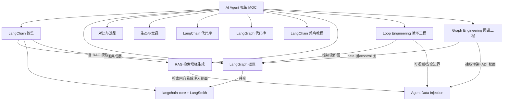

# AI Agent 框架 MOC

> [!info] 本 MOC 索引
> 收集 LangChain / LangGraph 两家主流 Agent 框架的资料，导入 Obsidian 便于检索与链接。
> 采集日期：2026-08-04 ｜ 信息源：官方文档 + 2026 年公开评测 / 博客（见各笔记内引用）

## 核心笔记（概念与选型）

- [[LangChain 概览]] —— 集成 / 连接层，LCEL 声明式组合，RAG 甜区，模块详解
- [[LangGraph 概览]] —— 有状态图状态机，循环 / 持久 / 人工介入，多智能体，生产部署
- [[LangChain vs LangGraph 对比]] —— 5 问决策框架 + 正面对比 + 两者如何配合
- [[Agent 框架生态与竞品]] —— CrewAI / AutoGen / LlamaIndex / 等横向对比与选型
- [[LangChain 菜鸟教程]] —— 菜鸟教程 landing 页整理（入门、首个程序、核心组件、参考文档）
- [[RAG 检索增强生成]] —— 检索增强生成全流程 + 2026 Advanced/GraphRAG/Agentic RAG 演进与工程落地
- [[RAG 详细学习笔记]] —— RAG 进阶 companion：Embedding 深潜 / 切分 / ANN 索引 / 混合检索 / 重排 / GraphRAG / 评估 / 生产取舍（入门见 [[RAG 检索增强生成]]）
- [[Loop Engineering 循环工程]] —— 把 agent 循环本身当工程对象：ReAct、五大部件、10 模式、失败目录、安全边界
- [[Loop Engineering 跨学科发散]] —— 向外辐射：控制论/OODA/PDCA/K8s 协调循环/生物学稳态/形式化验证/元认知/伦理，老智慧映射 agent loop
- [[Graph Engineering 图谱工程]] —— 知识图谱 / GraphRAG 工程化：构建五阶段、Schema 优先、三种集成模式、Vector vs Graph、本体
- [[应用层 Agent 框架 vs 系统级意图框架 对照]] —— 桥接应用层框架与 App Intents/AppFunctions/Intents Kit：同构映射 + 两层差异 + 端侧 Planner
- [[Agent 评测与基准 学习笔记]] —— 🌱 广度种子：通用/工具调用/GUI-OS/编码/RAG 五类基准地图（GAIA·τ-bench·OSWorld·AndroidWorld·SWE-bench…）+ 轨迹评测转向、污染与可信度危机 + 对 OS PM 的验收指标启发
- [[多智能体协作与编排 学习笔记]] —— 🌱 广度种子：多 agent 协作模式与编排框架全景（orchestrator-worker / supervisor / debate + AutoGen / CrewAI / LangGraph multi-agent / Anthropic Many hands / A2A·AGP），与 [[Loop Engineering 循环工程]]（单 agent 循环）、[[Agent 协议生态 学习笔记]]（协议）互补
- [[Agent 可观测性 LLM Observability 学习笔记]] —— 🌱 广度种子：Agent 可观测性/LLM Observability 全景（tracing/eval/cost&latency/用户 feedback 回路 + LangSmith/Langfuse/Phoenix/Datadog/Traceloop 等横向 + OpenTelemetry/OpenInference 语义约定 + 端侧 Agent 监控意义），与 [[Agent 评测与基准 学习笔记]]（离线基准）互补

## 实战代码库（可直接抄）

- [[LangChain 实战代码库]] —— LCEL / RAG / 结构化输出 / 记忆 / 工具调用 / LangServe / 流式兜底
- [[LangGraph 实战代码库]] —— 状态机 / ReAct / 人工介入 / 时间旅行 / 条件边 / 多智能体 / 流式
- [[Loop Engineering 实战代码库]] —— ReAct/Reflection/Tool-use/Ralph/Circuit Breaker/Bounded/Sub-agent/Human Gate/追踪/预算/多循环编排 可运行范式

## 概念地图

## 建议学习路径

1. 先读 [[LangChain vs LangGraph 对比]] 的 5 问决策框架，建立"何时用哪个"的直觉。
2. 按需求进 [[LangChain 概览]] 或 [[LangGraph 概览]] 看概念与架构图。
3. 写代码时直接抄 [[LangChain 实战代码库]] / [[LangGraph 实战代码库]] 的片段。
4. 选型纠结其他框架时查 [[Agent 框架生态与竞品]]。

## 与其它知识库的关联

- 系统级意图框架主题：[[App Intent 的核心作用]] ｜ [[Apple Intelligence 与 App Intents]] ｜ [[手机AI智能体知识库]]
- 执行安全主题：[[Agent Data Injection 数据注入攻击]] ｜ [[Windows Copilot Actions 与 Agent Workspace 2026]] ｜ [[确认机制]] ｜ [[隔离执行]]
- 端侧运行时：[[OS-PM-系统AI Runtime vs 应用引擎]]
- 检索增强生成：[[RAG 检索增强生成]]（RAG 是 LangChain 核心应用场景，检索内容亦属 [[Agent Data Injection 数据注入攻击]] 靶面）
- 循环工程：[[Loop Engineering 循环工程]]（agent 循环即控制流，可观测/安全边界与 ADI 主题咬合）
- 图谱工程：[[Graph Engineering 图谱工程]]（知识图谱/GraphRAG，注意与 LangGraph 执行图区分）
- LLM 基础与跨学科：[[LLM 跨学科发散]]（信息论/语言学/连接主义/压缩/Transformer/Scaling/涌现/对齐向外辐射 LLM 构件根脉，见 [[AI 工程 MOC]]）

## 待补 / 待核实

- ⚠️ 版本口径：各源对 LangChain / LangGraph 当前主版本说法不一（有 v0.3.x，有称 2026 已进入 v1.x），以 PyPI 官方为准，待查实修正。
- ⚠️ LangChain GitHub star 数各源差距大（12.8 万 / 14.2 万），未写入具体数字。
- ⚠️ NVIDIA NemoClaw Blueprint 的成本对比数字来自厂商评测，待官方复核。
- 可补：与其他框架（CrewAI/AutoGen/LlamaIndex）的**横向基准对比表**（目前仅聚焦用户指定的 LangChain + LangGraph，竞品放在 [[Agent 框架生态与竞品]] 做概览）。

> [!note] 相关概念
> [[LangChain 概览]] ｜ [[LangGraph 概览]] ｜ [[LangChain vs LangGraph 对比]] ｜ [[LangChain 实战代码库]] ｜ [[LangGraph 实战代码库]] ｜ [[Agent 框架生态与竞品]] ｜ [[LangChain 菜鸟教程]] ｜ [[RAG 检索增强生成]] ｜ [[Loop Engineering 循环工程]] ｜ [[Loop Engineering 跨学科发散]] ｜ [[Loop Engineering 实战代码库]] ｜ [[Graph Engineering 图谱工程]] ｜ [[手机AI智能体知识库]] ｜ [[OS-PM-系统AI Runtime vs 应用引擎]] ｜ [[LLM 跨学科发散]] ｜ [[AI 工程 MOC]]
