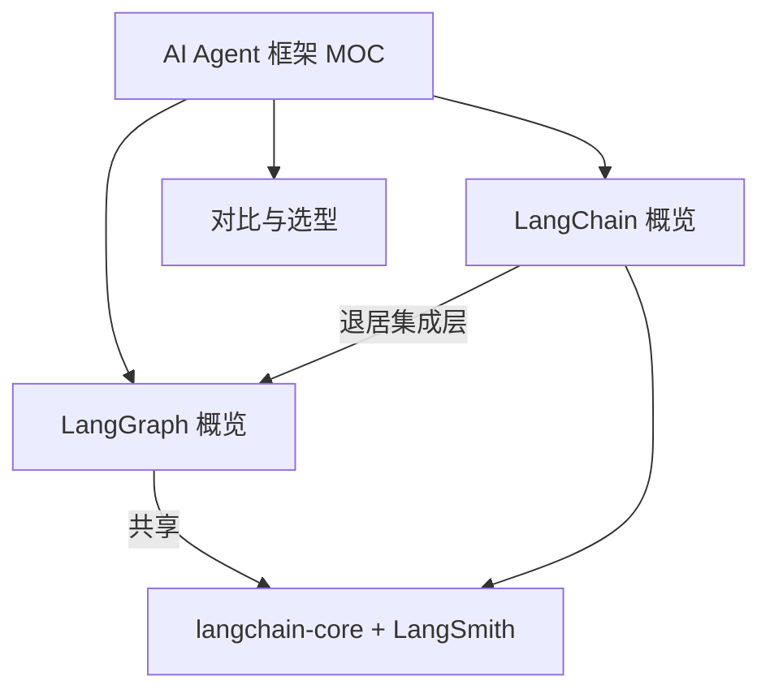

# AI Agent 框架 MOC

> [!info] 本 MOC 索引
> 收集 LangChain / LangGraph 两家主流 Agent 框架的资料，导入 Obsidian 便于检索与链接。
> 采集日期：2026-08-04 ｜ 信息源：官方文档 + 2026 年公开评测 / 博客（见各笔记内引用）

## 核心笔记

- [[LangChain 概览]] —— 集成 / 连接层，LCEL 声明式组合，RAG 甜区
- [[LangGraph 概览]] —— 有状态图状态机，循环 / 持久 / 人工介入，生产级 Agent 编排
- [[LangChain vs LangGraph 对比]] —— 决策框架 + 正面对比 + 两者如何配合

## 概念地图

## 与其它知识库的关联

- 系统级意图框架主题：[[App Intent 的核心作用]] ｜ [[Apple Intelligence 与 App Intents]] ｜ [[手机AI智能体知识库]]
- 执行安全主题：[[Agent Data Injection 数据注入攻击]] ｜ [[Windows Copilot Actions 与 Agent Workspace 2026]] ｜ [[确认机制]] ｜ [[隔离执行]]
- 端侧运行时：[[OS-PM-系统AI Runtime vs 应用引擎]]

## 待补 / 待核实

- ⚠️ 版本口径：各源对 LangChain / LangGraph 当前主版本说法不一（有 v0.3.x，有称 2026 已进入 v1.x），以 PyPI 官方为准，待查实修正。
- ⚠️ LangChain GitHub star 数各源差距大（12.8 万 / 14.2 万），未写入具体数字。
- ⚠️ NVIDIA NemoClaw Blueprint 的成本对比数字来自厂商评测，待官方复核。
- 可补：CrewAI / AutoGen / LlamaIndex 等竞品的横向对比（目前仅聚焦用户指定的 LangChain + LangGraph）。

> [!note] 相关概念
> [[LangChain 概览]] ｜ [[LangGraph 概览]] ｜ [[LangChain vs LangGraph 对比]] ｜ [[手机AI智能体知识库]] ｜ [[OS-PM-系统AI Runtime vs 应用引擎]]
