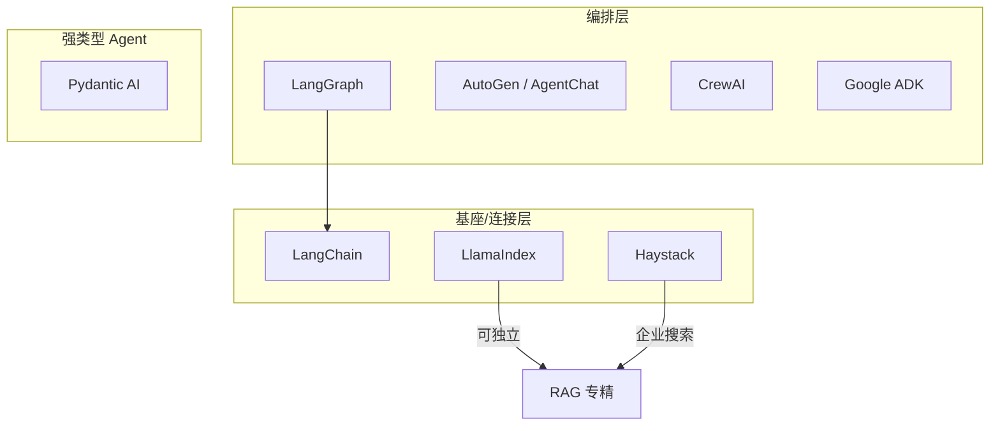

# Agent 框架生态与竞品

> [!abstract] 一句话
> 除用户指定的 LangChain / LangGraph 外，主流 Agent 框架还有 CrewAI、AutoGen、LlamaIndex、Haystack、Pydantic AI、Google ADK 等。本文做**横向概览与选型提示**，不做深度基准（基准数字待补）。

---

## 1. 生态全景

## 2. 主流框架速查

| 框架 | 定位 | 强项 | 典型场景 | 与 LangChain/LangGraph 关系 |
|---|---|---|---|---|
| **CrewAI** | 角色化多 Agent | 开箱即用的"船员/任务"抽象、上手快 | 营销文案、研究 summarization 等角色协作 | 独立；可用 LangChain 模型/工具 |
| **AutoGen (Microsoft)** | 对话式多 Agent | 多 Agent 对话、代码执行、人类参与 | 代码生成、自动化研究 | 独立；与 Semantic Kernel 互补 |
| **LlamaIndex** | 数据/RAG 框架 | 索引、检索、数据连接最强 | 知识库问答、企业搜索 | 可独立；也支持 Agent 与 LangChain 互操作 |
| **Haystack** | 企业级 NLP 管道 | 生产管道、文档检索稳健 | 企业搜索、合规问答 | 独立；偏管道而非自由 Agent |
| **Pydantic AI** | 强类型 Agent | 类型安全、依赖注入、结构化输出 | 工程化、可测试 Agent 服务 | 理念类似但更轻、更 Pythonic |
| **Google ADK** | 谷歌 Agent 开发套件 | 深度绑定 Gemini/谷歌云、多模态 | 谷歌生态 Agent | 独立；竞争者 |
| **Semantic Kernel** | 微软企业编排 | 企业集成、插件、.NET/Python | 企业应用内嵌 Agent | 与 AutoGen 互补 |
| **PhiData** | Agent 工作流 | 轻量、含记忆/知识、快速 Demo | 小团队快速出 Agent | 独立 |

## 3. 选型提示（与 [[LangChain vs LangGraph 对比]] 互补）

- **要自由、可控、生产级有状态编排** → **LangGraph**（无可替代的图状态机 + Checkpointer + 人工介入）。
- **要角色化多 Agent 快速出 Demo** → **CrewAI**（抽象友好，但深度编排不如 LangGraph）。
- **要代码执行 / 多 Agent 对话研究** → **AutoGen**。
- **核心是 RAG / 企业知识库** → **LlamaIndex** 或 **Haystack**（LangChain 也能做，但这两者更专精）。
- **要强类型、可测试的工程化服务** → **Pydantic AI**。
- **深度绑定谷歌云 / Gemini** → **Google ADK**。

## 4. 与端侧 / 系统意图框架的对照

你研究的系统级意图框架（App Intents / AppFunctions / Intents Kit / HarmonyOS ArkAF）与这些"应用层 Agent 框架"的关系：

- 应用层框架（LangGraph 等）解决**开发者侧**如何编排 LLM 工作流；
- 系统层意图框架解决**OS 侧**如何把"用户意图"路由到跨 App 执行——后者更接近"被 OS 托管的、受限的 Agent 运行时"。
- 两者都面临**循环/分支/人工确认/可审计**的同源问题，但系统层额外受**权限、沙箱、隐私（XPIA/ODR）**约束（详见 [[Windows Copilot Actions 与 Agent Workspace 2026]]、[[隔离执行]]、[[确认机制]]）。

## 5. 待补

- ⚠️ 各框架的**横向基准对比表**（延迟、成本、准确率）尚未采集，数字待补。
- 竞品版本与最新特性以各官网为准，本文仅做 2026-08 概览。
- 可补：华为/谷歌/微软的**系统级**意图框架与 LangGraph 的架构映射专文。

> [!note] 相关概念
> [[LangChain 概览]] ｜ [[LangGraph 概览]] ｜ [[LangChain vs LangGraph 对比]] ｜ [[Windows Copilot Actions 与 Agent Workspace 2026]] ｜ [[隔离执行]] ｜ [[确认机制]]

## 深化补充

**心智模型**：选型表里每个框架的"强项"差异，本质是它们在"解耦 / 状态 / 人工 / 多 Actor"四个维度上的取舍不同——和你评估系统意图框架的能力成熟度是同一组维度（见 [[应用层 Agent 框架 vs 系统级意图框架 对照]]）。

**待解问题**
- [ ] 如果给"系统级意图框架"也画一张竞品表，维度要比应用层框架多加哪一条？比如"受权限/沙箱约束的强度"该不该单列？
