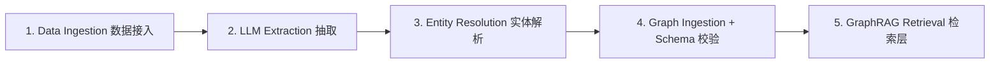

# Graph Engineering 图谱工程（知识图谱 / GraphRAG）

> [!abstract] 摘要
> 先厘清一个歧义：本笔记的 "graph" 指**知识图谱（graph as data）**，与 [[LangGraph 概览]] 里"图作为执行控制流"是**两个不同含义**。Graph Engineering 在这里 = 用 LLM 工程化构建知识图谱、并以 GraphRAG 做关系感知检索的整套方法。覆盖：知识图谱是什么、LLM 在管线中的真实角色、五阶段参考架构、Schema 优先原则、三种 LLM 集成模式、GraphRAG 核心架构、Vector vs Graph 对比、何时用/何时跳过、2026 趋势、Ontology 本体，以及工程陷阱。

---

## 〇、两个 "graph" 的区别（先划清边界）

| 维度 | 知识图谱 Graph（本文） | LangGraph 执行图（另文） |
|---|---|---|
| 本质 | **数据**：实体为节点、关系为边 | **控制流**：节点=步骤、边=转移 |
| 用途 | 关系感知检索、多跳推理 | 编排 agent 的循环/状态/分支 |
| 构建者 | LLM 抽取 + 图数据库 | 开发者用代码定义 StateGraph |
| 关联笔记 | 本文 | [[LangGraph 概览]]、[[Loop Engineering 循环工程]] |

> 两者可结合：LangGraph 编排的 agent 循环里，一步可以是"查知识图谱"（GraphRAG）。

## 一、知识图谱是什么

知识图谱是**结构化数据库**，存储实体（人、组织、产品、事件、概念）及其间关系。与关系库不同，它把**实体间的连接**作为一等数据元素，支持跨百万/十亿记录的多步关系查询。

- 向量库回答"什么和 X 相似？"
- 知识图谱回答"X 怎么和 Y 关联，这关系说明什么？"——这正是实体解析、欺诈检测、合规可解释性的底层能力。

## 二、LLM 在图谱管线中的真实角色

**易错假设**：LLM 和知识图谱是同一件事。不是。

LLM 是**抽取与转换层**，做三件事：
1. **命名实体识别（NER）**：识别人/组织/产品/地点/概念等。
2. **关系抽取（RE）**：识别实体如何连接（"A 收购 B"、"药物 X 治 Y"）。
3. **实体消歧（Entity Disambiguation）**：判定两个不同名字是否指同一真实对象（企业级关键，否则同一客户/产品出现几十次别名）。

**LLM 不做的事**（同等重要）：不校验抽取、不强制 schema 一致、不推理图谱——那是**图数据库**的职责。

> 核心原则：**LLM 填充图谱并通过自然语言查询使其可用；图数据库负责存储、校验、推理。**

## 三、五阶段参考架构（企业级）



1. **Data Ingestion**：结构化（DB/API）或非结构化（文档/邮件/会议记录）源接入。
2. **LLM Extraction**：NER + RE + 消歧，产出候选 (实体, 关系) 三元组。
3. **Entity Resolution**：合并指向同一真实对象的实体。
4. **Graph Ingestion + Schema Validation**：按 schema 入库，强制一致性。
5. **GraphRAG Retrieval**：图谱增强的检索层（见第七节）。

## 四、Schema 优先（最贵的一条经验）

**Schema 设计必须在 ingestion 之前完成。** 企业级 retrofitting schema = 全量重新抽取+重新入库， remediation 通常耗时**数月**。LLM 自动构建图谱让成本骤降，但 schema 治理、数据质量、可扩展性、集成架构仍是生产级与 PoC 的分水岭。

## 五、三种 LLM 集成模式（2026）

| 模式 | 做法 | 优劣 |
|---|---|---|
| **Text-to-SPARQL/Cypher** | NL → 图查询语言 → 执行 → 结构化结果回 LLM | 最精确、用尽图语言表现力；需高质量 text-to-query 模型 + 好 schema；适合有限明确查询模式 |
| **Subgraph Serialization** | 抽相关子图 → 序列化为 JSON-LD/Turtle/自定义 → 进上下文让 LLM 推理 | 比 text-to-query 灵活；需精心设计的序列化格式 |
| **GraphRAG（图增强检索）** | 向量检索定位种子实体 + 图谱遍历收集上下文 | 2026 最广泛采用；兼得向量语义灵活性与图关系感知 |

## 六、GraphRAG 核心架构

```mermaid
flowchart TB
    E[1. Knowledge Extraction: 文档→LLM→(实体,关系)] --> G[2. Graph Construction: 三元组→图库 Neo4j/Neptune]
    G --> C[3. Community Detection: 图聚类→社区摘要]
    C --> Q[4. Query: Local/Global/Hybrid]
    Q --> L[Local 实体中心]
    Q --> GL[Global 社区摘要]
    Q --> H[Hybrid 向量+图]
```

- **抽取**：LLM/NER 管线读文档抽实体与关系。
- **建图**：三元组成图；可选把节点聚成社区并各做摘要，使系统能在不同"缩放层级"推理。
- **查询**：识别 query 中实体 → 遍历其邻域 → 可选混入向量结果 → 组装子图给 LLM 作答。

**微软 GraphRAG 实践（2024–2026）要点**：
- 社区摘要让全局查询可行；多跳推理解复杂链（"Alice 导师的论文"）。
- 建图成本约传统 RAG 的 **10×**，但查询成本相当。
- 适合知识密集域（法律/医疗/金融）与全局视图分析；不适合简单 QA 或超低延迟。

## 七、Vector RAG vs Graph RAG

| 维度 | Vector RAG | Graph RAG |
|---|---|---|
| 检索单元 | 文本块 | 实体与关系 |
| 强项 | 局部、段落级问题 | 多跳、全局、聚合问题 |
| 可解释性 | 用了哪些块 | 走了哪条事实路径 |
| 搭建成本 | 低 | 较高（抽取+schema） |
| 维护 | 重嵌变更文本 | 重抽取并调和图谱 |
| 最佳搭档 | Reranking | 向量检索（混合） |

**向量检索的三种盲区**（GraphRAG 专治）：
1. **多跳问题**：需串联事实（"前 CTO 下属负责的项目有哪些"）。
2. **全局问题**：跨全语料的结论（"这些报告的主题是什么"），无单块含答案。
3. **需结构的聚合**：计数/分组相关实体。

## 八、何时用 / 何时跳过

**用 GraphRAG 当**：数据高度互联；用户问关系重/多跳问题；需要合规可解释、可审计的答案（医药/金融/法律/企业知识库）。

**跳过当**：语料小、问题是简单查找、内容变化快到维护图谱成本超过收益。**小语料简单查找用纯向量 RAG 更快更省**。

## 九、2026 趋势

1. **混合架构成为主流**：纯图检索罕见；成功实现 = 图库（Neo4j/TigerGraph/JanusGraph）+ 向量库（Pinecone/Weaviate/Qdrant）+ 搜索引擎（Elasticsearch/Solr）。图提供结构上下文，向量管语义相似。
2. **高级嵌入**：GNN embeddings、知识图谱嵌入（KGE）捕获实体/概念间关系；领域微调关键。
3. **LLM 深度集成检索**：LLM 用于查询理解、节点排序、关系抽取；chain-of-thought 引导图谱探索。
4. **自动化构建 + human-in-the-loop**：NLP 信息抽取自动化普及，但**低置信抽取路由人工复核**仍必要。
5. **可解释与可审计**：用户需理解"为何得此答案"，并能回溯到源数据。

> 许多图库已原生支持向量索引；小图可住在更简单存储里。

## 十、Ontology 本体：知识骨架

**定义**：Ontology = 概念 + 关系 + 约束。例：医疗域含 disease/symptom/drug/patient 概念，disease→symptom、drug→treats 关系，以及"孕妇忌用某些药"约束。

**为什么需要**：无本体时"头疼吃什么药"只召回松散相关句；有本体时可解析症状→映射概念→施加约束→返回精确答案。

**LLM 驱动本体（2026 新范式）**：传统人工构建 3–6 个月、贵、难维护；LLM 辅助管线从文档抽概念关系→人工复核→1–2 周自动生成。代表工具：OntoLLM(2026.03)、SchemaGPT(2026.04)、KnowledgeForge(2026.05)。

**本体的四个 AI 用途**：① 查询理解（意图映射到结构化概念）② 结果过滤（按本体规则校验召回）③ 推理增强（结合约束推断新知识）④ 知识图谱构建（本体作 schema 填充 KG）。

## 十一、工程陷阱

1. **抽取错误传播**：图中一个错关系 → 下游错误答案。必须校验抽取步骤（human-in-the-loop）。
2. **构建与维护成本**：源数据变化时图谱需调和（reconciliation），要预算。
3. **Schema 设计是真工作**：建模哪些实体/关系决定了系统能答什么。
4. **时效性**：图谱只与其上次抽取一样新——staleness 风险。
5. **生产优化**：增量更新（add-only 抽取降重建成本 ~90%）、混合检索路由（简单→纯向量、关系→图、复杂→向量+图，平均延迟↓40%、精度↑25%）、图索引调优（实体别名索引、加权关系、路径剪枝）。

---

> [!note] 与既有知识网的关联
> - **与 RAG 主线**：[[RAG 检索增强生成]] 第九节已含 GraphRAG 简述，本文是其**工程化深化**（构建管线、schema、集成模式、本体）。
> - **与注入安全**：[[Agent Data Injection 数据注入攻击]]——图谱抽取错误本质上是一种"结构化元数据被污染"，与 ADI 靶面同构；human-in-the-loop 校验正是对应的"来源可信"防线。
> - **与控制流图区分**：本文 graph=data，[[LangGraph 概览]] 的 graph=control flow，勿混。
> - **与语义路由**：[[语义路由]] 在图谱语境对应"查询理解→按问题类型路由到向量/图检索"。
> - 与 AppIntent 情报呼应：系统级意图框架若引入图谱做"关系感知意图解析"，同样面临抽取可信度与时效性问题。

## 深化补充

**心智模型**："Schema 优先"这条经验（retrofitting 要数月）和 OS 意图 Schema 设计同理——意图字段一旦发布就难改，所以"先定契约再接入"在系统层更贵也更不可逆；应用层抽错图谱顶多答案错，系统层抽错意图 Schema 会让所有接入方返工。

**待解问题**
- [ ] 如果系统意图框架引入图做"关系感知意图解析"，抽取错误的污染会不会比应用层 RAG 后果更严重（因为直接触发执行而非只生成文本）？
