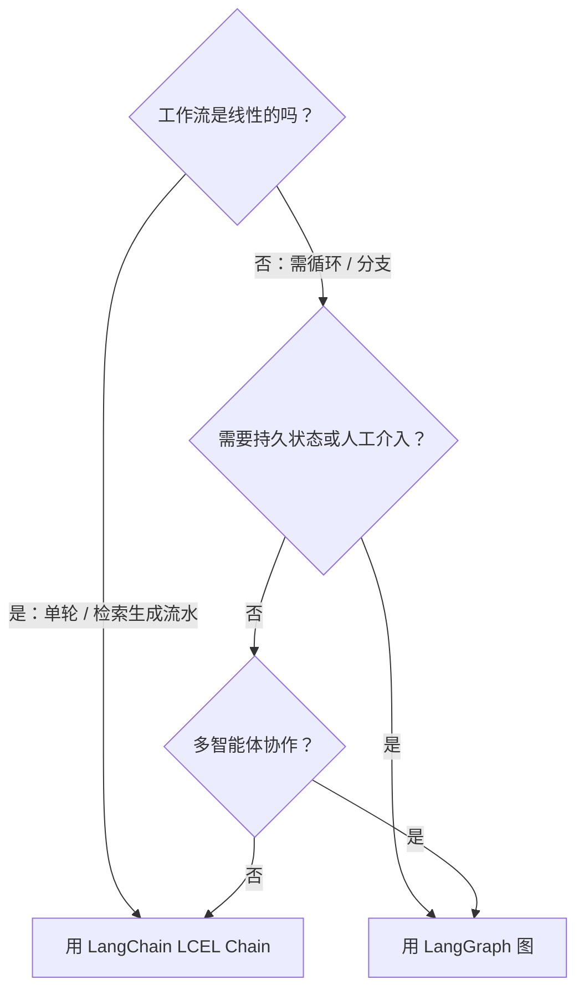
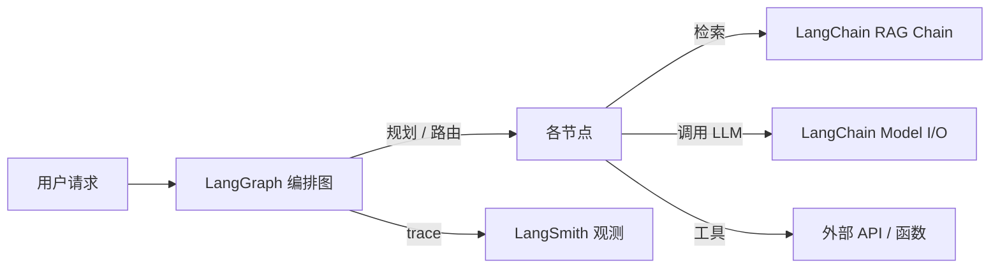

# LangChain vs LangGraph 对比

> [!abstract] 30 秒速览
> 这不是"哪个更好"的战争，而是"你的问题长什么样"的架构选择题。**LangChain** 是面向**线性 LLM 流水线**的组合框架（核心抽象 = chain）；**LangGraph** 是面向**有状态、可循环、多 Actor** Agent 的执行框架（核心抽象 = graph）。主流用法是两者配合：LangChain 管连接与检索，LangGraph 管编排与状态。

---

## 1. 决策框架（先回答 5 个问题）

1. **工作流是线性的还是分支的？** 线性（检索→生成）→ LangChain；分支 / 循环 → LangGraph。
2. **状态需要在多步间持久化、演化吗？** 需要 → LangGraph（Checkpointer）。
3. **需要人工介入 / 可暂停恢复吗？** 需要 → LangGraph（interrupt）。
4. **多智能体要共享状态协作吗？** 需要 → LangGraph（supervisor / hierarchical / collaborative）。
5. **只是拼装提示 / 换模型做实验？** → LangChain 足矣。

## 2. 正面对比表

| 维度 | LangChain | LangGraph |
|---|---|---|
| **核心抽象** | Chain（线性步骤序列） | Graph（节点 + 边 + 持久 State） |
| **最适合** | RAG、提示组合、文档批处理 | 有状态 Agent、循环推理、多智能体 |
| **循环 / 重试** | ✗（靠外部 while） | ✓ 原生 |
| **持久状态** | ✗（AgentExecutor 跨轮丢上下文） | ✓ Checkpointer（SQLite/Postgres） |
| **条件分支** | 有限 | ✓ conditional_edge |
| **人工介入** | ✗ | ✓ interrupt_before/after |
| **可观测** | LangSmith（链路级） | LangSmith（节点级事件） |
| **学习曲线** | 平缓 | 较陡（图 + 状态 schema） |
| **定位（2026）** | 集成 / 连接层基座 | 生产级有状态 Agent 编排层 |

## 3. 它们如何配合（不是二选一）

典型生产架构：

- **LangChain** 在节点内部负责"连模型、做检索、解析输出"。
- **LangGraph** 在外部负责"怎么串起这些节点、何时循环、何时暂停、状态怎么存"。
- 两者共享同一套 `langchain-core` 抽象与 LangSmith 观测，没有壁垒。

## 4. 选型速记

- **只有 RAG / 单轮问答 / 文档处理** → 纯 LangChain，别上图。
- **Agent 要反复调工具直到完成、要分支、要记住跨步状态、要在关键决策点等人确认** → LangGraph。
- **不确定** → 先用 LangChain 原型，遇到"需要 while 循环 / 人工审核"的信号再迁到 LangGraph（迁移成本主要在把逻辑重构成 State + Node）。

---

## 与端侧 / 系统智能体的关联

这套"线性链 vs 有状态图"的区分，映射到你研究的系统级意图框架同样成立：

- **App Intents / AppFunctions 的"单次意图执行"** 更接近 LangChain 的**线性链**（意图 → 槽位填充 → 执行 → 返回）。
- **跨 App 多步编排、带确认与回滚的意图工作流** 更接近 LangGraph 的**有状态图**——这恰是 HarmonyOS ArkAF / Windows Agent Workspace 在补的能力。
- 选型时问自己的五个问题，和系统里"这个意图该走一次性执行还是状态机编排"是同一个决策。

> [!note] 相关概念
> [[LangChain 概览]] ｜ [[LangGraph 概览]] ｜ [[App Intent 的核心作用]] ｜ [[语义路由]] ｜ [[确认机制]] ｜ [[隔离执行]]
