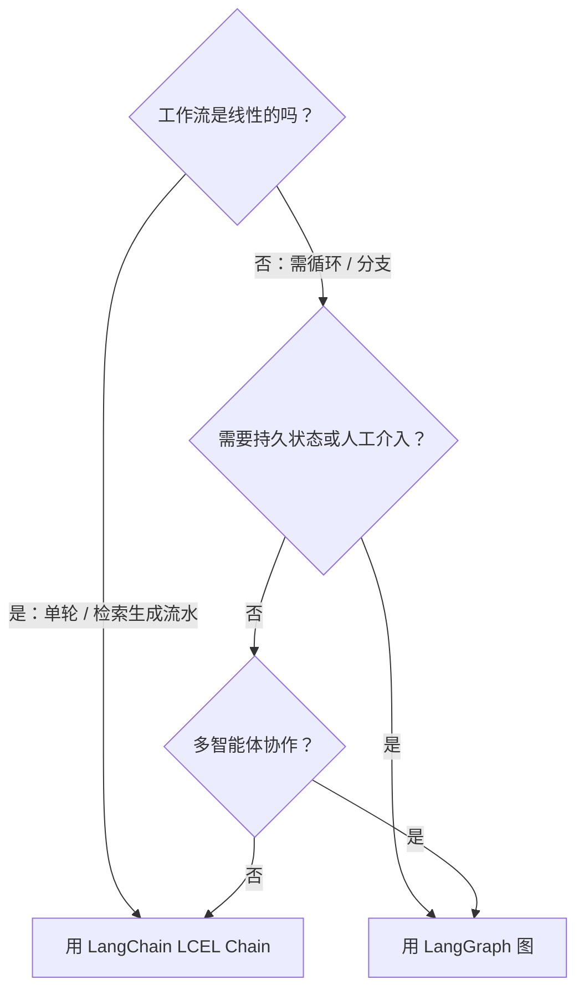
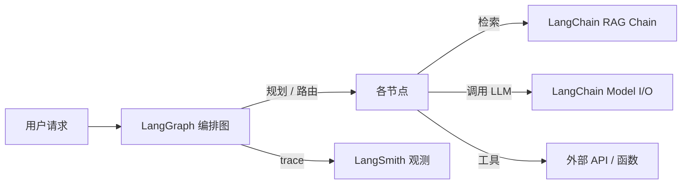

# LangChain vs LangGraph 对比

> [!abstract] 30 秒速览
> 这不是"哪个更好"的战争，而是"你的问题长什么样"的架构选择题。**LangChain** 是面向**线性 LLM 流水线**的组合框架（核心抽象 = chain）；**LangGraph** 是面向**有状态、可循环、多 Actor** Agent 的执行框架（核心抽象 = graph）。主流用法是**两者配合**：LangChain 管连接与检索，LangGraph 管编排与状态。

---

## 1. 决策框架（先回答 5 个问题）

1. **工作流线性还是分支？** 线性（检索→生成）→ LangChain；分支/循环 → LangGraph。
2. **状态需跨步持久化、演化？** 需要 → LangGraph（Checkpointer）。
3. **需人工介入 / 可暂停恢复？** 需要 → LangGraph（interrupt）。
4. **多智能体共享状态协作？** 需要 → LangGraph（supervisor/hierarchical/collaborative）。
5. **只是拼装提示 / 换模型做实验？** → LangChain 足矣。

## 2. 正面对比表

| 维度 | LangChain | LangGraph |
|---|---|---|
| **核心抽象** | Chain（线性步骤序列） | Graph（节点 + 边 + 持久 State） |
| **最适合** | RAG、提示组合、文档批处理 | 有状态 Agent、循环推理、多智能体 |
| **循环 / 重试** | ✗（靠外部 while） | ✓ 原生 |
| **持久状态** | ✗（AgentExecutor 跨轮丢上下文） | ✓ Checkpointer（SQLite/Postgres/Redis） |
| **条件分支** | 有限 | ✓ conditional_edge + Command |
| **人工介入** | ✗ | ✓ interrupt_before/after + resume |
| **时间旅行/状态编辑** | ✗ | ✓ get_state / update_state / replay |
| **多智能体拓扑** | 仅基础 | ✓ supervisor/hierarchical/collaborative |
| **可观测粒度** | LangSmith（链路级） | LangSmith（节点级事件） |
| **流式模式** | 基础 | values/updates/messages/events/debug |
| **学习曲线** | 平缓 | 较陡（图 + 状态 schema） |
| **2026 定位** | 集成/连接层基座 | 生产级有状态 Agent 编排层 |

## 3. 什么时候从 LangChain 毕业到 LangGraph

**信号清单**（出现任意一条就考虑迁移）：
- Agent 需要 `while` 循环反复调工具直到完成；
- 需要在多个步骤间记住并演化状态（不只是对话历史）；
- 关键决策点要暂停等人确认再继续；
- 要做多 Agent 协作（一个派活、多个干活）；
- 长任务要能断点恢复、且不想重跑已完成步骤；
- 调试时希望每个节点都是可 inspect 的事件。

**迁移成本**主要在把逻辑重构成 `State + Node`——组合层（模型、检索、工具）的代码大多可原样复用，因为两者共享 `langchain-core`。

## 4. 两者如何配合（不是二选一）

- **LangChain** 在节点内部负责"连模型、做检索、解析输出"（用 LCEL 拼）。
- **LangGraph** 在外部负责"怎么串起这些节点、何时循环、何时暂停、状态怎么存"。
- 共享同一套 `langchain-core` 抽象与 LangSmith 观测，无壁垒。

## 5. 选型速记

- **只有 RAG / 单轮问答 / 文档处理** → 纯 LangChain，别上图。
- **Agent 要反复调工具直到完成、要分支、要记住跨步状态、要在关键决策点等人确认** → LangGraph。
- **不确定** → 先用 LangChain 原型，出现第 3 节任一信号再迁 LangGraph。

## 6. 与端侧 / 系统意图框架的映射

- **App Intents / AppFunctions 的"单次意图执行"** 更接近 LangChain 的**线性链**。
- **跨 App 多步编排、带确认与回滚的意图工作流** 更接近 LangGraph 的**有状态图**——恰是 HarmonyOS ArkAF / Windows Agent Workspace 在补的能力。
- "线性链 vs 有状态图"的区分，和你做系统级意图框架时的"一次性执行 vs 状态机编排"是同一决策（详见 [[LangGraph 概览]] 第 13 节、[[App Intent 的核心作用]]）。

> [!note] 相关概念
> [[LangChain 概览]] ｜ [[LangGraph 概览]] ｜ [[Agent 框架生态与竞品]] ｜ [[App Intent 的核心作用]] ｜ [[语义路由]] ｜ [[确认机制]] ｜ [[隔离执行]]

## 深化补充

**心智模型**：选型决策"线性链 vs 有状态图" = 系统意图框架"一次性执行 vs 状态机编排"的同一道题（见 [[应用层 Agent 框架 vs 系统级意图框架 对照]]）；你在两层判断"要不要状态"的标准应该是一致的，不该两套逻辑。

**待解问题**
- [ ] 我的"系统意图该不该要状态"的判断标准，目前是凭感觉还是能落成一张检查清单？
