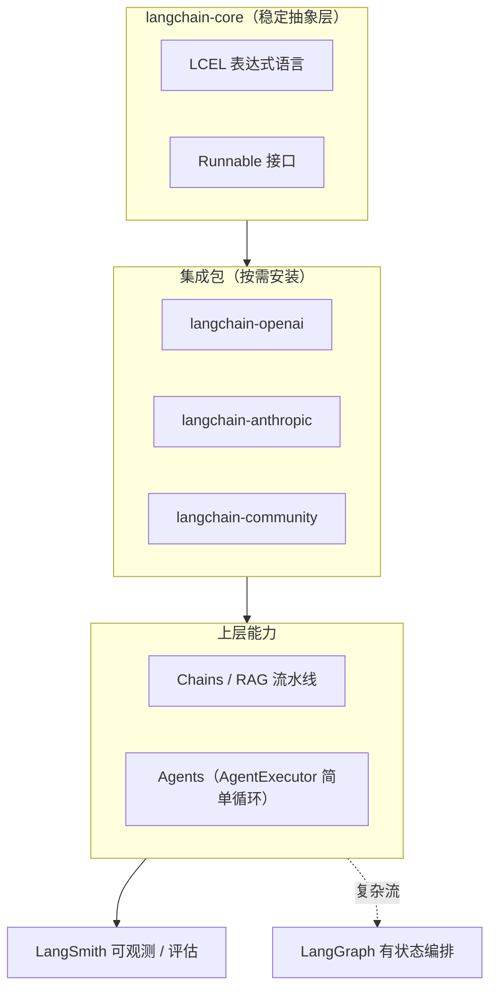

# LangChain 概览

> [!abstract] 30 秒速览
> LangChain 是 2022 年底问世的 LLM 应用开发框架，定位从"链（chain）胶水库"演进为 **AI 工程基础设施**。它的核心价值是把模型 / 提示 / 检索 / 工具 / 记忆等组件标准化成可拼装的乐高积木。2026 年战略重心已从"链"转向"智能体"，自身退居**集成与连接层**，把有状态编排交给 [[LangGraph 概览]]、可观测交给 LangSmith。

---

## 1. 它解决什么痛点（LLM 应用的三座大山）

| 挑战 | 没有框架时的困境 | LangChain 的应对 |
|---|---|---|
| **集成复杂度** | 几十种模型商、向量库、工具接口，每个都要写适配 | 统一抽象 + 1000+ 集成包，换模型常改一行 import |
| **工作流编排** | 多步推理、循环、条件分支靠 if-else 硬编码 | LCEL 声明式组合；复杂流交给 [[LangGraph 概览]] |
| **可观测性** | "Agent 为什么调了这个工具？"成玄学 | LangSmith 全链路追踪、评估、回归测试 |

一句话：把 LLM 应用开发从"写胶水代码"升级为"搭积木"。

## 2. 架构分层



- **langchain-core**：定义基础抽象（Runnables、LCEL、各组件接口），轻量且稳定，是契约层。
- **集成包**：`langchain-openai` / `langchain-anthropic` / `langchain-community` 等只装需要的依赖。
- **上层**：RAG、Agents；AgentExecutor 处理简单工具调用循环，复杂流交给 [[LangGraph 概览]]。
- **LangSmith**：独立的观测 / 评估平台，对两者都生效。

## 3. 核心抽象（模块拆解）

- **Model I/O**：ChatModel / LLM / Embedding 统一接口，换厂商只改 import。
- **Retrieval（RAG）**：Document Loaders（100+ 格式）、Text Splitters、Vector Stores（50+ 库）、Retrievers。
- **Memory**：对话历史管理，从简单 buffer 到 entity / summary 策略。
- **Tools & Agents**：工具调用 + 规划；内置 ReAct 风格 Agent。
- **Chains / LCEL**：用管道符声明式拼装 `prompt | llm | parser`。

## 4. LCEL 组合示例（RAG 流水线）

```python
from langchain_core.prompts import ChatPromptTemplate
from langchain_anthropic import ChatAnthropic
from langchain_community.vectorstores import Chroma
from langchain_core.output_parsers import StrOutputParser
from langchain_core.runnables import RunnablePassthrough

retriever = Chroma(...).as_retriever()
prompt = ChatPromptTemplate.from_template(
    "Answer based on context: {context}\n\nQuestion: {question}"
)
llm = ChatAnthropic(model="claude-sonnet-4-6")

# 8 行，完全可组合：检索 + 生成拼成一条链
rag_chain = (
    {"context": retriever, "question": RunnablePassthrough()}
    | prompt
    | llm
    | StrOutputParser()
)
response = rag_chain.invoke("What is our refund policy?")
```

LCEL 自带并行执行、错误处理、流式输出，是 LangChain 的"甜区"。

## 5. 生态版图

| 组件 | 角色 | 备注 |
|---|---|---|
| **LangChain** | 集成 / 连接层 | 2026 主线已转向 Agent 基座 |
| **[[LangGraph 概览]]** | 有状态多 Actor 编排 | 2025-05 GA，生产级 Agent 首选 |
| **LangSmith** | 观测 / 评估 / 部署 | 从 trace 工具长成全生命周期平台 |
| **LangServe** | 链 / Agent 的 API 部署 | 快速暴露为服务 |
| **LangGraph Platform / Studio** | 托管部署 + 可视化调试 | 原 LangGraph Cloud，GA 于 2024 末 |

## 6. 2026 关键动态（重要性 ≥6 收录）

- **战略转向 Agent**：核心库退居集成层，LangGraph 成为有状态多智能体首选框架（已被多家评测列为 2026 默认 Agent 构建方式）。
- **NVIDIA 合作（2026-07-08）**：发布 "NemoClaw for LangChain Deep Agents Blueprint"，结合 Nemotron 3 Ultra + OpenShell 运行时，主打低成本开放 Agent 系统（评测口径 $4.48 vs 竞品 $43.48，待官方复核）。
- **安全事件 CVE-2026-4539**：f-string 模板未隔离用户输入导致注入，修复为升级至 `0.3.84+`、改用沙箱 Jinja2 模板、严格转义。⚠️ 与你在做的 [[Agent Data Injection 数据注入攻击]] 主题直接相关——Agent 编排框架本身也是注入靶面。

## 7. 选型：什么时候用 LangChain 而非 [[LangGraph 概览]]

- ✅ 线性检索 / 生成流水线（RAG）、提示组合、文档批处理。
- ✅ 需要快速换模型 / 向量库做实验。
- ❌ 需要循环推理、持久状态、人工介入、多智能体协作 → 直接上 [[LangGraph 概览]]。
- 详见 [[LangChain vs LangGraph 对比]] 的决策框架。

---

## 与端侧 / 系统智能体的关联

作为 OS / Android PM，可把 LangChain 类比"**应用引擎层的 Agent 编排 SDK**"——它解决的是云端复杂 Agent 的拼装问题。而你之前研究的 [[OS-PM-系统AI Runtime vs 应用引擎]]、Apple App Intents / Android AppFunctions 是**系统级意图框架**，做的是"设备侧 Planner 如何把意图路由到 App 能力"。两者层级不同：一个是 App 内部 Agent 逻辑，一个是系统把意图派发给 App 的协议层。理解 LangChain/LangGraph 的"状态机 + 工具调用 + 人工介入"范式，有助于设计系统级意图执行总线里的**确认机制**与**隔离执行**（呼应 [[确认机制]] [[隔离执行]]）。

> [!note] 相关概念
> [[LangGraph 概览]] ｜ [[LangChain vs LangGraph 对比]] ｜ [[OS-PM-系统AI Runtime vs 应用引擎]] ｜ [[App Intent 的核心作用]] ｜ [[Agent Data Injection 数据注入攻击]]
