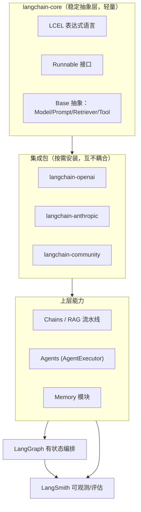
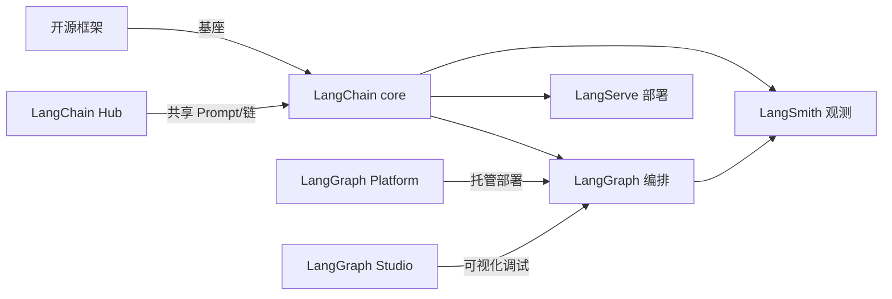

# LangChain 概览

> [!abstract] 30 秒速览
> LangChain 是 2022 年底诞生的 LLM 应用开发框架，2026 年已演进为"AI 应用基础设施"：**核心定位是集成/连接层**（一套接口统一模型、向量库、工具），用 **LCEL（LangChain Expression Language）** 做声明式组合，在 **RAG、提示拼装、文档批处理** 上是甜区。生产级的有状态 Agent 编排已交给同门的 **LangGraph**，可观测交给 **LangSmith**。它不是"写胶水代码"，而是"搭乐高"——组件可替换、可测试、可复用。

---

## 1. 解决什么痛点：LLM 应用的三座大山

| 痛点 | 没有框架时的困境 | LangChain 的应对 |
|---|---|---|
| **集成复杂度** | 几十种模型商、向量库、工具接口，每个都要写适配 | 统一抽象 + 1000+ 集成包，换模型改一行 |
| **工作流编排** | 多步推理、循环、条件分支要用 if-else 硬编码 | LCEL 声明式组合；复杂流交给 LangGraph 图 |
| **可观测性** | "Agent 为什么调这个工具？"成玄学 | LangSmith 全链路 trace、token 统计、评估集 |

核心设计哲学三层：

```python
# 第一层：抽象统一 —— 一套接口，切换任意模型/工具
from langchain_openai import ChatOpenAI
# 切到 Anthropic 只需改这一行：
from langchain_anthropic import ChatAnthropic

# 第二层：声明式编排 —— 用 LCEL 替代嵌套回调
chain = prompt | llm | output_parser   # 可读、可测、可复用

# 第三层：生产级基础设施 —— LangGraph 状态 + LangSmith 可观测
# 复杂工作流用图管理，关键路径有人工审核，全链路可追踪
```

一句话：**LangChain 把 LLM 应用开发从"写胶水代码"升级为"搭乐高积木"。**

## 2. 2026 年定位演进：从 chains 到 agents

2026 年 LangChain 的战略重心**已明确从"链"转向"智能体"**（参考 agentlas.pro 2026 评测与官方路线）：

- **LangChain core** 退居为**基座/连接层**：只负责模型接入、检索、工具、解析等可复用组件。
- **LangGraph** 成为**有状态、多 Actor Agent 的 GA 级主框架**（2025 年 5 月 GA，2026 持续成熟）。
- **LangSmith** 从 trace 工具演进为"观察—评估—部署"全周期平台。
- 类比：**LangChain 2026 ≈ AI 领域的 Spring Boot**——灵活、工程可控、深度可定制，但生产级问题（状态持久化、错误处理、合规适配）需自己补齐。

## 3. 架构分层



分层带来的好处：**只装需要的依赖**（core 很稳定，集成包各自演进），组件可热替换而不动应用逻辑。

## 4. 核心模块详解

### 4.1 Model I/O（模型交互层）
- **ChatModels**：对话模型（`ChatOpenAI`、`ChatAnthropic`），输入输出是 `BaseMessage` 列表（System/Human/AI/ToolMessage）。
- **LLMs**：补全式模型（老接口，新项目优先用 ChatModels）。
- **Embeddings**：文本向量化（`OpenAIEmbeddings`、`HuggingFaceEmbeddings`），RAG 检索前置。
- **Prompts**：`PromptTemplate`（f-string）、`ChatPromptTemplate`、`FewShotPromptTemplate`、`MessagePlaceholder`（占位历史消息）。

### 4.2 Output Parsers（输出解析）
- `StrOutputParser`：纯文本。
- `PydanticOutputParser` / `JsonOutputParser`：结构化输出（强烈推荐做 Agent 工具结果解析）。
- `CommaSeparatedListOutputParser`：列表。
- **Structured Output**：新模型原生支持 `with_structured_output(Schema)`，比 prompt 约束更稳。

```python
from langchain_core.output_parsers import PydanticOutputParser
from pydantic import BaseModel, Field

class Person(BaseModel):
    name: str = Field(description="姓名")
    age: int = Field(description="年龄")

parser = PydanticOutputParser(pydantic_object=Person)
# prompt + llm + parser 组成链，自动把 LLM 文本约束成 Person 对象
```

### 4.3 Retrieval（检索 / RAG 核心）
- **Document Loaders**：100+ 格式（PDF、网页、Notion、CSV、数据库…）。
- **Text Splitters**：按字符/令牌/递归/语义切分（`RecursiveCharacterTextSplitter` 最常用）。
- **Vector Stores**：50+ 向量库（Chroma、FAISS、PGVector、Pinecone、Milvus…）。
- **Retrievers（检索器，进阶）**：
  - `MultiQueryRetriever`：把问题扩写成多个角度再检索，缓解单一问法漏召回。
  - `ParentDocumentRetriever`：小切块检索、大块喂给 LLM，兼顾精度与上下文。
  - `SelfQueryRetriever`：让 LLM 把自然语言转成"元数据过滤 + 向量检索"。
  - `EnsembleRetriever`：混合 BM25 + 向量，融合排序。
  - `ContextualCompressionRetriever`：检索后压缩无关内容，省 token。

### 4.4 Memory（记忆）
| 类型 | 行为 | 适用 |
|---|---|---|
| `BufferMemory` | 全量保留最近 N 条 | 短对话 |
| `BufferWindowMemory` | 只留最近 K 轮 | 控制成本 |
| `SummaryMemory` | 把历史逐步摘要 | 长对话省钱 |
| `EntityMemory` | 抽取实体建知识 | 需跨轮记"人物/事物" |
| `ConversationSummaryBufferMemory` | 摘要 + 窗口混合 | 生产常用 |

> [!note] 2026 记忆趋势
> 长程记忆正从"prompt 里塞历史"转向**向量化记忆 + 结构化记忆**双轨，且越来越多把记忆状态交给 LangGraph Checkpointer 管理（见 [[LangGraph 概览]]）。

### 4.5 Chains & LCEL（组合层）
LCEL 用管道符 `|` 把 `Runnable` 串起来，原生支持：
- **并行**：用 `RunnableParallel` / dict 同时跑多个分支。
- **兜底**：`RunnableParallel` + `with_fallbacks`（主模型挂了切备用）。
- **重试**：`.with_retry()`。
- **流式**：`.stream()` / `.astream()` 实时吐 token。
- **批处理**：`.batch()` 并发多个输入。
- **配置注入**：`RunnableConfig` 传 run_id、tags、callbacks。

### 4.6 Agents & Tools（智能体层）
- `Tool` / `@tool` 装饰器：把一个 Python 函数包装成 Agent 可调用的工具（含名称、描述、schema）。
- **Tool Calling**：现代 Agent 靠模型原生 function calling 决策调哪个工具（优于老的 ReAct 文本解析）。
- `AgentExecutor`：LangChain 内置的**简单工具循环**（线性、无状态），复杂场景应迁 LangGraph。
- `create_tool_calling_agent`：标准 tool-calling Agent 构造器。

## 5. LCEL 组合示例（RAG 甜区，8 行）

```python
from langchain_core.prompts import ChatPromptTemplate
from langchain_anthropic import ChatAnthropic
from langchain_community.vectorstores import Chroma
from langchain_core.output_parsers import StrOutputParser
from langchain_core.runnables import RunnablePassthrough

retriever = Chroma(...).as_retriever()
prompt = ChatPromptTemplate.from_template(
    "基于以下上下文回答：{context}\n\n问题：{question}"
)
llm = ChatAnthropic(model="claude-sonnet-4-6")

rag_chain = (
    {"context": retriever, "question": RunnablePassthrough()}
    | prompt
    | llm
    | StrOutputParser()
)
response = rag_chain.invoke("我们的退款政策是什么？")
```

这是 LangChain 的**甜区**：检索增强的线性流水，每步输出即下一步输入，干净、可读、好测。

## 6. 生产化能力

- **LangServe**：把链/图一键发布成 FastAPI 服务（自动生成 OpenAPI、Playground、流式端点）。
- **LangSmith**：trace 可视化、prompt 版本管理、评估数据集、回归测试、线上监控。
- **流式 / 异步 / 批处理**：LCEL 原生支持，便于做打字机效果和并发。
- **RunnableConfig**：贯穿全链路的 metadata（user_id、session、tags），用于计费与审计。

## 7. 生态全景



- **LangChain Hub**：社区共享 prompt 与链。
- **Cookbook / 官方文档**：从基础聊天到多智能体的范例库。
- **商业侧**：LangSmith（观测评估）、LangGraph Platform（托管部署）、LangGraph Studio（可视化调试）。
- **社区规模**：GitHub star 各源口径差异大（12.8 万 / 14.2 万不等），**确切数字待官网核实**，不写入具体值。

## 8. 2026 年关键动态（待进一步核实原始链接）

- **战略转向 agents**：官方重心从链明确转向有状态 Agent，LangGraph 成主框架。
- **NVIDIA 合作 NemoClaw Deep Agents Blueprint（2026-07-08）**：LangChain Deep Agents + NVIDIA Nemotron + OpenShell 运行时，官方评测称聚合分 0.86、成本约 \$4.48，显著低于对照。⚠️ 成本数字来自厂商评测，待官方复核。
- **安全事件 CVE-2026-4539**：f-string 模板未隔离用户输入导致注入，修复为升级至 0.3.84+、改用沙箱 Jinja2 模板、严格输入转义。
- **VB Transform 2026 "Broken Agent" 议题**：单轮对话评分会掩盖系统性架构缺陷，推动从"准确率"到"系统健康度"的评估标准迁移。

## 9. 与端侧 / 系统意图框架的关联

你研究的系统级意图框架，和 LangChain 的抽象存在结构映射：

- **App Intents / AppFunctions 的"单次意图执行"** ≈ LangChain 的**线性链**（意图 → 槽位填充 → 执行 → 返回）。
- **LCEL 的"统一接口替换模型/工具"** ≈ 系统意图层希望实现的"意图与执行方解耦"。
- **LangSmith 的可观测** ≈ 系统意图执行总线需要的"每次意图调用可追踪、可审计"。
- 选型信号（线性 vs 有状态图）与 [[LangChain vs LangGraph 对比]] 的五个问题一致——系统里"该走一次性执行还是状态机编排"是同一个决策。

> [!note] 相关概念
> [[LangGraph 概览]] ｜ [[LangChain vs LangGraph 对比]] ｜ [[Agent 框架生态与竞品]] ｜ [[App Intent 的核心作用]] ｜ [[语义路由]] ｜ [[确认机制]] ｜ [[隔离执行]] ｜ [[Agent Data Injection 数据注入攻击]]

## 深化补充

**心智模型**：LangChain core 的"统一抽象换模型/工具"本质是**解耦**——和你做系统意图框架想达成的"意图与执行方解耦"是同一工程直觉（详 [[应用层 Agent 框架 vs 系统级意图框架 对照]]）；应用层解耦靠一行代码，系统层解耦靠一份不可随意改的契约。

**待解问题**
- [ ] 当 OS 把意图固化进系统、换执行方不再是改一行代码，我的"换模型/换后端"在系统层对应的是什么治理动作？审批还是弃用窗口？
