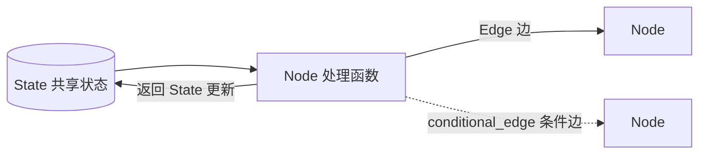
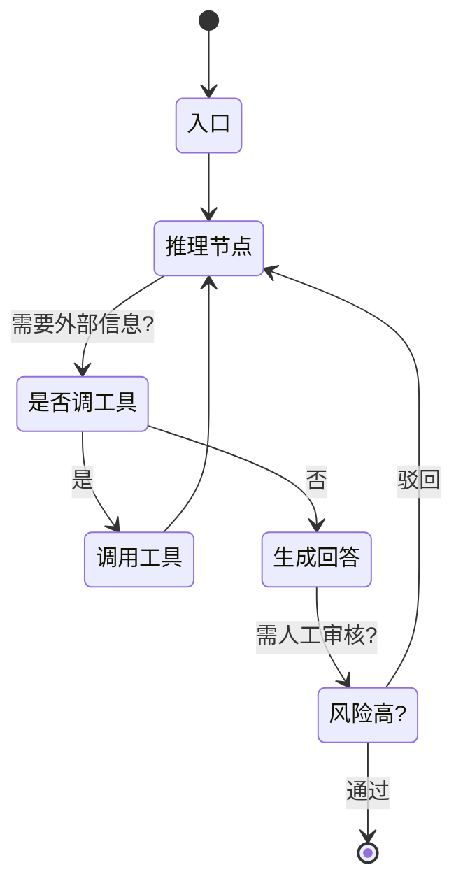

# LangGraph 概览

> [!abstract] 30 秒速览
> LangGraph 是 LangChain 团队 2024-01 开源的**有状态 Agent 运行时**，MIT 许可。它把 Agent 的执行过程建模成**有向图状态机**：节点是处理函数、边是转移条件、状态在节点间流动且能持久化。解决 LangChain 线性链做不了的三件事——**循环 / 重试、持久状态、人工介入**。2025-05 达到 GA，是 2026 年生产级有状态多智能体 Agent 的主流选择。

---

## 1. 为什么需要 LangGraph（Chain 的天花板）

| 能力 | LangChain Chain | LangGraph |
|---|---|---|
| 循环 / 重试 | ✗ 不支持 | ✓ 原生支持 |
| 条件分支 | 有限 | ✓ 完整路由 |
| 持久化状态 | ✗ | ✓ Checkpoint 机制 |
| 人工介入 | ✗ | ✓ interrupt_before/after |
| 流式输出 | 部分 | ✓ 原生 streaming |

一句话比喻：**LangChain 链是传送带（单向、不能回头）；LangGraph 是流程图（能循环、分支、暂停、转交人工）**。

## 2. 四大原语（Graph / State / Node / Edge）



- **State（状态）**：贯穿整图执行的共享数据结构，每个节点读取并更新它的一部分。
- **Node（节点）**：普通 Python 函数，接收 State、返回 State 的更新，是计算单元。
- **Edge（边）**：连接节点的路径。普通边固定跳转；**条件边**按状态动态选下一节点。
- **Graph（图）**：节点 + 边组成的控制流骨架，类似状态机。
- **Reducer（归并器）**：LangGraph 的杀手锏。你声明"状态怎么合并"而非"何时合并"。最典型的是 `add_messages`，节点返回 `{"messages":[m]}` 时**追加**而非覆盖。

```python
from typing import Annotated, TypedDict
from langgraph.graph.message import add_messages
from langchain_core.messages import BaseMessage

class AgentState(TypedDict):
    """共享状态；add_messages 是 reducer，自动累积聊天历史。"""
    messages: Annotated[list[BaseMessage], add_messages]
```

## 3. 一个最小可运行 Agent（含条件路由 + 持久化）

```python
from langgraph.graph import StateGraph, END
from langgraph.checkpoint.sqlite import SqliteSaver
from typing import TypedDict, Annotated
import operator

class AgentState(TypedDict):
    messages: Annotated[list, operator.add]
    risk_score: float
    loop_count: int

def analyst_node(state):
    # 分析，更新 risk_score
    return {"risk_score": 0.87, "loop_count": state["loop_count"] + 1}

def router(state) -> str:
    if state["risk_score"] > 0.8:
        return "human_review"      # 高风险 → 人工闸门
    if state["loop_count"] >= 5:
        return END                 # 达到上限 → 结束
    return "analyst"               # 继续分析

memory = SqliteSaver.from_conn_string("agent_state.db")
graph = StateGraph(AgentState)
graph.add_node("analyst", analyst_node)
graph.add_node("human_review", human_review_node)
graph.add_conditional_edges("analyst", router)
graph.add_edge("human_review", "analyst")
# 持久化 + 在 human_review 前中断，等人工放行
app = graph.compile(checkpointer=memory, interrupt_before=["human_review"])
```

## 4. 关键能力拆解

### 4.1 持久化（Checkpointer）
- 每执行完一个节点就把状态落盘，Agent 可从中间恢复，不重跑已完成步骤。
- 开发用 `SqliteSaver`，生产用 `PostgresSaver`（也有 Redis 实现）。
- 用 `thread_id` 区分不同会话 / 任务实例。

### 4.2 人工介入（Human-in-the-loop）
- `interrupt_before=["node"]` / `interrupt_after=["node"]`：在关键决策点暂停，等人工确认或修改后再 `graph.invoke(..., config)` 续跑。
- 这是**生产级治理与可审计性**的核心机制——高风险动作（如扣款、删库）前必须人工闸门。

### 4.3 条件路由（conditional_edge）
- 按 State 值动态选下一节点，实现分支、循环、重试。

### 4.4 多智能体模式
| 模式 | 说明 |
|---|---|
| **Supervisor（监督者）** | 一个编排者把任务分派给子 Agent |
| **Hierarchical（层级）** | 嵌套监督者，多层分解 |
| **Collaborative（协作）** | 平级 Agent 共享消息队列协作 |

## 5. 一个典型 ReAct Agent 图的形态



## 6. 生产部署

- **LangGraph Platform**（原 LangGraph Cloud，2024 末 GA）：托管部署、鉴权、webhook、SLA 支持。
- **LangGraph Studio**：可视化调试 Agent 图。
- **LangSmith** 集成：每个节点执行都是可检查事件，全链路 trace。
- 生产检查清单：保持 State schema 干净强类型、用持久 Checkpointer、加错误重试、高风险点加 interrupt、用 LangSmith 监控。

## 7. 2026 安全事件（执行安全素材）

- **2026-06-19 安全报告**：底层 LangGraph / LangChain 漏洞致约 **7000 台 LangFlow 服务器**遭攻击，Agent 可能把含 OpenAI key、数据库 token 的服务器 shell 权限交给攻击者。
- 教训：Agent 设计必须重视**安全中间件与沙箱化**——Agent 能调工具 = 能触达凭证，编排层本身是攻击面。
- 这与你已建的 [[Agent Data Injection 数据注入攻击]]、[[Windows Copilot Actions 与 Agent Workspace 2026]] 中"把工具调用当作可检查流量"的防御思路同构。

---

## 与端侧 / 系统智能体的关联

LangGraph 的"**状态机 + 工具调用 + Checkpoint + 人工闸门**"范式，正是系统级意图执行总线想要的骨架：

- **Checkpoint / 持久状态** ↔ 系统级意图执行的断点续跑与审计日志。
- **interrupt_before（人工闸门）** ↔ 你研究的 [[确认机制]]（高风险意图执行前必须用户确认）。
- **条件路由** ↔ 设备侧 Planner 的 [[语义路由]]（按状态决定走哪个 App 能力）。

不同的是，LangGraph 跑在**应用进程内**（云端 / 服务端），而系统级意图框架（App Intents / AppFunctions / Intents Kit）跑在**系统层**，由 OS 提供隔离与权限围栏（呼应 [[隔离执行]]）。理解 LangGraph 能帮你把"系统意图执行总线该怎么设计确认与隔离"想得更具体。

> [!note] 相关概念
> [[LangChain 概览]] ｜ [[LangChain vs LangGraph 对比]] ｜ [[Agent Data Injection 数据注入攻击]] ｜ [[确认机制]] ｜ [[语义路由]] ｜ [[隔离执行]] ｜ [[Windows Copilot Actions 与 Agent Workspace 2026]]
