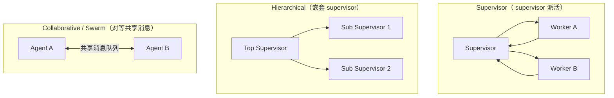

# LangGraph 概览

> [!abstract] 30 秒速览
> LangGraph 是 LangChain 团队 2024-01 推出的**开源有状态 Agent 框架**（MIT 许可），核心是把 Agent 逻辑建模成**有向图状态机**：节点是处理函数，边是转移（含条件边），整张图维护一份**持久共享状态**。它解决 LangChain 线性链做不了的三件事——**循环/重试、持久状态、人工介入**，是 2026 年生产级多步/多智能体 Agent 的事实标准编排层。

---

## 1. 为什么需要 LangGraph（线性链的局限）

普通的 LangChain 链是单向传送带：输入进去、输出出来。但真实 Agent 需要：

| 能力 | 说明 | LangChain Chain | LangGraph |
|---|---|---|---|
| 🔄 循环 / 重试 | 反复调工具直到任务完成 | ✗（靠外部 while） | ✓ 原生支持 |
| 🧠 持久状态 | 跨步/跨轮记住上下文 | ✗ | ✓ Checkpoint |
| 🔀 条件分支 | 按 LLM 输出动态选路 | 有限 | ✓ 完整路由 |
| 👁️ 人工介入 | 关键节点暂停等人确认 | ✗ | ✓ interrupt |
| 📡 流式 | 实时中间状态 | 部分 | ✓ 原生 streaming |

> 一个比喻：LangChain 链是**传送带**（单向、不回头）；LangGraph 是**流程图**（可循环、分支、暂停、转交人工）。

## 2. 四大原语

LangGraph 的世界由四要素构成：

- **Graph（图）**：整个 Agent 的控制流骨架，类似状态机。
- **State（状态）**：贯穿全图执行的共享数据结构，每个节点读取并更新它的一部分。
- **Node（节点）**：一个普通 Python 函数，接收 State、返回 State 的更新（实际计算单元）。
- **Edge（边）**：连接节点的路径。普通边固定跳转；**条件边**按状态动态选下一节点。

**Reducer（归并器）是杀手级特性**：你声明"状态怎么合并"，而不是"何时合并"。例如 `add_messages` 让节点返回 `{"messages":[m]}` 时**追加**而非覆盖——再也不会"忘记 extend 列表"。

## 3. 第一个 ReAct Agent（状态 + 图）

```python
from typing import Annotated, TypedDict
from langgraph.graph.message import add_messages
from langchain_core.messages import BaseMessage

class AgentState(TypedDict):
    """共享状态；add_messages 是 reducer，节点返回 {"messages":[m]} 时自动追加。"""
    messages: Annotated[list[BaseMessage], add_messages]
```

```python
from langgraph.graph import StateGraph, END

def call_model(state: AgentState):
    response = llm.invoke(state["messages"])
    return {"messages": [response]}          # reducer 自动追加

def call_tool(state: AgentState):
    # 取最后一条 AIMessage 的 tool_calls，执行工具，结果以 ToolMessage 追加
    ...

def should_continue(state: AgentState) -> str:
    last = state["messages"][-1]
    if getattr(last, "tool_calls", None):
        return "call_tool"
    return END

builder = StateGraph(AgentState)
builder.add_node("call_model", call_model)
builder.add_node("call_tool", call_tool)
builder.set_entry_point("call_model")
builder.add_conditional_edges("call_model", should_continue)
builder.add_edge("call_tool", "call_model")
graph = builder.compile()
```

## 4. 状态设计进阶

- **TypedDict + Annotated**：多字段状态，`Annotated[list, add_messages]` 声明归并方式。
- **自定义 reducer**：除了 `add_messages`，可用 `operator.add`、自定义函数（如取最大值、求并集）。
- **私有/通道状态**：可定义不被 reducer 全量覆盖的字段（如 `loop_count` 自增）。
- **状态 schema 共享**：子图可复用父图的状态子集，实现嵌套编排。

```python
class AgentState(TypedDict):
    messages: Annotated[list, add_messages]
    risk_score: float
    human_approved: bool
    loop_count: int
```

## 5. 节点与边

- **节点**：普通函数、可调用类、甚至另一个已编译的图（子图）。
- **普通边**：`add_edge("a", "b")` 固定转移。
- **条件边**：`add_conditional_edges("a", router_fn)`，`router_fn(state) -> str` 返回下一节点名，或 `Command` 对象（可在路由时同时返回状态更新）。
- **入口/出口**：`set_entry_point("node")`、`END` 常量表示终态。

## 6. 持久化：Checkpointer（核心能力）

Checkpointer 在**每个节点执行后**把状态落盘，使 Agent 能"中途恢复、不重跑已完成步骤"。

```python
from langgraph.checkpoint.sqlite import SqliteSaver

memory = SqliteSaver.from_conn_string("agent_state.db")
app = graph.compile(checkpointer=memory)

config = {"configurable": {"thread_id": "session_001"}}
app.invoke({"messages": [HumanMessage("研究 2026 Agent 趋势")]}, config)
# 同一 thread_id 后续调用会延续该会话的全部状态
```

- **MemorySaver**：开发用，内存态。
- **SqliteSaver**：单机/轻量持久（dev）。
- **PostgresSaver**：生产推荐（高并发、可横向）。
- **RedisSaver**：需低延迟/分布式场景。
- **thread_id** 是隔离不同会话的键；同一图可同时跑多个 thread。

## 7. 人工介入（Human-in-the-Loop）

生产级 Agent 的关键治理手段：

- `interrupt_before=["node"]` / `interrupt_after=["node"]`：在指定节点**前/后暂停**，把控制权交还人类。
- 暂停期间状态已落盘；人类审阅/修改后，用 `Command(resume=...)` 或 `update_state` 恢复执行。
- 适用：**高风险动作**（转账、删数据、对外发信）前的审批闸门——与你在做的 [[确认机制]] 主题直接相关。

```python
app = graph.compile(checkpointer=memory, interrupt_before=["human_review"])
result = app.invoke(inputs, config)
# ... 人类在 human_review 前介入 ...
app.invoke(Command(resume="approved"), config)   # 恢复
```

## 8. 时间旅行与状态编辑（高级可观测）

- `app.get_state(config)`：查看当前状态、下一步、待恢复点。
- `app.update_state(config, {"messages":[...]})`：直接改写状态（纠错、注入人工决定）。
- **Replay（重放）**：从某个历史 checkpoint 重新执行，便于调试"当时为什么走这条路"。

## 9. 多智能体模式

LangGraph 原生支持三种主流协作拓扑：



- **Supervisor**：一个编排者把任务委派给多个 worker，worker 返回结果后继续调度。最常见。
- **Hierarchical**：嵌套 supervisor（子 supervisor 再管一组 worker），适合大团队分工。
- **Collaborative（Swarm）**：对等 Agent 共享消息队列、自主交接，适合无明确上下级的协作。
- **预置构造器**：`create_react_agent`、`langgraph-supervisor` 包可快速搭 supervisor。

## 10. 流式输出（Streaming）

`app.stream()` / `app.astream()` 支持多种模式：
- `values`：每个步骤后完整状态快照。
- `updates`：仅该步的增量更新（最常用）。
- `messages`：逐 token 的 LLM 输出。
- `events` / `debug` / `tasks`：更细的执行事件，便于前端做"思考过程"可视化。

## 11. 生产部署

- **LangGraph Platform（原 LangGraph Cloud）**：托管部署，2024 末 GA，提供鉴权、Webhook、水平扩展、SLA 支持。
- **LangGraph Studio**：可视化调试图结构、单步执行、状态检查。
- **LangSmith**：节点级 trace（每个节点执行是可 inspect 的事件），这是相对 AgentExecutor 的**可观测性跃升**。
- **运维清单**：保持 State schema 干净强类型；长任务务必用持久 Checkpointer；关键决策点加 interrupt；生产用 PostgresSaver；用 LangSmith 监控。

## 12. 2026 安全事件

- **LangFlow 服务器被攻击（2026-06-19 报告）**：约 7000 台 LangFlow 服务器遭攻击，根因与底层 LangGraph/LangChain 框架中 Agent 可能把 shell 访问权 inadvertent 交给攻击者（含 OpenAI key、DB token 等敏感凭据）有关。教训：**Agent 设计必须强制安全中间件与沙箱隔离**（呼应你的 [[Agent Data Injection 数据注入攻击]] 与 [[隔离执行]] 研究）。

## 13. 与端侧 / 系统意图框架的关联

- LangGraph 的"**有状态图 + 条件路由 + 人工闸门**"≈ 系统级意图框架里"**跨 App 多步编排**"想要的能力——HarmonyOS ArkAF、Windows Agent Workspace 正在补的正是这层。
- 其 Checkpointer/thread_id 模型 ≈ 意图执行总线需要的"**一次多步意图可暂停、可恢复、可审计**"。
- 选型五问（见 [[LangChain vs LangGraph 对比]]）与"系统意图该走一次性执行还是状态机"是同一决策。

> [!note] 相关概念
> [[LangChain 概览]] ｜ [[LangChain vs LangGraph 对比]] ｜ [[Agent 框架生态与竞品]] ｜ [[确认机制]] ｜ [[隔离执行]] ｜ [[语义路由]] ｜ [[Agent Data Injection 数据注入攻击]] ｜ [[Windows Copilot Actions 与 Agent Workspace 2026]]

## 深化补充

**心智模型**：LangGraph 的 `interrupt_before` 人工闸门，正是你要做的"敏感操作唤起系统确认 UI"的最小可运行原型（对应 [[确认机制]]）；把它从"应用内自定义弹窗"搬到"系统级原生弹窗 + 硬件背书"，就是跨层落地。

**待解问题**
- [ ] Checkpointer 的 `thread_id` 隔离模型，能不能直接类比成端侧"一次多步意图会话"的隔离键？恢复/重放语义在系统层要不要对用户可见？
