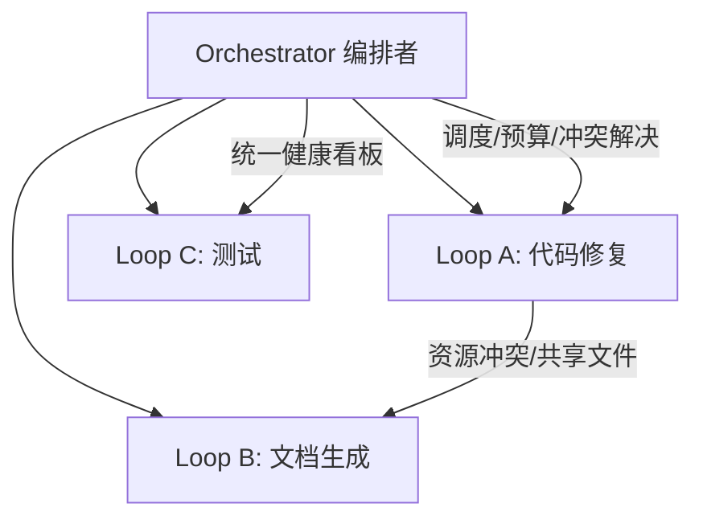

# Loop Engineering 实战代码库

> [!abstract] 摘要
> 本文是 [[Loop Engineering 循环工程]] 概念篇的**落地补完**：把 ReAct、Reflection、Tool-use、Prompt Chaining、Ralph、Circuit Breaker、Bounded Execution、Sub-agent 分离、Human-in-the-loop Gate、结构化追踪、预算护栏逐一写成**可运行范式**。末尾附 Multi-Loop Orchestration（多循环编排，2026 前沿）骨架。所有片段以 2024-2026 真实接口风格书写，关键处标 ⚠️ 待按你的 SDK 校正。

配套概念见 [[Loop Engineering 循环工程]]；安全边界呼应 [[Agent Data Injection 数据注入攻击]] [[确认机制]] [[隔离执行]]。

---

## 0. 统一的 LLM 抽象（所有片段共用）

为聚焦 loop 逻辑，先用一个极简接口封装模型调用：

```python
# llm_base.py
from langchain_openai import ChatOpenAI

llm = ChatOpenAI(model="gpt-4o-mini", temperature=0)

def ask(prompt: str, system: str = "") -> str:
    """最小封装：把 prompt 发给 LLM，返回文本。"""
    from langchain_core.messages import HumanMessage, SystemMessage
    msgs = []
    if system:
        msgs.append(SystemMessage(content=system))
    msgs.append(HumanMessage(content=prompt))
    return llm.invoke(msgs).content
```

> 下面的片段都假设存在 `ask()`。换模型/换框架只改这一处。

---

## 1. ReAct Loop（基础范式）

```python
# pattern_react.py
import re

def react_loop(goal: str, max_steps: int = 8) -> str:
    trace = []
    thought = f"目标：{goal}\n请按 Thought/Action/Observation 循环推进，直到能给出 Final Answer。"
    for step in range(max_steps):
        out = ask(thought, system="你是 ReAct agent，严格用以下格式：\nThought: ...\nAction: <call tool X with arg Y>\nObservation: (稍后填入)\n或 Final Answer: ...")
        trace.append(out)
        if "Final Answer:" in out:
            return extract_final(out, trace)
        # 解析 Action，这里用占位 tool 调用
        action = parse_action(out)
        observation = run_tool(action)          # 见 pattern_tool_use.py
        thought += f"\n{out}\nObservation: {observation}\n"
    return f"[未收敛] 最后状态：\n" + "\n".join(trace)

def extract_final(text, trace):
    return text.split("Final Answer:")[-1].strip()

def parse_action(text):
    m = re.search(r"Action:\s*(.+)", text)
    return m.group(1) if m else None

def run_tool(action: str) -> str:
    # 占位：真实场景接入工具注册表
    return f"[tool 执行结果] 收到动作：{action}"
```

> 这是所有实验室收敛的核心循环。生产里一般不用字符串解析，而用 **structured output / function calling**（见 pattern_tool_use）。

---

## 2. Reflection Loop（自我批评）

```python
# pattern_reflection.py
def reflection_loop(task: str, rounds: int = 2) -> str:
    draft = ask(f"完成任务：{task}")
    for i in range(rounds):
        critique = ask(
            f"请批判下面这份草稿，指出事实错误/不一致/遗漏：\n---\n{draft}\n---",
            system="你是严格的评审者，只列问题，不重写。"
        )
        if "无问题" in critique or "没有问题" in critique:
            break
        draft = ask(
            f"根据评审意见修订草稿：\n原稿：{draft}\n意见：{critique}",
            system="你是写作者，只输出修订后的完整稿。"
        )
    return draft
```

> ⚠️ 局限：验证者即自身（self-administered）。敏感/不可逆任务应改用 pattern_subagent 或 Human Gate。

---

## 3. Tool-Use Loop（function calling，生产主力）

```python
# pattern_tool_use.py
from langchain_core.tools import tool
from langchain_core.messages import HumanMessage

@tool
def search_web(q: str) -> str:
    """联网搜索（占位实现）。"""
    return f"[搜索结果] 关于「{q}」的 top 条..."

@tool
def calculator(expr: str) -> str:
    """安全计算算术表达式。"""
    return str(eval(expr, {"__builtins__": {}}, {}))   # ⚠️ 仅示例，生产用 ast.literal_eval/numexpr

tools = [search_web, calculator]
llm_with_tools = ChatOpenAI(model="gpt-4o-mini").bind_tools(tools)

def tool_loop(question: str, max_steps: int = 5):
    from langchain.agents import create_tool_calling_agent, AgentExecutor
    from langchain_core.prompts import ChatPromptTemplate
    prompt = ChatPromptTemplate.from_messages([
        ("system", "你是有工具的 agent，按需调用工具后回答。"),
        ("human", "{input}"),
        ("placeholder", "{agent_scratchpad}"),
    ])
    agent = create_tool_calling_agent(llm_with_tools, tools, prompt)
    exec = AgentExecutor(agent=agent, tools=tools, max_iterations=max_steps)
    return exec.invoke({"input": question})["output"]
```

> 这是 LangChain 标准 Tool-Use Loop；与 [[LangChain 实战代码库]] 的工具调用片段同源。

---

## 4. Prompt Chaining（确定性序列）

```python
# pattern_chain.py
def prompt_chain(input_text: str) -> str:
    steps = [
        "提取下面文本中的关键实体：",
        "基于实体，生成 3 个候选标题：",
        "从候选标题中选最贴切的一个并说明理由：",
    ]
    out = input_text
    for s in steps:
        out = ask(f"{s}\n\n文本：{out}")
    return out
```

> 代码决定下一步（非 agent 决定），高可审计、低自主——控制谱最确定的一端。

---

## 5. Ralph Loop（有目的地遗忘）

最极简：每次迭代重启全新上下文，只跑一个任务，故意丢弃累积状态。

```bash
# ralph.sh —— Geoffrey Huntley 的 bash 一行
while :; do cat PROMPT.md | claude-code ; done
```

Python 等价（更可控）：

```python
# pattern_ralph.py
import subprocess, time

def ralph_loop(prompt_file: str, rounds: int = 5, sleep_s: int = 0):
    for i in range(rounds):
        # 每次都是全新上下文窗口，不累积历史 → 反而更稳
        out = subprocess.run(
            ["claude-code", "--print", open(prompt_file).read()],
            capture_output=True, text=True
        ).stdout
        print(f"[round {i}] {out[:200]}")
        time.sleep(sleep_s)
```

> "Fresh context beats accumulated context"——遗忘让 loop 更可靠（[[Loop Engineering 循环工程]] 第八节）。

---

## 6. Circuit Breaker 断路器（生产控制）

```python
# pattern_circuit_breaker.py
from functools import wraps

class CircuitBreaker:
    def __init__(self, failure_threshold=3, cooldown=30):
        self.failures = 0
        self.threshold = failure_threshold
        self.cooldown = cooldown
        self.opened_at = 0

    def __call__(self, fn):
        @wraps(fn)
        def wrapper(*a, **k):
            if self.failures >= self.threshold:
                raise RuntimeError("Circuit OPEN：失败率超阈值，已熔断，避免级联失控")
            try:
                return fn(*a, **k)
            except Exception as e:
                self.failures += 1
                raise
        return wrapper

cb = CircuitBreaker(failure_threshold=3)

@cb
def risky_step(x):
    ...
```

> 对应失败模式"Infinite loop / Token blowout"——熔断防止失控扩散。

---

## 7. Bounded Execution 有界执行

```python
# pattern_bounded.py
def bounded_loop(goal: str, max_steps: int = 10, max_tokens: int = 50000):
    used_tokens = 0
    for step in range(max_steps):
        # ... 执行一步 ...
        used_tokens += estimate_tokens(step_output)
        if used_tokens > max_tokens:
            return f"[Bounded] 触发 token 上限，安全停止于 step {step}"
    return "done"

def estimate_tokens(s: str) -> int:
    return len(s) // 4   # 粗略估算
```

> 硬性迭代/资源上限，是 [[Loop Engineering 循环工程]] "可靠性与安全控制" 的落地。

---

## 8. Sub-agent 分离（执行 ≠ 校验）

```python
# pattern_subagent.py
def doer(task: str) -> str:
    return ask(task, system="你是执行者，只产出结果，不自我审查。")

def checker(result: str, criteria: str) -> str:
    return ask(
        f"按以下标准审查结果是否合格：\n{criteria}\n\n结果：{result}\n输出 PASS 或 具体问题。",
        system="你是独立审查者，与执行者角色分离。"
    )

def subagent_pipeline(task: str, criteria: str):
    result = doer(task)
    verdict = checker(result, criteria)
    if "PASS" in verdict:
        return result
    # 反馈给执行者修正（迭代，但带独立门禁）
    return doer(f"之前的结果未通过：{verdict}\n请修正：{task}")
```

> 角色分离 = service mesh 的 mTLS 互验思想（[[Loop Engineering 循环工程]] 第七节）。**独立 grader 是防"Hallucinated progress"伪进度的关键**。

---

## 9. Human-in-the-Loop Gate（L1-L3）

```python
# pattern_human_gate.py
def human_gate(action: dict, level: str, risk: str) -> bool:
    if level == "L1":
        print(f"[L1 仅报告] 建议动作：{action}，不执行")
        return False
    if level == "L2":
        print(f"[L2 辅助] 提议：{action}，等待人确认")
        return input("执行？(y/n) ") == "y"
    if level == "L3":
        if risk in ("high", "irreversible"):
            return input(f"[L3 高风险需人批] {action} 确认？ ") == "y"
        return True   # 低风险 auto-merge
    return False
```

> 对应 [[确认机制]]：敏感/不可逆操作必须等人。这是 OS 层 Confirmation UI 在应用层的等价实现。

---

## 10. Observability 结构化追踪

```python
# pattern_trace.py
import json, time

class LoopTracer:
    def __init__(self): self.spans = []
    def record(self, step, tool_calls, decision, output, verify):
        self.spans.append({
            "ts": time.time(), "step": step,
            "tool_calls": tool_calls, "decision": decision,
            "output_len": len(output), "verified_by": verify,
        })
    def dump(self):
        return json.dumps(self.spans, ensure_ascii=False, indent=2)

tracer = LoopTracer()
# 在每次循环里调用 tracer.record(...)，结束后 tracer.dump() 即完整审计轨迹
```

> 可接 Prometheus（scrape 指标）/ Grafana（可视化迭代次数·失败率·周期）/ PagerDuty（loop 卡住告警）。见 [[Loop Engineering 循环工程]] 第八节。

---

## 11. Budget Guard 预算护栏

```python
# pattern_budget.py
class BudgetGuard:
    def __init__(self, max_tokens=100_000, max_cost_usd=1.0):
        self.used_tokens = 0; self.used_cost = 0.0
        self.max_tokens = max_tokens; self.max_cost = max_cost_usd
    def charge(self, tokens: int, cost_per_1k: float = 0.0005):
        if self.used_tokens + tokens > self.max_tokens:
            raise RuntimeError("Budget: token 超上限")
        if self.used_cost + tokens/1000*cost_per_1k > self.max_cost:
            raise RuntimeError("Budget: cost 超上限")
        self.used_tokens += tokens; self.used_cost += tokens/1000*cost_per_1k
```

> Sub-agent 架构有**乘性成本**；预算护栏是经济可持续的底线（[[Loop Engineering 循环工程]] 第九节）。

---

## 12. Multi-Loop Orchestration 多循环编排（2026 前沿骨架）



```python
# pattern_multiloop.py（骨架，非完整实现）
class LoopOrchestrator:
    def __init__(self):
        self.loops = {}        # name -> loop fn
        self.resource = {}     # 资源锁（GPU token / 文件）
    def register(self, name, fn): self.loops[name] = fn
    def schedule(self):
        # 开放问题：资源分配 / 调度 / 冲突解决 / 统一可观测
        for name, fn in self.loops.items():
            if self._can_run(name):
                fn()
    def _can_run(self, name):
        # 冲突检测：两 loop 改同一文件则串行
        return True
```

> 类比 K8s 从手动跑容器到编排层：声明目标与约束，编排者接管。治理难点质变——错误 loop 产出"看似正确但引入架构债/漏洞"的代码的 blast radius 更难检测（[[Loop Engineering 循环工程]] 第七节）。

---

## 落库与关联

- 概念总纲 → [[Loop Engineering 循环工程]]
- 失败模式对照 → 本文 pattern 6/7/8 正是对应 Thrashing / Infinite loop / Hallucinated progress 的修复
- 安全主题 → [[Agent Data Injection 数据注入攻击]]（独立 grader 防自我验证被注入利用）、[[确认机制]]（pattern 9）、[[隔离执行]]（pattern 8 角色分离）
- 控制流图 → [[LangGraph 概览]]（Graph/State/Node/Edge 即把 loop 显式建模）、[[应用层 Agent 框架 vs 系统级意图框架 对照]]

> ⚠️ 所有 `ask()` 封装、tool 实现、token 估算均为**范式示例**，生产前按你的 SDK/模型/计费校正；尤其 `eval()` 仅作演示，真实场景用 `ast.literal_eval` 或专用计算器。

## 深化补充

**心智模型**：片段 9 的 `human_gate` 三档（L1/L2/L3）是"确认机制"的最小可执行版本；系统层把它升级成"原生确认 UI + 硬件背书"就是跨层落地（见 [[确认机制]]）——应用层靠 `input()` 等人，系统层靠系统弹窗不可伪造。

**待解问题**
- [ ] 应用层 `BudgetGuard` 的 token 预算，和端侧 NPU 算力预算（见 [[OS-PM-3B模型内存预算推演]]）是同一思维吗？把"钱"换成"瓦和内存"后，护栏怎么重新设计？
