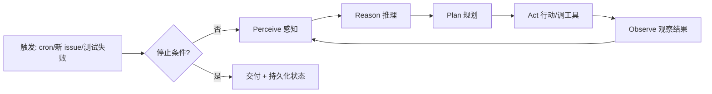
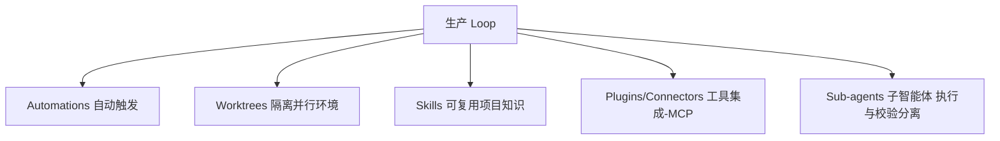

# Loop Engineering 循环工程

> [!abstract] 摘要
> Loop Engineering 是 2026 年 Agent 领域的核心范式转移：**工程对象从"写好一个 prompt"升级为"设计、调优、拥有 agent 持续运行的循环本身"**。其本质是被一句话点破的——*"一个带工具的 while 循环"*（Braintrust：The canonical agent architecture: A while loop with tools）。本文覆盖演进脉络、ReAct 标准循环、生产循环的五大可组合部件、12-Factor Agents 的"Own your control flow"、10 大设计模式、云原生类比、可观测性/成本/安全控制、失败模式目录与分阶段上线策略。

---

## 一、概念来由：prompt → context → harness → loop

Loop Engineering 是三年堆叠出的"最新一层"，每层包裹而非取代下一层：

| 层 | 时期 | 关注点 |
|---|---|---|
| **Prompt Engineering** | 2022–2024 | 措辞，从单次调用中"哄"出好回答 |
| **Context Engineering** | 2025 中（Karpathy 命名） | 往上下文窗口里精准填入"对的信息" |
| **Harness Engineering** | 2025 | 单次运行外的脚手架：工具、验证、上下文管线（如"Token Billionaires"日烧十亿 token 无人工 review） |
| **Loop Engineering** | 2026 | 比 harness 再高一层：发现工作、派发、按 rubric 验证、把状态持久化到窗口外、决定是否继续或停止 |

**关键区别**：harness 装备"一次运行"；**loop 按节奏不断戳 agent 并自我喂食**。人从"操作者"变为"系统设计者"——从打字 prompt 转为架构那个会打字prompt 的系统。

> Addy Osmani 原文（2026-06-07）一句话：**"Build the loop. But build it like someone who intends to stay the engineer, not just the person who presses go."**（自动化程度越高，需要的工程判断力越强。）

## 二、本质：Agent Loop = "一个带工具的 while 循环"

最极简的 loop 是 Geoffrey Huntley 的 "Ralph"——一个 bash 一行：`while :; do cat PROMPT.md | claude-code ; done`。其诀窍是**每次迭代重启全新上下文窗口、只跑一个任务、故意丢弃累积状态**——"有目的地遗忘"反而让循环更可靠。

## 三、标准循环：ReAct（五大阶段）

ReAct（Reason + Act，2022 论文）是几乎所有主流实验室（OpenAI / Anthropic / Google / Microsoft）收敛到的核心循环架构：

- **Perceive** 感知 → **Reason** 推理 → **Plan** 规划 → **Act** 行动 → **Observe** 观察
- 每轮 feeding into next，直到任务完成或停止条件触发。
- 这是本列表一切模式的地基。

## 四、生产循环的五大可组合部件（Osmani 的"零件表"）

1. **Automations**：定时/事件触发发现工作（cron tick、新 issue、失败测试），无需人在位即 kick off 一次运行。
2. **Worktrees**：隔离的并行执行环境，多个 agent 同时工作而不在同一文件上冲突。
3. **Skills**：按需加载的、可复用的项目知识，避免每轮重新推导。
4. **Plugins / Connectors**：通常通过 **MCP** 接入真实工具与外部系统。
5. **Sub-agents**：大目标分解；**关键点是把"干活的 agent"与"检查的 agent"分离**。

> 贯穿五者的主线是**控制（control）**。

## 五、12-Factor Agents：Factor 8 — Own your control flow

Dex Horthy 的 12-Factor Agents 框架（GitHub 2.3 万+ stars），最被引用的原则 Factor 8 提前一年说清了整个 loop 工程论点：**不要把一个工具包和模糊目标丢给模型然后祈祷；亲手一步步工程化你的循环，直到它到达你定义的"完成"状态。**

## 六、10 大设计模式（三层）

| 层 | 模式 | 要点 |
|---|---|---|
| **基础 (1-4)** | 1. ReAct Loop | 五大阶段，所有实验室收敛的核心 |
| | 2. Reflection Loop | 生成→自我批评→直到通过自评估；局限：验证者即自身 |
| | 3. Tool Use Loop | 调外部 API/工具取训练数据外信息；最成熟的生产模式 |
| | 4. Prompt Chaining | 上一次 LLM 输出是下一次输入，固定确定性序列；高可审计 |
| **实践 (5-7)** | 5. Ralph Loop | 持续循环直到**外部**验证器确认成功（非自我验证） |
| | 6. Critique / Adversarial | 生成者-评估者对抗（Anthropic workshop：planner-generator-evaluator，报告显著优于单 agent 自循环） |
| | 7. Multi-agent / Sub-agent | 目标分解 + 执行/校验角色分离 |
| **生产控制 (8-10)** | 8. Circuit Breaker 断路器 | 失败率超阈值即熔断，防止级联失控 |
| | 9. Bounded Execution 有界执行 | 限定迭代次数/时长/资源上限 |
| | 10. Human-in-the-loop Gate | 中高风险动作必须人批 |

> 大多数生产失败源于**跳过最后三层（生产控制）**。

## 七、云原生类比（为什么基础设施团队有天然优势）

| Loop 概念 | 云原生对应 | 作用 |
|---|---|---|
| Worktrees | K8s Namespace | 隔离共享 codebase 的 checkout，防 noisy-neighbour |
| 持久状态（markdown/issue 板） | etcd | 进程重启后可查的系统状态记录 |
| Quality Gate（"测试须过、review 须净"） | Admission Controller | 意图与执行间的策略强制层 |
| Sub-agent 分离（写代码 ≠ 审代码） | Service Mesh（mTLS 互验） | 认知角色分离，生产者不自助验证 |

Prometheus 可 scrape loop 指标；Grafana 可视化迭代次数/失败率/周期；PagerDuty 在 loop 卡住时告警。

## 八、可观测性与追踪（Observability & Traceability）

Loop 系统必须**天生可观测**：每次执行产出结构化 trace，含 tool calls、决策、中间输出、验证结果。两大用途：
1. **单跑可审计**：重建系统行为。
2. **聚合训练数据**：跨运行检测失败/低效模式。

没有这层，loop 不透明、难调试；有了它，才可分析、可调试、可改进。

## 九、成本与资源控制

成本必须作为**一等设计约束**，而非运营后想。
- Sub-agent 架构带来**乘性成本**（每个 agent 独立 model + tool 消耗）。
- 显式 budget 约束；仅在高价值处用高成本验证；追踪"每完成任务的成本"。
- 否则系统看似成功却经济不可持续。

## 十、可靠性与安全控制

| 机制 | 作用 |
|---|---|
| **Stopping conditions** 停止条件 | 防无限精炼、无边际收益 |
| **Idempotency** 幂等 | 重复执行不产生不一致或复合副作用 |
| **Rollback** 回滚 | 从部分失败态恢复 |
| **Scoped changes** 范围受限 | 修改约束在预期边界内 |

共同定义 loop 在共享/生产环境可运行的**安全信封（safety envelope）**。

## 十一、失败模式目录（设计透镜，非排错清单）

| 失败模式 | 现象 | 根因 | 修复 |
|---|---|---|---|
| **Thrashing** 抖动 | agent 反复改代码不收敛 | 目标不清/验证信号噪声/一次改太多 | 收紧停止条件、限定 diff、强化 grader |
| **Infinite loop** 死循环 | 永不停止 | 无"完成"的可验证定义 | 写具体可查的退出条件 |
| **Hallucinated progress** 伪进度 | 报成功但没达成 | 弱/自助验证 | 用独立 grader，优先确定性检查 |
| **Token blowout** 烧钱 | 成本失控 | 无界运行、过度用 sub-agent | budget 护栏，sub-agent 只用于值回票价处 |
| **Comprehension debt** 理解债 | 你不再懂现有代码 | loop 发货快过你阅读 | 读 loop 产出，把 review 带宽当真限制 |
| **Cognitive surrender** 认知投降 | 停止形成判断、照单全收 | 习惯 self-running loop | 保持参与 |

> 多数失败不神秘，可追溯到某个薄弱/缺失的构件：**停止条件不清、验证不足、状态管理差、权限过度、隔离弱、成本失控**。

## 十二、分阶段上线与安全边界

**三阶段 rollout**（所有 loop 模式推荐）：
- **L1（报告期）**：仅观察、仅报告、不动手
- **L2（辅助期）**：可提议修复，但不自动操作
- **L3（自助期）**：经 allowlist 验证后处理低风险操作

**安全体系四件套**：
- **Denylist**：loop 不能碰的路径（生产配置、认证凭证等）
- **Allowlist**：仅这些路径上的改动可 auto-merge
- **Human gate**：任何中以上风险操作必须等人批准
- **Kill switch**：每个 loop 必须有明确的停止条件文档

**辅助工具**（cobusgreyling/loop-engineering，210+ stars）：`loop-init`（脚手架+budget/run-log）、`loop-audit`（Loop Readiness Score）、`loop-cost`（按 pattern+cadence+level 估 token 成本，如 `daily-triage` L1 ≈ 50k tokens/run，建议日上限 100k）。

---

> [!note] 与既有知识网的关联
> - **执行安全最直接咬合点**：[[Agent Data Injection 数据注入攻击]] 与 [[Windows Copilot Actions 与 Agent Workspace 2026]]——微软 Project Perception 让 Defender 检查 agent loop 的**用户提示/工具调用/工具响应三段流量**，正是 loop 可观测性 + 安全边界的端点落地；loop 的"自助验证失败→需独立 grader"结论与之互证。
> - **LangGraph 即控制流图**：[[LangGraph 概览]] 的图状态机本质就是把 loop 的 control flow 显式建模为图——"Own your control flow"在 LangGraph 里是 Graph/State/Node/Edge + 条件边。
> - **人工闸门**：[[确认机制]] 对应本笔记的 Human gate / L1-L3 分阶段。
> - **隔离**：[[隔离执行]] 对应 Worktrees / Scoped changes / Denylist。
> - 与 AppIntent 情报的呼应：系统级意图执行总线同样需要"停止条件 + 幂等 + 回滚 + 范围受限"这套 loop 安全信封，否则端侧自动执行风险同理。

## 深化补充

**心智模型**：Loop 的"安全信封（停止/幂等/隔离/确认）"和你做系统级意图执行总线要守的边界是同一套——OS 层只是把这套信封从"开发者自觉"变成"系统强制"（见 [[应用层 Agent 框架 vs 系统级意图框架 对照]]）；凡是应用层靠自律的，到系统层都该变成不可绕过的默认。

**待解问题**
- [ ] loop 的 L1-L3 分阶段上线，能不能直接套用到系统意图能力的灰度发布策略？"仅报告→辅助→自助"对系统能力放量是否天然合适？
