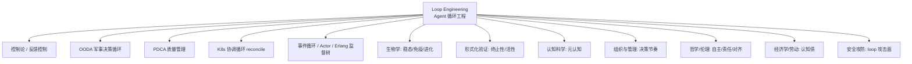

# Loop Engineering 跨学科发散谱系

> [!abstract] 摘要
> "Loop Engineering" 不是 2026 凭空冒出的新学科，而是**把"大循环"这个古老范式，第一次装上了 LLM 当大脑**。本文向外发散，把 agent loop 的每一个构件映射回它的跨学科先辈——控制论、OODA、PDCA、K8s 协调循环、事件循环/Actor、生物学稳态、形式化验证、元认知、组织决策、哲学伦理、劳动经济、安全攻防——并收敛出老智慧给 loop engineering 的 5 条启示。目的：让"循环工程"从一阵潮流，落回一张更大的知识网。

---

## 一、一句话核心洞察

> Loop engineering 真正的"新"只有两点：(1) 循环的**推理/决策**环节从确定性程序变成概率性 LLM；(2) 循环的**速度/成本**因 LLM 首次可被大规模无人值守运行。
> 其余——反馈、停止、校验、人在回路——全是老智慧。

拆开 agent loop，几乎每个构件都能在别的学科找到先辈：

---

## 二、逐支发散

### 1. 控制论与反馈控制（Norbert Wiener, 1948《Cybernetics》）
- **本质**：系统通过"感知输出 → 与期望比较 → 调节输入"的**负反馈**维持目标态（稳态）。
- **映射**：agent loop 的 Observe →（与 goal 比对）→ Act 就是负反馈环；stopping condition 即"误差归零即停"。
- **启示**：多数失败 loop 是**开环**（不比对实际输出与期望）。应补负反馈——可借鉴 PID 思想：proportional=当前偏差、integral=历史累积、derivative=趋势，给 loop 加"调节量"而非 blind 重试。

### 2. 军事决策 OODA 循环（John Boyd, 美军上校, 1950–70s）
- **本质**：Observe–Orient–Decide–Act，强调**节奏（tempo）**与"观察/判断"权重 > 行动。
- **映射**：ReAct 的 Perceive/Reason/Plan/Act/Observe 几乎是 OODiA 的 AI 翻版；Boyd 的 "Orient"（基于经验/文化/遗传的态势判断）≈ LLM 的 system prompt + 先验。
- **启示**：胜负在循环节奏——更快完成 OODA 的一方压制另一方。Agent loop 的延迟优化，本质是 OODA tempo 工程。

### 3. 质量管理 PDCA（Shewhart 提出, Deming 普及）
- **本质**：Plan–Do–Check–Act 持续改进环。Check=验证、Act=标准化/修正。
- **映射**：恰是 loop engineering 的 Reflection + 独立 grader。PDCA 的"**Check 独立于 Do**"正是 sub-agent 分离（执行≠校验）的质量管理源头。
- **启示**：loop 不应"Do 完就交付"，必须过 Check。大量 agent 失败是跳过了 C/A。

### 4. 分布式系统 / Kubernetes 协调循环（reconcile loop）
- **本质**：控制器持续比对"**期望态(desired state)**"与"**实际态(actual state)**"，驱动系统向期望收敛（reconciliation）。
- **映射**：**loop engineering 最直接的工程先祖**——K8s controller 本就是一个无人值守、带重试、带健康检查的 loop；Operator 模式把领域知识编码进 loop。
- **启示**：agent loop 可建模为"期望态(goal) vs 实际态(world)"的调和；**幂等、最终一致、背压(backpressure)** 等 K8s 概念直接适用。本库 MOC 里的云原生类比（worktree≈namespace 等）正源于此。

### 5. 软件演进：事件循环 / Actor 模型 / Erlang 监督树
- **事件循环**（Node/libuv、GUI run loop）：单线程持续 dispatch 事件——agent loop 的"调度骨架"。
- **Actor 模型**（Hewitt, 1973）：消息驱动、无共享状态、每 actor 自循环——**agent 即 actor**。
- **Erlang 监督树**（Armstrong 等）："let it crash" + 监督者重启子进程——对应 loop 的 rollback/重启/隔离。30 年高可用经验可直接搬。
- **启示**：agent 容错不必发明新轮子，Erlang "崩溃即重启"哲学 + 监督层级可直接映射到 sub-agent 树。

### 6. 生物学：稳态 / 免疫检测 / 进化
- **稳态 homeostasis**（Cannon）：生物靠负反馈维持内稳——agent 维持目标态同理。
- **免疫系统**：持续扫描"非我"→ 告警 → 响应，是**天然的 ADI 检测 loop**（对应 Defender 检查 agent loop 流量）。
- **进化循环**：变异–选择–遗传——迭代精炼 loop 是进化在软件里的微观重演；但进化**无显式停止条件**、靠环境淘汰，agent loop 必须有显式停止，否则退化为无限循环。
- **关联**：[[Agent Data Injection 数据注入攻击]]（免疫类比：区分自我/非我数据）。

### 7. 形式化方法与验证：循环的终止性与活性
- **本质**：证明"这个循环会不会停"（termination/**liveness**）与"会不会做错"（**safety**）。Alpern–Schneider 的 safety/liveness 划分是经典框架。
- **映射**：loop engineering 的 stopping condition = **liveness 保证**；隔离/沙盒 = **safety 不变式(invariant)**。
- **启示**：生产 loop 应把"停止条件"当**可证明的终止性**对待，而非模糊的"差不多就行"。可借鉴 model checking 思路枚举失败路径。

### 8. 认知科学：元认知与反思
- **本质**：metacognition（Flavell, 1979）= "对思考的思考"。Reflection loop 即元认知的程序化。
- **映射**：agent 的 self-critique = 元认知监控；但 LLM 元认知能力有限 → 印证"self-administered verification 弱"的失败模式，需外部/独立验证。
- **启示**：把"知道自己不知道"做成 loop 的一等能力（uncertainty flag → 转人工），而非硬撑到底。

### 9. 组织与管理：决策节奏与社会技术系统
- OODA/PDCA 本是组织决策方法论；agent loop 是把"组织决策循环"压缩进单进程。
- **映射**：multi-loop orchestration = 组织内多团队并行协作的微观化；冲突解决/调度本就是管理问题。
- **启示**："谁审计一个没人在里面的 loop"= 组织治理问题；需要类似**内部审计**的 loop 监督机制。

### 10. 哲学与伦理：自主性、责任、对齐
- **自主性 vs 控制**：loop 越自治，人类越"退居设计师"——自由意志/代理责任的经典张力。
- **责任归属**：loop 出错造成损害，责任在开发者/运营者/模型方？"**认知投降(cognitive surrender)**"是伦理失守的前兆。
- **对齐**：loop 级 alignment = 让循环在无人监督时仍朝人类意图收敛（对应 stopping condition + 独立 grader + human gate）。
- **关联**：[[确认机制]]（伦理落地的 UX）、[[隔离执行]]。

### 11. 经济学与劳动：知识工作自动化与认知债
- **本质**：*"Build the loop. Stay the engineer."* —— 自动化挤出的不是体力，而是**判断带宽**。
- **映射**：comprehension debt / cognitive surrender 是劳动经济学视角——loop 产出的"理解成本"转移给人类 reviewer。
- **启示**：评估 loop 要算"人类 review 带宽"这笔隐性成本，否则表面省时、实则欠债。

### 12. 安全攻防：loop 作为新攻击面
- **本质**：无人值守循环 = 攻击者梦寐以求的"自动执行器"。
- **映射**：agent loop 的三段流量（提示/工具调用/响应）是新型可被注入/劫持的攻击面（Microsoft Project Perception 的出发点）。
- **红队 loop**：用对抗性 evaluator 持续尝试攻破主 loop（planner-generator-evaluator 里 evaluator 可转红队）。
- **关联**：[[Agent Data Injection 数据注入攻击]] ｜ [[Windows Copilot Actions 与 Agent Workspace 2026]]。

---

## 三、收敛：老智慧给 loop engineering 的 5 条启示

| # | 启示 | 源自 |
|---|---|---|
| 1 | **负反馈优先**：每次循环必须比对实际 vs 期望，拒绝开环盲试 | 控制论 |
| 2 | **停止条件可证明**：把终止当不变量，而非"差不多" | 形式化验证 |
| 3 | **Check 独立于 Do**：执行与校验角色强制分离 | PDCA / Erlang |
| 4 | **崩溃即重启**：用监督树而非试图永不崩溃 | Erlang 监督树 |
| 5 | **人在回路是责任/劳动刚需**：human gate 不是降级而是责任分配 | 组织/哲学/经济 |

---

## 四、关联知识网

- **本系列**：[[Loop Engineering 循环工程]]（概念总纲）｜ [[Loop Engineering 实战代码库]]（用户本期未采用，仅作索引）
- **系统/安全**：[[Agent Data Injection 数据注入攻击]] ｜ [[Windows Copilot Actions 与 Agent Workspace 2026]] ｜ [[确认机制]] ｜ [[隔离执行]] ｜ [[语义路由]]
- **跨框架**：[[LangGraph 概览]]（图即控制流）｜ [[应用层 Agent 框架 vs 系统级意图框架 对照]]
- **向外辐射的相关主题**（本库/可补）：[[OS-PM-系统AI Runtime vs 应用引擎]]（系统级仲裁与 loop 安全信封同源）、[[手机AI智能体知识库]]（端侧 agent 落地的现实约束）

> ⚠️ 历史年份/人物为公认常识性事实（Wiener 1948、Boyd 1950–70s、Shewhart/Deming PDCA、Hewitt Actor 1973、Cannon 稳态、Flavell 元认知 1979 等），具体引文与精确日期以原始文献为准；本文重点在"映射关系"而非考据。

## 深化补充

**心智模型**：经济学支里"自动化挤出的是判断带宽而非体力"这一条，正是你作为 PM 用 AI 写 PRD 时的真实风险——效率提升的同时，判断能力可能悄悄外包出去（呼应 [[PRD学习笔记]] 的 AI 辅助风险）；Loop 的 "cognitive surrender" 在 PRD 场景就是"不再复核 AI 初稿"。

**待解问题**
- [ ] 我怎么量化自己"认知投降"的程度——哪些判断我已经习惯性交给 AI 而不复核？能不能建一个自查清单？
