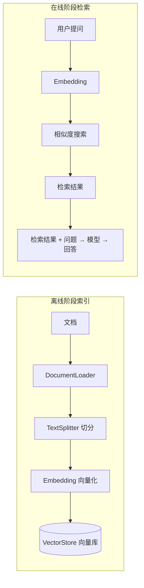
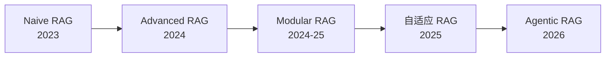
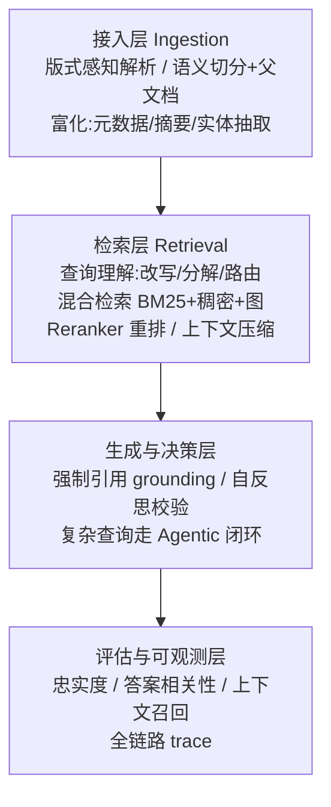

# RAG 检索增强生成（Retrieval-Augmented Generation）

> [!abstract] 摘要
> RAG 让 AI 能够基于你的私有文档回答问题，不需要微调模型——只需将文档向量化存储，Agent 就能检索相关内容来回答。核心价值：在**海量文档中精准找到最相关片段**，而不是让模型在长上下文中"大海捞针"。本文整合菜鸟教程 RAG 专页 + 2026 年 Advanced / Modular / Agentic RAG 演进资料，覆盖基础流程、Embedding、向量库、检索器，以及混合检索、重排序、GraphRAG、评估等进阶主题。

---

## 一、RAG 是什么 / 为什么需要

普通大模型只能回答训练数据中有内容的问题。私有文档（公司内部文档、个人笔记）模型"不知道"。RAG 解决此问题：

| 维度 | 纯 LLM | RAG |
|---|---|---|
| 知识时效性 | 训练数据截止 | 实时检索最新信息 |
| 领域知识 | 通用知识 | 企业私有知识 |
| 幻觉问题 | 可能编造信息 | 基于真实文档 |
| 可追溯性 | 无法追溯 | 可引用来源 |
| 成本 | 微调成本高 | 无需微调 |

**结论**：RAG 与微调解决不同问题——RAG 给模型"它不知道的事实"，微调改变模型"行为方式（语气/格式/领域推理）"。许多生产系统两者并用。

## 二、RAG 工作流程



- **离线阶段**：文档切分 → Embedding 转为向量 → 存入向量数据库
- **在线阶段**：用户提问 → 问题转向量 → 向量库相似搜索 → 检索内容作上下文 → 模型基于检索内容回答

## 三、环境准备（菜鸟教程版）

```bash
pip install langchain-deepseek langchain-chroma chromadb
```

| 包 | 用途 |
|---|---|
| `langchain-deepseek` | 提供 OpenAI Embedding 模型（兼容接口） |
| `langchain-chroma` | Chroma 向量数据库的 LangChain 集成 |
| `chromadb` | Chroma 向量数据库（轻量，适合入门） |

## 四、Embedding 模型初始化

### OpenAI Embedding

```python
from dotenv import load_dotenv
load_dotenv()

from langchain_openai import OpenAIEmbeddings

# text-embedding-3-small 输出 1536 维向量
embeddings = OpenAIEmbeddings(model="text-embedding-3-small")

text = "菜鸟教程 RUNOOB 是一个编程学习平台"
vector = embeddings.embed_query(text)

print(f"文本: {text}")
print(f"向量维度: {len(vector)}")      # 1536
print(f"向量前 5 个值: {vector[:5]}")
```

### 阿里百炼（DashScope）Embedding（无 OpenAI key 时）

> 百炼 Embedding 接口兼容 OpenAI 规范，可直接用 `OpenAIEmbeddings` 并把 `base_url` 指向百炼端点。`.env` 需配置 `DASHSCOPE_API_KEY="sk-xxx"`。

```python
import os
from dotenv import load_dotenv
load_dotenv()

from langchain_openai import OpenAIEmbeddings

# 两个关键参数不能少：
# - check_embedding_ctx_length=False：百炼只接受原始字符串，不关会报
#   "contents is neither str nor list of str"
# - chunk_size=10：百炼单次最多 10 条，OpenAIEmbeddings 默认 1000 会超限
embeddings = OpenAIEmbeddings(
    model="text-embedding-v4",                 # 默认 1024 维
    api_key=os.getenv("DASHSCOPE_API_KEY"),
    base_url="https://dashscope.aliyuncs.com/compatible-mode/v1",
    check_embedding_ctx_length=False,
    chunk_size=10,
)
text = "菜鸟教程 RUNOOB 是一个编程学习平台"
vector = embeddings.embed_query(text)
print(f"向量维度: {len(vector)}")
```

## 五、创建向量存储 + 语义检索

```python
from langchain_openai import OpenAIEmbeddings
from langchain_chroma import Chroma

embeddings = OpenAIEmbeddings(model="text-embedding-3-small")

# 数据持久化到本地目录
vector_store = Chroma(
    collection_name="runoob_docs",
    embedding_function=embeddings,
    persist_directory="./chroma_db",
)

texts = [
    "菜鸟教程（RUNOOB）是一个免费的编程学习网站，提供 HTML、CSS、JavaScript、Python 等教程。",
    "Python3 基础教程共 30 章，适合零基础入门，包含环境搭建、语法基础、面向对象等内容。",
    "HTML 基础教程共 25 章，覆盖 HTML 标签、表单、多媒体等基础知识。",
]
vector_store.add_texts(texts)
print(f"已添加 {len(texts)} 个文档到向量存储")

# 语义检索——按语义相似度而非关键词匹配排序
results = vector_store.similarity_search(
    "我想学 Python，有什么教程推荐？",
    k=2,
)
for i, doc in enumerate(results):
    print(f"\n结果 {i+1}:")
    print(f"  内容: {doc.page_content}")
    print(f"  元数据: {doc.metadata}")
```

> 注意：第一个结果虽含 "Python" 关键词，但排序依据**语义相似度**而非关键词匹配——这是向量检索的优势。

## 六、创建 Retriever 检索器

Retriever 是 Vector Store 的标准化接口：

```python
retriever = vector_store.as_retriever(
    search_type="similarity",
    search_kwargs={"k": 3},
)
docs = retriever.invoke("Python 学习路线")
for doc in docs:
    print(f"- {doc.page_content[:60]}...")
```

---

# 进阶：2026 年 Advanced / Agentic RAG

> 朴素 RAG（Naive RAG）：单次检索 → 拼上下文 → 生成。2026 年已演进为包含检索前/后优化、模块化、可 Agent 化的工程体系。

## 七、RAG 技术演进五阶段



1. **Naive RAG**：切片→向量化→存库→检索 Top-K→生成。问题：切片粒度难兼顾、相关性不精准、无多轮记忆。
2. **Advanced RAG**：引入检索前/后优化（查询重写、HyDE、混合检索、语义分块、重排序、上下文压缩）。企业问答召回率提升 30–50%。
3. **Modular RAG**：模块化，每步可插拔（查询理解→策略路由→多源检索→聚合→生成），支持向量库/知识图谱/关系库/搜索引擎多后端。
4. **自适应 RAG**：模型自主判断"是否需要检索"——简单问题直接答，需实时数据才触发检索，需多步推理则迭代检索。
5. **Agentic RAG（2026 主流）**：RAG 成为 Agent 的记忆模块——主动检索、迭代精炼（检索→评估→再检索）、多源异构、图检索增强。

## 八、Advanced RAG 四层优化

| 层 | 技术 |
|---|---|
| **Chunking（切分）** | 递归分块（带重叠）、语义分块（按 embedding 相似度边界）、父子检索（检索子块、返回父块） |
| **Retrieval（检索）** | 混合检索（稠密向量 + 稀疏 BM25）、RRF 倒数排名融合、向量库选型（Chroma/Pinecone/Milvus/Azure AI Search） |
| **Post-Retrieval（检索后）** | 重排序器（Cross-encoder 重打分）、查询重写、HyDE（先写假答案再嵌入检索）、多查询检索、上下文压缩 |
| **Evaluation（评估）** | RAGAS 指标（上下文相关性、答案相关性、忠实度）、黄金数据集回归测试 |

**朴素 vs 进阶对比**：
- 检索次数：朴素 1 次 → 进阶 多次并行 + 重排
- 查询处理：朴素 直接嵌入 → 进阶 查询重写/HyDE/多查询
- 检索类型：朴素 仅向量 → 进阶 混合（向量+BM25+RRF）
- 排序：朴素 原始相似度 → 进阶 Cross-encoder 重排

## 九、五大新范式（2026）

1. **Self-RAG（自我反思检索）**：生成中动态判断——`[Retrieve]` 是否需要检索、`[IsRel]` 结果是否相关、`[IsSup]` 内容是否有根据。幻觉率比普通 RAG 降低约 40%。
2. **GraphRAG（图检索增强）**：文档解析为知识图谱（实体-关系），支持多跳推理（"A 的老板的老板是谁？"）与社区摘要。适用：法律文档、医疗知识库、代码库分析。微软 2024 年开源实现；企业结构化数据结合分类法可将检索精度推至 99%+（视场景）。
3. **混合检索 2.0**：BM25+向量 + 结构化数据检索 + 时序过滤 + 跨模态（文搜图/视频）。
4. **RAG-as-Memory**：RAG 作为 Agent 长期记忆——对话结束写关键信息入库，下次检索历史记忆。
5. **RAG + MCP**：RAG 像工具一样被 Agent 调用：

```python
result = await mcp_client.call_tool(
    "knowledge_search",
    {"query": "用户的问题", "top_k": 5}
)
```

## 十、生产级 RAG 架构（四层）



- **接入层**：版式感知解析（尤其 PDF）；切分用"语义切块+父文档"；向量库选支持混合检索与元数据的（pgvector、Milvus、Elasticsearch）。
- **检索层**：查询理解先行；混合检索 + Reranker 已是 modern RAG 及格线。
- **生成层**：强制引用 + 自反思；复杂查询走 Agentic 闭环，但用护栏约束轮数和数据源。
- **评估层**：生产系统与玩具 demo 的分水岭，没有这层出问题都无从修起。

## 十一、关键工程决策

**1. 向量数据库选型**

| 规模 | 推荐 | 理由 |
|---|---|---|
| < 100 万文档 | Chroma / Qdrant | 轻量易部署 |
| 100 万–1 亿 | Milvus / Weaviate | 高并发、分布式 |
| > 1 亿 | Elasticsearch + 向量插件 | 成熟运维体系 |

（PostgreSQL 用户可选 pgvector，避免再引入托管服务）

**2. 切块大小经验法则**
- 问答场景：256–512 tokens/块，重叠约 50 tokens
- 摘要场景：1024–2048 tokens/块
- 代码场景：按函数/类切分，不按字符
- 2026 推荐范围常取 chunk_size=512、overlap=128（结构化文档用 `RecursiveCharacterTextSplitter`）

**3. 要不要 Reranker？** 要，但权衡延迟——小应用用 Cohere Rerank API，大应用部署本地 BGE-Reranker / bce-reranker。延迟增加约 100–200ms，精度提升 15–25%。

**4. Embedding 模型**：OpenAI `text-embedding-3-large`、Cohere `embed-v4`、开源 `nomic-embed-text`（自托管）；按隐私要求与能否外发数据选型。

## 十二、评估指标（RAGAS 三件套）

- **Context Relevance（上下文相关性）**：检索到的片段与问题多相关？
- **Faithfulness（答案忠实度）**：生成的答案是否基于检索内容？
- **Answer Relevance（答案相关性）**：回答是否切中问题？
- 推荐框架：RAGAS、TruLens、DeepEval

## 十三、常见坑

1. **过度检索**：Top-K 设太大（如 K=20），模型在片段中迷失，反而答不好。从 K=3 起步逐步调优。
2. **忽略元数据过滤**：相似度高 ≠ 答案正确。加时间戳、来源权重等元数据过滤可大幅提升精准度。
3. **文档解析质量**：PDF/Word 解析常有乱码、表格错位。用 marker、Docling 等专业解析工具，而非直接 pdfplumber。

---

> [!note] 延伸关联
> - 编排层见 [[LangChain 概览]] 与 [[LangGraph 概览]]；RAG 常作为两者流水线的一环（[[LangChain 实战代码库]] 含 RAG 片段）。
> - 检索内容被当作"可信上下文"注入 Prompt，本身是 [[Agent Data Injection 数据注入攻击]] 的潜在靶面——注意检索结果的来源可信度。
> - 多智能体 / Agent 化检索与 [[确认机制]] [[隔离执行]] 主题相关；知识图谱检索与你的 [[语义路由]] 思路可对照。
> - 与既有笔记 [[AppIntent 每日情报 2026-08-04]] 中"来源分级防注入"结论呼应：RAG 检索内容也应做来源标注与可信度分级。

## 深化补充

**心智模型**：RAG 把"检索结果当可信上下文注入"这一步，本身就是 ADI 的靶面——所以端侧意图框架一旦接入 RAG，检索内容必须做来源分级（呼应 [[Agent Data Injection 数据注入攻击]] 与你的"数据溯源分级"），否则一句被污染的检索结果会直接驱动一次真实执行。

**待解问题**
- [ ] 端侧 RAG 的"隐私数据不出设备"和"检索内容可能被注入"两个诉求，怎么在同一条流水线里同时守住？
