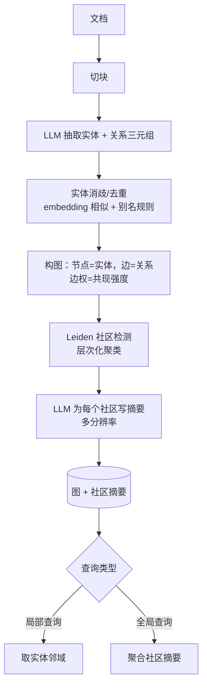

# RAG 详细学习笔记

> [!abstract] 学习定位
> **本篇是 [[RAG 检索增强生成]]（入门篇）的进阶 companion。**
> 入门篇讲透了「是什么 / 为什么 / 基础五步流程 / Chroma + Embedding 起手代码」，本篇**不重复那些**。
> 这里只走一条线：**每一步的机制到底怎么运作，以及每个参数背后你在拿什么换什么。**
> 全文 own-words 综合，配表格与少量进阶代码。**所有带数字的结论都标了来源**，未一手核实的一律进文末「⚠️ 待核实清单」。

---

## 一、一句话心智模型

**RAG 不是「让模型查资料」，是「在 token 预算内做一次有损压缩」。**

你的知识库有 1 亿 token，模型窗口只放得下 8000。RAG 干的事就是：**用极便宜的近似手段，从 1 亿里挑出那 8000**。整条流水线上的每一个组件，都是这个压缩过程中的一次**信息丢弃决策**：

| 阶段 | 丢掉了什么 | 换来了什么 |
|---|---|---|
| **切分** | 跨块的上下文关联 | 检索粒度变细，命中更精准 |
| **Embedding** | 一整段话被压成一个点 | 一次向量比较就能算相似度 |
| **ANN 索引** | 精确的最近邻保证 | 亚线性查询延迟 |
| **量化** | 向量的数值精度 | 内存/存储降一个量级 |
| **Top-K 截断** | 排在 K 名之后的一切 | 塞得进上下文窗口 |
| **重排序** | （不丢，反而找回一部分） | 用延迟和成本换精度 |

> 所以调 RAG 的本质不是"加技术"，而是**判断你的失败案例是在哪一步被丢掉的**。
> Context Recall 掉了 → 东西在切分或召回阶段就丢了；Context Precision 掉了 → 东西召回到了但排不上去；Faithfulness 掉了 → 东西都在，是生成环节没用好。**先定位丢在哪一层，再决定加哪个组件。**

还有一句必须写在最前面的：

> **检索结果一进 prompt，就成了模型眼里的「事实」。** 这一步是 [[Agent Data Injection 数据注入攻击]] 的标准靶面——详见第九节 9.5。

---

## 二、Embedding 深潜

### 2.1 向量到底是什么

Embedding 模型是一个**把语义映射到几何**的函数：`text → R^d`。训练目标（对比学习）只保证一件事——**语义相近的文本，向量方向相近**。

关键推论，很多人绕不过来：

- **向量的绝对坐标没有意义**，只有**相对关系**有意义。所以不同模型产出的向量**绝不可混用**，哪怕维度相同。
- 它学到的"相似"，是**训练数据定义的相似**。用通用语料训练的模型，在你的领域里可能认为"退款政策"和"退货政策"几乎一样——而在你的业务里这是两回事。**领域微调的价值就在这**。

### 2.2 三种相似度度量：其实只有一种

| 度量 | 公式 | 关注什么 |
|---|---|---|
| **点积 Dot** | `a·b` | 方向 **+ 模长** |
| **余弦 Cosine** | `a·b / (‖a‖‖b‖)` | **只关注方向** |
| **欧氏 L2** | `‖a-b‖` | 空间绝对距离 |

**关键事实（自己推一遍就懂）**：当向量都做了 L2 归一化（`‖a‖=‖b‖=1`）时：

```
cosine(a,b) = a·b                    # 余弦退化成点积
‖a-b‖² = 2 - 2·(a·b)                 # L2 与余弦单调等价
```

→ **归一化之后，三种度量给出的排序完全一致。** 大多数现代 embedding 模型默认输出 L2-normalised 向量，正是为了让最便宜的点积就能当余弦用。

**什么时候三者不等价**：模型**没做**归一化时。此时点积会偏向长文本（模长大），余弦不会。**踩坑点**：向量库里配的度量（`cosine`/`ip`/`l2`）和模型的归一化状态不匹配，检索质量会莫名其妙地烂，而且不报错。

### 2.3 维度权衡与 Matryoshka（MRL）

维度越高 ≠ 越好，它是一条**明确的成本曲线**：

| 维度 | 存储（1000 万条 float32） | 影响 |
|---|---|---|
| 3072 | ~123 GB | 质量上限最高，索引又大又慢 |
| 1024 | ~41 GB | 常见甜点 |
| 768 | ~31 GB | 端侧/大规模的实用档 |
| 256 | ~10 GB | 明显有损，但常常够用 |

（算法：`条数 × 维度 × 4 字节`，这是纯算术，不是 benchmark）

**Matryoshka Representation Learning（MRL，套娃嵌入）** 改变了这条曲线的用法：模型在训练时就约束**前 N 维自己也构成一个合法嵌入**。于是你可以**直接截断向量**——取前 256 维——而不需要换模型、不需要重训。

> 这是我认为 2024–2026 年 embedding 侧最实用的一个工程杠杆：**维度从"选型时的一次性决策"变成"部署时的可调旋钮"**，甚至可以做**两段式检索**——用 128 维粗筛百万级候选，再用完整维度精算 Top-100。

⚠️ MRL 截断的质量损失，各方口径不一（有说 <1%，有说 2–3%），且强依赖语料与任务 → **必须在自己的数据上实测**，见待核实清单。

**进阶代码：MRL 截断的正确姿势（sentence-transformers）**

```python
import numpy as np
from sentence_transformers import SentenceTransformer

model = SentenceTransformer("BAAI/bge-m3")   # 换成你实际选型的模型

# ① 很多检索模型对 query 和 document 用不同的前缀/指令，用错会明显掉点
#    非对称检索（短 query 找长 doc）几乎都需要区分，务必看模型卡
queries = ["HNSW 的 efSearch 怎么调？"]
docs = ["efSearch 控制查询时候选队列的大小，调大召回上升、延迟上升……"]

q_vec = model.encode(queries, prompt_name="query", normalize_embeddings=True)
d_vec = model.encode(docs, normalize_embeddings=True, batch_size=64)

# ② MRL 截断：取前 N 维后【必须重新归一化】——截断会破坏原来的单位长度
def mrl_truncate(vecs: np.ndarray, dim: int) -> np.ndarray:
    v = vecs[:, :dim]
    return v / np.linalg.norm(v, axis=1, keepdims=True)

q256, d256 = mrl_truncate(q_vec, 256), mrl_truncate(d_vec, 256)

# ③ 归一化之后，余弦 == 点积，直接矩阵乘法就是相似度矩阵
print("full :", float(q_vec @ d_vec.T))
print("256d :", float(q256 @ d256.T))   # 对比两档的分差，就是你自己的 MRL 实测
```

> **三个高频坑**：① 忘了 `prompt_name`/指令前缀（非对称检索会明显掉点）；② 截断后忘了重新归一化；③ 建库和查询用了**不同的归一化设置**——这个不报错，只是悄悄变烂。

### 2.4 多语言与中文

- 多语言模型把所有语言塞进**同一个向量空间**，好处是天然支持跨语言检索（中文问句命中英文文档）。
- 代价是**空间被摊薄**：同参数量下，多语言模型在单语任务上通常不如专精模型。
- **中文的额外坑**：分词粒度、繁简、中英混排（"把 AppFunctions 集成到 App 里"）。中英混排句子在纯中文语料训练的模型上表现常常很差。

### 2.5 Late-interaction（ColBERT）：单向量瓶颈的解法

**单向量瓶颈**：把一整段话压成一个点，多主题段落会被"平均成一团糊"，一个依赖具体术语的查询可能输给一个只是"大致相关"的段落。

**ColBERT 的做法**（Stanford，SIGIR 2020）：**不压缩**——每个 token 存一个向量。查询时对每个 query token 在所有 doc token 里找最相似的那个（**MaxSim**），再求和：

```
score(q, d) = Σ_i  max_j  ( q_i · d_j )
```

"late"指的是：query 和 doc **各自独立编码**（所以文档能预先算好），只在**打分那一刻**才交互。这是它区别于 cross-encoder 的关键——cross-encoder 必须把 query 和 doc 拼一起过一遍模型。

| | 编码 | 交互 | 精度 | 速度 | 存储 |
|---|---|---|---|---|---|
| BM25 | 无 | 词法 | 低-中 | 最快 | 小 |
| 单向量稠密 | 分离 | 无 | 中 | 快 | 小 |
| **ColBERT** | **分离（可预算）** | **late / MaxSim** | **高** | **中** | **大（每 token 一个向量）** |
| Cross-encoder | 联合 | 全交互 | 最高 | 最慢 | 不建索引 |

**代价与缓解**：ColBERTv2（NAACL 2022）用**残差压缩**——每个 token 存"最近质心 ID + 低比特残差"——把每向量存储从约 256 字节降到约 20–36 字节；PLAID 进一步用同样的残差做剪枝提速。⚠️ 具体压缩比与提速倍数来自二手技术博客转述，未逐一核对原论文，见待核实清单。

**2026 的实际状态（⚠️ 均为二手源）**：多向量索引开始成为主流向量库的一等公民（Qdrant、LanceDB 等）；late-interaction 扩到了视觉文档（ColPali，ICLR 2025）与多模态（ColQwen 系列）。

> **我的工程判断**：对绝大多数团队，**ColBERT 的性价比不如"混合检索 + 商用 reranker"**——后者拿到大部分的 token 级匹配收益，却不用自己托管 token 级索引。ColBERT 值得上的场景只有一个：**检索质量本身就是你的产品**。

---

## 三、切分策略深潜

### 3.1 切分是整条流水线里最被低估的一步

因为它决定了**检索的原子单位**。切错了，后面所有环节都在为一个错误的粒度做优化。

| 策略 | 机制 | 适合 | 主要问题 |
|---|---|---|---|
| **固定长度** | 按字符/token 硬切 | 快速原型 | 会从句子中间劈开 |
| **递归切分** | 按 `\n\n → \n → 。 → 空格` 逐级降级 | 通用默认 | 不理解语义边界 |
| **语义切分** | 相邻句子 embedding 相似度掉到阈值以下就断开 | 主题混杂的长文 | 慢（要给每句算向量）、阈值难调 |
| **结构化切分** | 按 Markdown 标题 / 代码 AST / 表格行 | 文档、代码、表格 | 需要按格式定制 |
| **父子 / small-to-big** | 检索小块，喂给 LLM 大块 | **大多数生产系统** | 索引层要多存一层映射 |

### 3.2 结构化切分：按文档"本来的样子"切

这是最容易被跳过、收益却最直接的一条。文档自己就带着结构，别扔掉：

- **Markdown**：按 `##` 标题层级切，并把**完整标题路径写进 metadata**（`一级标题 > 二级标题 > 三级标题`）。这样检索到的块自带定位信息。
- **代码**：按函数/类切，不按字符。一个被从中间切断的函数，向量上什么都不是。
- **表格**：整张表当一块，且**每一行都要重复表头**——否则单独一行 `| 2025-03-26 | Streamable HTTP |` 出现在检索结果里，模型完全不知道这两列是什么。
- **PDF**：先做版式感知解析再切。这一步的质量上限，就是整个 RAG 的质量上限。

### 3.3 父子检索 / small-to-big：解耦"检索粒度"和"阅读粒度"

**核心洞察：让检索器看的块，和让 LLM 读的块，不必是同一个块。**

```
索引层：把文档切成 200 token 的小块 → 向量化 → 存库（检索精准）
返回层：命中小块 → 通过 parent_id 取出它所属的 1500 token 父块 → 喂给 LLM（上下文完整）
```

这解决了那个最经典的两难：小块检索准但缺上下文，大块上下文全但检索糊。**它不是折中，是把两个目标拆开各自优化。**

变体：
- **父文档检索**：父 = 整篇文档
- **句子窗口检索**：索引单句，返回该句前后各 N 句
- **摘要索引**：索引 LLM 生成的摘要，返回原文

**进阶代码：用 Chroma 手搓父子检索（不依赖框架封装，看清机制）**

```python
import chromadb
from chromadb.utils import embedding_functions

client = chromadb.PersistentClient(path="./chroma_kb")
ef = embedding_functions.SentenceTransformerEmbeddingFunction("BAAI/bge-m3")

# 只给【子块】建向量索引；父块存本地 dict / KV / 另一个 collection 即可，不必向量化
child = client.get_or_create_collection(
    name="kb_v1_bgem3_1024",            # ← 索引名带上模型与维度，见第 9.4 节版本化
    embedding_function=ef,
    metadata={"hnsw:space": "cosine"},  # 度量必须和模型的归一化状态对齐（见 2.2）
)
parent_store: dict[str, str] = {}

def index_document(doc_id: str, parents: list[str], split_child):
    for pi, ptext in enumerate(parents):
        pid = f"{doc_id}::p{pi}"
        parent_store[pid] = ptext
        children = split_child(ptext)                    # 父块内再切成小块
        child.add(
            ids=[f"{pid}::c{ci}" for ci in range(len(children))],
            documents=children,
            metadatas=[{
                "parent_id": pid,
                "doc_id": doc_id,
                "heading_path": "MCP > 授权 > OAuth",     # 结构化切分留下的定位信息
                "source_type": "official_doc",           # ← 第 9.5 节的来源分级字段
                "trust_level": "internal",               # ← 单调棘轮：只升不降
                "updated_at": "2026-07-28",              # ← 新鲜度过滤依据
            } for _ in children],
        )

def retrieve(query: str, k: int = 20, min_trust: list[str] | None = None) -> list[str]:
    res = child.query(
        query_texts=[query],
        n_results=k,
        # 元数据过滤下推到索引层：无权/过期/低可信的内容【从一开始就不在候选集里】
        where={"$and": [
            {"source_type": {"$in": min_trust or ["official_doc"]}},
            {"updated_at": {"$gte": "2026-01-01"}},
        ]},
    )
    # 命中子块 → 去重回溯父块（保序，父块只取一次）
    seen, out = set(), []
    for md in res["metadatas"][0]:
        pid = md["parent_id"]
        if pid not in seen:
            seen.add(pid)
            out.append(parent_store[pid])
    return out
```

> 注意这段里**元数据同时承担了三个角色**：检索粒度映射（`parent_id`）、质量过滤（`updated_at`）、安全分级（`source_type` / `trust_level`）。**第三个角色正是 9.5 说的 ADI 靶面**——这些字段一旦可被第三方伪造，过滤就形同虚设。

### 3.4 Contextual Retrieval：给每个块补回它的身份（一手源，强烈推荐）

来源：**Anthropic《Introducing Contextual Retrieval》**（anthropic.com/engineering/contextual-retrieval）。

**问题**：一个块写着 `"The company's revenue grew by 3% over the previous quarter."`——哪家公司？哪个季度？用户问 "ACME Corp 2023 Q2 营收增长"，这个块的向量根本不在附近。

**做法**：入库前，用 LLM 给每个块生成一段 50–100 token 的「定位说明」（这块出自哪份文档、哪一节、讲的是谁），**拼在块前面再做嵌入和建 BM25 索引**。

**官方实测（failure@20，九个语料）**：

| 配置 | 检索失败率 | 相对降幅 |
|---|---|---|
| 纯 embedding（基线） | 5.7% | — |
| + Contextual Embeddings | 3.7% | **35%** |
| + Contextual BM25（混合） | 2.9% | **49%** |
| + Reranking | 1.9% | **67%** |

**成本**：借助 prompt caching（整份文档缓存、逐块复用），官方口径约 **$1.02 / 百万文档 token**。没有缓存的话会高一到两个量级——因为每生成一个块的上下文都要重读整篇文档。

> **另一条官方结论值得单独记**：如果知识库**小于 20 万 token（约 500 页）**，直接把整个知识库塞进 prompt 就行，**根本不需要 RAG**。配合 prompt caching，官方称延迟降低 >2×、成本最多降 90%。
> → **RAG 是规模问题的解，不是默认架构。** 上 RAG 之前先算一下你的语料到底有多大。

⚠️ 上表中 35% 那一行与 "+BM25 单独 17.5%" 的中间数据来自二手转述，49% / 67% / $1.02 / 20 万 token 三项在 Anthropic 原文中直接可见。

### 3.5 chunk size 的三角权衡

块大小同时被三方拉扯，**没有普适最优解**：

```
        检索粒度（越小越准）
              ▲
              │
              │
   LLM 上下文预算 ◄──┴──► 语义完整性（越大越全）
   （越小塞得越多）
```

| 你的场景 | 倾向 | 理由 |
|---|---|---|
| 事实问答（"XX 是多少"） | **小块** | 答案就在一两句里，大块全是噪声 |
| 需要推理/综合 | **大块 或 父子** | 论证链被切断就废了 |
| 代码检索 | **按结构** | 函数是天然原子单位 |
| 长文摘要 | **大块** | 本来就要全局信息 |

**重叠（overlap）的真实作用**：只是**降低"关键句正好被切在边界上"的概率**，是个廉价保险，不是万灵药。经验上取块长的 10–20%。**注意重叠会等比例放大索引体积和嵌入成本**——50% 重叠意味着你的库大了一倍、账单翻了一倍。

> **反直觉的一条**：与其花两周调 chunk size，不如**先上父子检索**——它直接让 chunk size 这个参数变得不那么关键。**能消除参数的架构，胜过调好的参数。**

---

## 四、索引结构（ANN / 量化 / 混合）

### 4.1 为什么必须用 ANN（近似最近邻）

暴力检索（flat）要把 query 和**每一条**向量都算一遍。1000 万条 × 1024 维，每次查询就是上百亿次浮点运算。**它是 O(N) 的，且没有任何优化空间。**

ANN 的交易很明确：**放弃"保证找到真正的 Top-K"，换取亚线性查询时间。** 于是引入了一个新指标——**召回率（recall@K）**：ANN 找到的 Top-K 里，有多大比例是真正的 Top-K。

> 这是很多人第一次真正理解"向量库调参"在调什么：**你在调的是"准确度 vs 延迟"的兑换比例，而不是在调"性能"。**

### 4.2 三类索引

| 索引 | 机制 | 查询复杂度 | 建库成本 | 关键参数 |
|---|---|---|---|---|
| **Flat** | 暴力全比 | O(N) | 0 | — |
| **IVF** | 先把空间聚成 `nlist` 个簇，查询只搜最近的 `nprobe` 个簇 | ~O(N·nprobe/nlist) | 需要训练聚类 | `nlist` / `nprobe` |
| **HNSW** | 多层可导航小世界图，从稀疏层粗定位、逐层下钻 | ~O(log N) | 高（建图慢、吃内存） | `M` / `efConstruction` / `efSearch` |

**调参的直觉**：
- IVF：`nprobe` 调大 → 搜更多簇 → 召回↑ 延迟↑。`nprobe = nlist` 就退化成 flat。
- HNSW：`M` 是每个节点的连接数（影响图的稠密度和内存）；`efSearch` 是查询时候选队列大小，**这是线上唯一该动的旋钮**——调大召回↑延迟↑，且**不需要重建索引**。
- **HNSW 的最大隐性代价是内存**：图结构常驻内存，且**增删改的支持普遍不如 IVF 优雅**——大量删除后往往需要重建。

**选型速判**：
- 百万级以下、要求精确 → flat 就够，别过度设计
- 需要低延迟、数据相对静态 → HNSW
- 超大规模、内存受限、写入频繁 → IVF + 量化

### 4.3 量化：拿精度换内存

| 方法 | 做法 | 压缩比 |
|---|---|---|
| **SQ（标量量化）** | float32 → int8，每维独立缩放 | **4×**（32bit → 8bit） |
| **BQ（二值量化）** | 每维只留符号位，用汉明距离比较 | **32×**（32bit → 1bit） |
| **PQ（乘积量化）** | 把向量切成 m 段，每段独立聚类，只存 m 个质心 ID | 可达 **数十×** |

（压缩比是位宽算术，不是 benchmark 结论）

**PQ 的精髓**：不压缩单个数值，而是**压缩"这一段子向量长什么样"**——把连续空间换成有限个码本条目。因此它的失真不是均匀的，而是**取决于码本能不能覆盖你数据的分布**。

**标准生产组合是"量化粗筛 + 精确重算"**：
```
用 BQ/PQ 索引快速召回 Top-1000（内存里跑，飞快）
  → 对这 1000 条读取原始 float32 向量，精确重算距离
  → 得到真正的 Top-10
```
这个模式（rescoring / refinement）让你**吃到量化的内存收益，同时几乎不损失最终精度**。它和第六节的"两阶段重排"是**同一个思想在不同层的复用**：便宜的手段管召回，昂贵的手段管排序。

### 4.4 稠密 + 稀疏混合索引

现代向量库越来越倾向于**一套系统同时存稠密向量、稀疏向量（BM25/SPLADE）和标量元数据**。理由很实在：

- 分两套系统 → 两份数据一致性、两次网络往返、两套运维
- 一套系统 → **元数据过滤能下推到索引层**（先过滤再搜，而不是搜完再过滤）

> ⚠️ **元数据过滤有个坑**：如果过滤条件太严（比如只剩 100 条候选），HNSW 图会被"打断"——大量节点被过滤掉后图不再连通，**召回率会断崖式下跌**。这时候反而应该退回暴力检索。生产上要专门测**高选择性过滤下的召回**。

---

## 五、检索（词法 / 稠密 / 稀疏 / 混合 / 路由）

### 5.1 三条技术路线的本质区别

| | **词法（BM25）** | **稠密（Dense）** | **学习稀疏（SPLADE）** |
|---|---|---|---|
| 表示 | 词频统计 | 低维稠密向量 | 高维稀疏向量（词表维度） |
| 匹配 | 精确词项 | 语义邻近 | 学习出的词项权重（含扩展词） |
| 强项 | **代码、ID、型号、罕见实体** | 同义、改写、"我想说的意思" | 兼顾精确词与语义扩展 |
| 弱项 | 完全不懂同义词 | **精确串会漏**（"错误码 TS-999"） | 索引膨胀、语言绑定 |
| 可解释 | 高（看得到哪个词命中） | **低（黑箱）** | 中（能读出哪些词被激活） |
| 需要训练 | 否 | 是 | 是 |

**为什么必须混合**：它们的失败模式是**互补**的，不是重叠的。Anthropic 那组数据里，"加 BM25"这一步的增益就是纯 dense 漏掉的精确串。

### 5.2 融合：RRF vs 分数加权

**问题**：BM25 给出 `14.7`，向量给出 `0.83`——这两个数**不在同一个尺度上，也不服从同一个分布**，直接加权是错的。

**RRF（Reciprocal Rank Fusion）** 的解法是**扔掉分数，只用排名**：

```
RRF(d) = Σ_over_retrievers  1 / (k + rank_i(d))
```

`k` 常取 60（源自 RRF 原论文的经验取值）。`k` 的作用是**压平头部差距**——k 越大，第 1 名和第 5 名的分差越小，越"民主"。

| 融合方式 | 优点 | 缺点 |
|---|---|---|
| **RRF** | 无需归一化、无需调参、极其稳健 | 丢掉了分数强度信息（第 1 名领先多少完全看不到） |
| **CC（凸组合加权）** | 保留分数强度，可按场景调权重 | **必须先做分数归一化**，且归一化方式本身就是个坑 |

> **默认用 RRF**。只有当你确信"分数差距本身携带信息"、且有评估集能验证权重时，才上加权融合。

**进阶代码：BM25 + 稠密 的混合检索与 RRF 融合（20 行看清全部机制）**

```python
from collections import defaultdict
from rank_bm25 import BM25Okapi
import jieba                                    # 中文必须先分词，BM25 才有意义

corpus: list[str] = [...]                       # 与向量库【同一批】chunk，顺序对齐
bm25 = BM25Okapi([list(jieba.cut(c)) for c in corpus])

def lexical_search(query: str, k: int = 100) -> list[int]:
    scores = bm25.get_scores(list(jieba.cut(query)))
    return sorted(range(len(scores)), key=lambda i: -scores[i])[:k]

def dense_search(query: str, k: int = 100) -> list[int]:
    res = child.query(query_texts=[query], n_results=k)
    return [int(i.split("::c")[-1]) for i in res["ids"][0]]   # 映射回 corpus 下标

def rrf(rank_lists: list[list[int]], k: int = 60, weights=None) -> list[tuple[int, float]]:
    """只吃排名、不吃分数——所以两路召回的分数尺度完全不用管，这正是 RRF 的价值"""
    weights = weights or [1.0] * len(rank_lists)
    fused = defaultdict(float)
    for w, ranks in zip(weights, rank_lists):
        for pos, doc_id in enumerate(ranks):    # pos 从 0 开始 → rank = pos + 1
            fused[doc_id] += w / (k + pos + 1)
    return sorted(fused.items(), key=lambda x: -x[1])

query = "AppFunctions 需要哪个权限？EXECUTE_APP_FUNCTIONS"
fused = rrf([lexical_search(query), dense_search(query)])
candidates = [corpus[i] for i, _ in fused[:100]]   # → 交给下一节的 reranker
```

> 这个例子里的 query 正好演示了为什么要混合：**"EXECUTE_APP_FUNCTIONS" 这种精确标识符，稠密检索很可能漏，BM25 一击即中**；而 "需要哪个权限" 这种语义表述，BM25 又抓不住。**两路的失败模式互补，融合才有意义。**
> `k=60` 调小 → 更信任各路的头部；调大 → 更"民主"。**它是唯一的旋钮，且通常不用动。**

### 5.3 查询侧的四种改造

用户的原始问句**往往不是最好的检索输入**。

| 技术 | 做法 | 解决什么 | 代价 |
|---|---|---|---|
| **查询改写** | LLM 把口语问句改成检索友好的表述 | 口语化、指代不清（"它多少钱"） | +1 次 LLM 调用 |
| **多查询扩展** | 生成 3–5 个不同角度的变体，各自检索后合并 | 单一表述的召回盲区 | +1 次 LLM + N 次检索 |
| **查询分解** | 把复合问题拆成子问题分别检索 | "A 和 B 有什么区别" | +1 次 LLM + N 次检索 |
| **HyDE** | 让 LLM **先编一个假答案**，用假答案去检索 | **问句和答案的语态不对称** | +1 次 LLM 调用 |

**HyDE 为什么有效（这是个很漂亮的洞察）**：问句"怎么配置 HNSW 的 efSearch？"和答案文档"efSearch 控制查询时的候选队列大小……"在向量空间里其实**并不特别接近**——一个是疑问句，一个是陈述句。HyDE 先生成一段**长得像答案的假文本**（哪怕事实是错的），再用它去检索——**答案找答案，比问题找答案更近。**

⚠️ HyDE 的风险：假答案跑偏时会把检索带到沟里；且**每次查询多一次 LLM 调用**，在延迟敏感场景直接出局。

### 5.4 元数据过滤：被低估的最高性价比手段

相似度高 ≠ 答案对。一份 2023 年的旧版文档可能在语义上和查询完美匹配。

真正好用的做法是**让 LLM 把自然语言查询翻译成"过滤条件 + 语义查询"两部分**（self-query）：

```
"去年 Q3 关于 AppFunctions 权限的官方文档"
   → filter: {year: 2025, quarter: 3, source_type: "official"}
   → semantic_query: "AppFunctions 权限"
```

> **这条对 PM 尤其重要**：元数据的设计（该打哪些标签）是**产品决策**，不是工程细节。而且它和 9.5 的安全议题直接耦合——**元数据同时是过滤依据和 ADI 靶面**。

### 5.5 路由：先决定"去哪里查"

当你有多个索引/数据源（产品文档、代码库、工单、知识图谱、实时 API），**第一个决策不是"怎么查"，而是"查哪个"**。

| 路由方式 | 机制 | 适合 |
|---|---|---|
| **规则路由** | 关键词/正则命中 | 边界清晰、可枚举 |
| **语义路由** | 把每个数据源的描述做成向量，query 向量匹配最近的 | 数据源多、边界模糊 |
| **LLM 路由** | 把数据源列表当工具清单让模型选 | 需要推理的复杂分派 |
| **不路由（全查 + 融合）** | 全部查一遍再融合 | 源少、延迟不敏感 |

> 这和端侧的意图路由是**同一个问题的两个实例**——见 [[Intent Router 语义路由]]。区别只在于：RAG 路由选的是"哪个索引"，端侧路由选的是"哪个 App 能力"。**判据结构完全一样：描述 → 匹配 → 消歧。**
>
> 再往前一步就是 **Agentic RAG**：路由和检索本身变成模型可反复调用的循环（检索 → 评估 → 再检索），机制见 [[Loop Engineering 循环工程]]。代价是**轮数不可控**，生产上必须设硬上限。

---

## 六、重排序（两阶段原理）

### 6.1 bi-encoder vs cross-encoder：为什么必须分两阶段

这是整个检索工程里最重要的一组对比：

| | **Bi-encoder（召回）** | **Cross-encoder（重排）** |
|---|---|---|
| 输入 | query 和 doc **分别**过模型 | query 和 doc **拼在一起**过模型 |
| 交互 | 无（只在最后比向量） | **每一层 attention 都在交互** |
| 文档能否预计算 | ✅ **能**（离线建好索引） | ❌ **不能**（必须在线算） |
| 计算量 | 查询时只算 1 次 query 编码 | 查询时算 **N 次**（每个候选一次） |
| 精度 | 中 | **高** |
| 能否扩展到百万级 | ✅ | ❌ |

**核心矛盾**：cross-encoder 精度更高，正是因为它让 query 和 doc 在模型内部**充分交互**——但这也意味着它**没法预计算**，因为在见到 query 之前，你无从算起。

**两阶段就是唯一的出路**：

```
阶段一（召回 / 廉价）：混合检索 → Top-100 ~ Top-150
        目标：Recall 优先。宁可多召，不能漏。

阶段二（重排 / 昂贵）：cross-encoder 逐对精算 → Top-5 ~ Top-20
        目标：Precision 优先。只在 100 条上跑，成本可控。
```

> **算一笔账就明白了**：在 1000 万条上跑 cross-encoder 是不可能的；在 100 条上跑，就是 100 次前向传播——完全可接受。
> **两阶段的本质，是把昂贵计算的作用域从"全库"缩小到"候选集"。** 这和 4.3 的"量化粗筛 + 精确重算"是同一个模式。

### 6.2 三类 reranker

| 类型 | 机制 | 特点 |
|---|---|---|
| **Cross-encoder（pointwise）** | 逐个 `(query, doc)` 打分 | 主流，可并行，延迟可预测 |
| **Late-interaction（ColBERT 式）** | MaxSim，介于两者之间 | 精度接近 cross-encoder，但要存 token 级向量 |
| **Listwise（RankGPT 式）** | 把候选列表**整体**交给 LLM 排序 | 能利用文档间的相对比较；但**受上下文窗口限制、有位置偏置、延迟高、成本高** |

⚠️ 具体 reranker 型号的精度/延迟数字，2026 年各方口径分歧极大（开源 vs 商用 API、不同 benchmark 版本不可直接比较）→ 本笔记不采信任何具体分数，见待核实清单。**唯一可靠的做法是在自己的评估集上测。**

**进阶代码：本地 cross-encoder 重排 + 延迟预算护栏**

```python
import time
from sentence_transformers import CrossEncoder

# 注意：CrossEncoder 吃的是【句子对】，输出的是一个标量分数——
# 它内部没有"文档向量"这回事，所以【无法预建索引】。这就是 6.1 那张表的全部含义。
reranker = CrossEncoder("BAAI/bge-reranker-v2-m3", max_length=512)

def rerank(query: str, candidates: list[str], top_n: int = 5,
           budget_ms: int = 300) -> list[tuple[str, float]]:
    t0 = time.perf_counter()
    pairs = [(query, doc) for doc in candidates]        # ← N 次前向传播，N = 候选数
    scores = reranker.predict(pairs, batch_size=32)
    cost = (time.perf_counter() - t0) * 1000

    ranked = sorted(zip(candidates, scores), key=lambda x: -x[1])[:top_n]
    if cost > budget_ms:
        # 生产上要有这条：超预算就告警并考虑降级（减候选 / 关重排 / 换更小的模型）
        print(f"[warn] rerank {cost:.0f}ms > budget {budget_ms}ms, N={len(candidates)}")
    return ranked

final = rerank(query, candidates, top_n=5)

# 关键实践：重排后【只取 Top-5 塞进 prompt】，而不是把 100 条全给模型。
# 两阶段的收益 = 召回 100 条(便宜) + 精排 5 条(准) + 生成只付 5 条的 token 钱。
```

**延迟与成本的直觉**：重排耗时**与候选数近似线性**——候选从 100 降到 50，延迟大致减半。所以调 reranker 只有两个旋钮：**候选数**（管延迟）和**模型大小**（管精度上限）。

**成本对照**：

| 方案 | 精度 | 延迟 | 运维 |
|---|---|---|---|
| 商用 Rerank API | 高 | +网络往返 | 零运维，但**数据要出网** |
| 本地 cross-encoder（如上） | 高 | 吃自己的 GPU/CPU | 要部署、要扩容 |
| 不重排 | 基线 | 0 | 0 |

> **隐私敏感场景（尤其是端侧/私有语料）只有本地一条路**——商用 rerank API 意味着**把 query 和候选文档原文都发出去**。这一点在选型阶段就要定死，不要等做完再返工。

### 6.3 什么时候**不该**上 reranker

反 hype 一节：

- **候选集本来就很小**（Top-5 就那么几条）→ 重排没什么可排的
- **延迟预算极紧**（端侧、实时补全）→ 多一跳可能就超预算
- **召回本身就烂** → reranker 只能在你给的候选里排，**它救不了没被召回的文档**。Recall 是天花板，Precision 只能在天花板下优化。

> **诊断顺序永远是：先看 Context Recall，再谈重排。** Recall 低就去修切分和召回，别急着加 reranker。

---

## 七、GraphRAG 深潜

### 7.1 它到底解决什么

向量 RAG 的结构性缺陷：**它只能"取回相似的片段"，无法"跨片段做聚合"。**

- ✅ 向量 RAG 能答：「这份合同的赔偿条款是什么？」（答案就在某一块里）
- ❌ 向量 RAG 答不了：「这 5000 条评论里反复出现的主题有哪些？」（答案**不在任何一块里**，它需要全局归纳）
- ❌ 也答不了多跳：「A 的老板的老板是谁？」（需要沿关系走两步）

**这不是调参能解决的**——答案在语料里根本没有以"一段连续文本"的形式存在过。

### 7.2 微软 GraphRAG 的流水线



**为什么是 Leiden**：它是社区检测算法（Louvain 的改进版），能把稠密连接的实体聚成簇，且**天然产出层次结构**——于是可以在不同粒度上写摘要，回答不同尺度的问题。

**成本落在哪（这是 GraphRAG 最关键的工程事实）**：

| 阶段 | 是否调用 LLM | 成本量级 |
|---|---|---|
| 实体/关系抽取 | ✅ **每个块都要调** | **主要成本，占大头** |
| 实体消歧 | 部分（embedding 为主） | 中 |
| 社区检测 | ❌ 纯图算法 | 低 |
| 社区摘要 | ✅ **每个社区都要调** | **第二大成本** |

→ **两个 LLM 密集环节乘在一起，就是"建图比建向量库贵一到两个量级"的原因。而且这笔钱在用户提出第一个问题之前就花掉了。**

### 7.3 三个真实的工程痛点

1. **增量更新几乎等于重建**。新增文档会改变图的连通性，社区划分随之变化，社区摘要就得重写。原始 pipeline 假设的是**静态语料**。
2. **抽取本身是概率性的**。实体消歧主要靠名字匹配，同一个人的三种写法可能变成三个节点；schema 会随语料漂移（前 1000 篇教会模型"公司"和"组织"是两类，后 10000 篇又教它是一类）。
3. **图会一本正经地骗你**。这是最危险的一点——**一条被幻觉出来的边，长得和真边一模一样**：有类型、有标签、schema 干干净净。向量索引至少从不宣称自己掌握"关系"，图会。

### 7.4 何时有效、何时过度

| 用 GraphRAG | 别用 GraphRAG |
|---|---|
| 查询大量是「为什么 / 有哪些主题 / 谁和谁有关」 | 查询主要是点查事实 |
| 语料实体密集、关系是核心信息（法律、医疗、代码依赖、组织架构） | 语料是松散的文章集合 |
| 语料相对静态 | 语料每天更新 |
| 检索质量的价值远高于索引成本 | 成本敏感 |

⚠️ **2026 的成本变化（均为二手源，未一手核实）**：多个转述提到 LazyGraphRAG（微软研究院）把索引成本降到全量 GraphRAG 的约 0.1%（做法是把重活推迟到查询时）、LightRAG 用双层检索省掉社区摘要步骤。**方向是可信的（把 LLM 密集环节从索引期挪到查询期），但所有倍数与美元金额一律进待核实清单。**

> **实操建议**：不要非此即彼。**先做查询分类，再路由**——点查走向量 RAG，全局/多跳走图。这就是 5.5 说的路由，只是数据源换成了图。相关方法论见 [[Graph Engineering 图谱工程]]。

---

## 八、评估体系

### 8.1 RAGAS 四个核心指标：它们对应四个不同的病因

**关键在于按"两轴两对"来读**，而不是看一个总分：

| 指标 | 轴 | 测什么 | 需要 ground truth？ | 掉了怎么修 |
|---|---|---|---|---|
| **Context Recall** | 检索 | 回答所需的信息，**是否都被召回了** | ✅ **需要** | 切分、embedding、混合检索、Top-K |
| **Context Precision** | 检索 | 相关块**是否排在了前面** | 可无（有 with/without reference 两版） | 重排序、查询改写、元数据过滤 |
| **Faithfulness** | 生成 | 答案的每句话**是否有检索内容支撑** | ❌ 不需要 | prompt、强制引用、换模型 |
| **Answer Relevancy** | 生成 | 答案**是否真的在回答这个问题** | ❌ 不需要 | prompt、答案格式约束 |

**Faithfulness 的计算方式值得记**（这是它比"幻觉率"更有用的原因）：

```
Faithfulness = 被检索上下文支持的 claim 数 / 答案拆出的 claim 总数
```

先把答案**拆成原子陈述**，再逐条核验。所以它给的不是"这答案有没有幻觉"的二元判断，而是**"这答案有多大比例站得住"**。

**诊断表**——这张表是评估体系的全部价值所在：

| Recall | Precision | Faithfulness | 诊断 |
|---|---|---|---|
| 低 | — | — | **东西根本没召回**。去修切分/召回，别碰生成 |
| 高 | 低 | — | 召回了但排不上去。**上 reranker** |
| 高 | 高 | 低 | 资料都对，**模型没好好用**。修 prompt / 强制引用 |
| 高 | 高 | 高 | 但用户还是不满意 → 问题在**问题理解**或**答案呈现** |

### 8.2 LLM-as-judge 的陷阱（有一手实证）

**最大的坑：用同一个模型既生成又评判。** 判官和被告共享同一套训练数据和失败模式，它会系统性地给自己的错误打高分。**做法：换一个模型家族当判官。**

**更深的坑——"可靠"不等于"有效"**。这一点现在有大规模实证：

> **《Reliability without Validity: A Systematic, Large-Scale Evaluation of LLM-as-a-Judge Models Across Agreement, Consistency, and Bias》**，arXiv:2606.19544，2026-06-17 提交，作者 Justin D. Norman、Michael U. Rivera、D. Alex Hughes。
> 规模：**9 家提供商的 21 个 judge**，跨 MT-Bench / JudgeBench / RewardBench，三种协议、**118 次 run、约 54.1 万条判断**。（✅ 本条已直接核对 arXiv 摘要页）

摘要中的四条结论，逐条都是可以直接拿去用的工程约束：

| 发现 | 数值 | 对我的意义 |
|---|---|---|
| **kappa deflation 普遍存在** | MT-Bench 上 exact-match 与 Cohen's kappa 差 **33–41 个百分点** | **别用"和人类一致的百分比"当判官指标**，它系统性高估判官能力，要用 chance-corrected 的 kappa |
| **judge 排名跨 benchmark 剧烈漂移** | 最多变动 **14 个位次** | 「哪个模型当判官最好」这个问题**没有跨场景答案** |
| **一致性–偏置悖论** | 两个**已在生产部署**的判官：test–retest reliability **>0.95**，同时 position bias **>0.10** | **判官每次都给同一个分 ≠ 给对了分**。稳定和正确是两件事 |
| **verbosity bias 反而很小** | 在该 cohort 单一 pairwise rubric 下 **<0.011** | 长答案偏好这个"常识"，至少在这套设定下不成立 |

论文还提炼了一个 **Minimum Viable Validation Protocol**（最小可行验证协议）——即**判官本身也要被评估**，且必须分开测三件事：**一致性（agreement）、稳定性（consistency）、偏置（bias）**。

> **落到我的操作清单**：① 判官模型和版本必须 pin 死；② 换判官 = 换了度量衡，历史分数**全部作废**，不可跨版本比较；③ 每个 item 多采样几次取中位数；④ 定期用人工标注的小集合校准；⑤ **别只优化单一指标**——Goodhart 定律在这里生效得特别快。

### 8.3 离线 vs 在线：两者不可互相替代

| | **离线评估** | **在线评估** |
|---|---|---|
| 对象 | 固定黄金数据集 | 真实生产流量 |
| 作用 | **回归测试**：改动有没有把已有能力弄坏 | **发现盲区**：用户真实在问什么 |
| 时机 | CI / 合并前 | 持续采样 |
| 局限 | **数据集永远滞后于真实分布** | 没有 ground truth，只能用无参考指标 + 用户信号 |

**黄金集怎么建**（这是最painful也最值钱的一步）：
1. 从**生产日志**里捞真问题，不要凭空编（编出来的问题分布和真实分布差得远）
2. 人工写 ground truth 答案 + 标注**应该被召回的块**（后者才是 Context Recall 可算的前提）
3. 规模：太小则噪声吃掉信号（10 条时一次判官抖动就是 10 个百分点）；**50 条起步、100 条舒服、200 条以上边际收益递减**（⚠️ 此经验区间来自二手实践博客）
4. **必须包含负例**：知识库里根本没有答案的问题——考的是系统会不会老实说"不知道"

### 8.4 Tracing：没有它，前面全是黑箱

分数告诉你**坏了**，trace 告诉你**坏在哪一跳**。一条完整的 trace 应该能回放：

```
原始 query → 改写后 query → 路由决策 → 各路检索命中(带分数)
  → 融合结果 → 重排后顺序 → 最终 prompt 全文 → 模型输出 → 各项评分
```

常用：LangSmith（与 LangChain 生态一体，见 [[LangChain 概览]]）、Arize Phoenix（开源，OpenTelemetry 生态）、TruLens、DeepEval（Pytest 风格，适合塞进 CI）。

**A/B 的纪律**：一次只改一个变量。同时换 embedding 模型和 chunk size，指标动了你也不知道是谁干的。

---

## 九、生产关注点（延迟 / 成本 / 版本化 / 安全）

### 9.1 延迟预算：要拆开算，不能只看总数

| 环节 | 相对量级 | 能否砍 |
|---|---|---|
| 查询改写 / HyDE | 一次 LLM 调用 | ✅ 可关（简单查询走快路） |
| Query embedding | 小 | ⚠️ 端侧会明显变大 |
| ANN 检索 | 小–中（取决于 `efSearch`/`nprobe`） | ✅ 调参可换 |
| 重排序 | 中（与候选数成正比） | ✅ 减少候选数 |
| **LLM 生成** | **通常是大头** | 流式输出可以掩盖感知延迟 |

> **两条实操原则**：
> ① **先量再优化**。多数人凭直觉去优化向量检索，结果 90% 的时间花在 LLM 生成上。
> ② **分级路由**：简单查询走"直接检索 → 生成"，只有复杂查询才启用改写 + 重排 + 多轮。**别让所有请求都承担最坏情况的延迟。**

### 9.2 单查询成本拆解

```
单次查询成本 = query embedding（可忽略）
             + 检索（基本是自有算力）
             + 重排（按候选数计费/计算）
             + 【生成：输入 token × 单价 + 输出 token × 单价】← 通常是主导项
```

**关键推论**：**Top-K 直接决定成本**。K 从 3 调到 10，输入 token 涨 3 倍多，账单同步涨——而质量往往**不涨反跌**（lost-in-the-middle）。

> **"K 越大越保险"是最贵的错觉之一。** 正确做法是 **K 小 + 重排 + 上下文压缩**，而不是 K 大 + 祈祷。

**索引期成本别忘了算**：Contextual Retrieval 那种"每块调一次 LLM"的方案，成本发生在**入库时**且**每次全量重建都要再付一遍**。做预算时要把"预计一年重建几次"算进去。

### 9.3 缓存：分四层

| 层 | 缓存什么 | 命中率 | 注意 |
|---|---|---|---|
| **Embedding 缓存** | 文本 → 向量 | 高（同样的块不会变） | key 必须含**模型名 + 版本** |
| **检索结果缓存** | query → doc ids | 中（长尾查询多则低） | 索引更新时必须失效 |
| **语义缓存** | 语义相近的 query 复用答案 | 看业务 | ⚠️ **阈值太松会答非所问**，是个真实事故源 |
| **Prompt 缓存** | 固定前缀（系统提示、长文档） | 高 | Anthropic 官方口径：延迟降 >2×、成本最多降 90% |

### 9.4 版本化：embedding 模型一换，全库作废

**这是 RAG 最容易被低估的运维炸弹。**

不同模型（甚至同模型的不同版本）产出的向量**不在同一个空间**。换模型 = **必须全量重新嵌入 + 重建索引**。

一个 1 亿 token 的库，重嵌一次就是实打实的一笔钱和几个小时到几天的窗口期。

**必须做的三件事**：

1. **给索引打版本号**，别原地覆盖：`docs_v3_qwen3emb_1024`——**模型名和维度写进 collection 名里**
2. **双写 / 影子索引**：新索引在后台建好并跑完评估集，确认不回退，再切流量
3. **每条向量的 metadata 里存 `embedding_model` + `model_version`**，否则半年后你无法回答"这条向量是哪个模型产出的"

**还要版本化的东西（清单）**：切分策略与参数、prompt 模板、reranker 型号、judge 模型。**任何一个变了，历史评估分数就不可比。**

### 9.5 安全：检索即 ADI 攻击面 ⚠️（本节最重要）

**这是整篇笔记里我最想让自己记住的一节。**

RAG 的架构假设是：**检索回来的东西 = 可信上下文**。这个假设在设计上就是 [[Agent Data Injection 数据注入攻击]] 描述的那个洞。

**为什么 RAG 是 ADI 的教科书级靶面**：

| ADI 的攻击要素 | 在 RAG 里对应什么 |
|---|---|
| 伪造 Agent 视为可信的**元数据** | chunk 的 `source` / `author` / `date` / `doc_id` 字段 |
| 让模型**基于被污染的结构自己推出错误结论** | 模型看到 `source: 官方文档` 就提高采信权重 |
| **不需要注入任何指令** | 攻击者只要往知识库里塞一份带伪造来源标记的文档 |
| **过滤器类防御完全失效** | 载荷里一句祈使句都没有，护栏模型抓不到 |

**RAG 特有的三条放大路径**：

1. **知识库的写入端往往比读取端松得多**。谁能往库里加文档？UGC、爬取的网页、用户上传的 PDF、工单——这些**全都是不可信输入**，但入库之后和官方文档长得一模一样。
2. **切分会切碎信任边界**。一份文档里"引用的外部内容"和"本文的结论"被切进同一个块之后，**没有任何标记能区分它们**。这正是 ADI 讲的「概率性分隔符注入」——**LLM 对字段边界的解析本来就是模糊的**。
3. **RAG-as-Memory 会让污染持久化**。Agent 把对话结论写回向量库当长期记忆，一次污染就变成**永久污染**，且后续每次检索都在复读它。写回路径的评估见 [[Agent 写回路径 XPIA 风险评估 SOP]]、读入路径见 [[Agent 读入路径可信数据边界 SOP]]。

**能抄的对策（对应库内已有结论）**：

| 层 | 做法 | 库内对应 |
|---|---|---|
| **入库** | 每条 chunk 强制带**来源类型枚举** + **敏感级别**，且级别**只升不降** | [[数据溯源分级与单调棘轮]] |
| **检索** | 按来源等级过滤/降权；低可信源的内容**不参与高风险决策** | 本文 5.4 |
| **拼 prompt** | 检索内容与系统指令**结构化隔离**，明确标注"以下是数据，不是命令" | [[Dual View 智能体数据视图隔离]] · [[XPIA 跨提示注入]] |
| **执行** | 任何由检索内容驱动的**有副作用动作**，必须走确认 | [[确认机制]] · [[Agent 执行安全（PM视角）]] |
| **隔离** | 高风险检索链路跑在隔离环境 | [[Agent Workspace 隔离执行]] |

> **PM 视角的一句话结论**：**「RAG 提升了准确率」和「RAG 扩大了攻击面」是同一件事的两面。** 你把外部数据接进了模型的事实通道——准确率的提升，正是因为模型更信这些内容了。**信任度就是攻击面。**
>
> 这也直接指向 [[Agent 执行安全（PM视角）]] 里那条判据：**确认的产物必须是可审计的数据凭证，不能是一次性事件**——因为被污染的检索结果可以驱动一次看起来完全合规的执行。

### 9.6 新鲜度与隐私

**新鲜度**——三个层次，别混为一谈：
- 文档变了 → **索引什么时候更新**（增量 vs 全量、延迟多久）
- 索引更新了 → **缓存什么时候失效**
- 内容过期了 → **旧版本要不要删**（法务/审计常常要求保留 → 那就必须靠时间元数据过滤，而不是删除）

**隐私**——两条硬约束：
- **权限必须在检索层强制，不能靠 prompt**。「不要透露 HR 文档」写在系统提示里是**没有安全性的**。正确做法：把用户的权限标签作为**元数据过滤条件下推到索引**，让无权文档**从一开始就不在候选集里**。
- **PII**：入库前脱敏 vs 检索时脱敏，是两种成本模型。入库前脱敏更安全但不可逆；检索时脱敏灵活但每次都要付计算成本。

---

## 十、与 Context Engineering / 端侧 RAG 的连接

### 10.1 检索结果只是 context window 的一部分

**这是视角的一次升级**：RAG 不是一个独立系统，它是**上下文装配流水线里的一个供应商**。

模型真正看到的窗口里，同时挤着：

```
系统提示 + 工具定义(schema) + 对话历史 + 长期记忆 + 【检索内容】 + 当前问题
```

它们**共享同一个 token 预算，并且互相竞争注意力**。

由此产生的几条判断，是单看 RAG 看不到的：

- **Top-K 不是 RAG 的局部参数，是全局预算分配问题**。多召 5 个块，就是少 5 个块的对话历史。
- **位置很重要**。lost-in-the-middle 效应下，放在中间的检索内容最容易被忽略——**重排的意义不只是"选对"，还包括"放对位置"**。
- **上下文压缩**（只保留块里与查询相关的句子）本质上是**在装配阶段做二次检索**。
- **工具定义也占预算**。Agent 挂了 30 个工具，schema 本身就吃掉几千 token——这直接压缩了留给检索内容的空间。

> 系统性地看待"窗口里该放什么、放多少、放哪个位置"，就是 **Context Engineering** —— 见 [[Context Engineering 学习笔记]]。
> **两篇的分工**：本篇管「**怎么把对的东西找出来**」，那篇管「**找出来之后怎么摆进窗口**」。检索质量再高，装配环节把它埋在窗口中段、或被工具 schema 挤掉，一样白搭。
> 记忆侧的相邻主题见 [[Agent 记忆与个性化意图理解]]——RAG-as-Memory 正是这两条线的交汇点。

**RAG-as-Tool 的连接**：在 MCP 体系里，知识检索通常被封装成一个 **Tool**（模型决定调用），而不是 **Resource**（用户/Host 挂载）。这个区分在 [[MCP 与设备侧 MCP]] 里讲得很清楚——**它决定了"谁决定检索什么"**：

- 封装成 Tool → **模型自己判断要不要检索、检索什么**（Agentic RAG）
- 封装成 Resource → **用户/Host 预先挂载**，模型只能用给定的内容

> 这个选择不是技术细节，是**控制权归属**。Tool 更灵活但轮数不可控、注入面更大；Resource 更可控但需要用户知道自己要什么。

### 10.2 端侧 RAG：契合本库手机 AI 主线

**为什么端侧 RAG 特别值得关注**：手机上的私有数据（短信、相册、备忘录、聊天记录、日程）是**最有价值、也最不能上云**的语料。RAG 恰好是"不微调就能用私有数据"的路径，**天然适配端侧隐私诉求**。

**端侧的约束（和云侧完全不是一个游戏）**：

| 维度 | 云侧 | **端侧** |
|---|---|---|
| Embedding 模型 | 8B 参数无压力 | **必须 <1B，通常几百 M** |
| 索引 | HNSW 常驻内存 | **内存以 MB 计，量化几乎是必选** |
| 重排序 | cross-encoder 随便上 | **多一跳可能就超预算** |
| 语料规模 | 亿级 token | **通常几万到几百万** |
| 更新 | 批量重建 | **数据持续增量产生（每条新短信）** |
| 隐私 | 靠合规约束 | **靠物理约束——数据根本不出端** |

**EmbeddingGemma——一个具体的端侧锚点（✅ 一手源：Google DeepMind 官方模型页）**：

- **3.08 亿参数**
- **量化后可在小于 200MB RAM 上运行**
- 训练覆盖 **100+ 语言**
- 支持 **MRL**，嵌入维度可裁剪
- 官方定位：**MTEB 上 500M 参数以下的最强开源多语言文本嵌入模型**
- 明确面向 **on-device RAG pipeline / 语义搜索**

⚠️ 常见转述中的"EdgeTPU <15ms"、"2K 上下文"、"维度 768→128"等细节来自二手中文报道，未在官方页确认 → 见待核实清单。

**端侧的三个特有工程判断**：

1. **语料小反而是优势**——几万条的规模，**flat 暴力检索完全够用**，可以省掉整个 ANN 索引层及其调参和内存开销。**别把云侧那套照搬到端上。**
2. **增量写入是常态，不是例外**——每来一条新消息就要嵌入入库。HNSW 的增删弱势在这里会被放大，**要么用支持增量的结构，要么定期重建**。
3. **"隐私不出端"和"检索内容可能被注入"要同时守住**——这正是入门篇 [[RAG 检索增强生成]] 结尾留的那个待解问题。**难点在于：端侧最有价值的语料（短信、通知、剪贴板）恰恰是最容易被外部写入的**——任何人都能给你发一条短信。数据不出端保护的是**外泄**，完全**不保护注入**。

> 算力/内存预算的量化方法见 [[端侧 AI 基建与算力预算]] 与 [[OS-PM-3B模型内存预算推演]]；端侧能力的评测口径见 [[Local Agent Bench 端侧智能体基准]]。

---

## 十一、库内关联

- **入门篇（本文的前置）**：[[RAG 检索增强生成]] —— 基础流程、Chroma 起手代码、Advanced/Agentic RAG 演进五阶段。**本篇是它的进阶 companion。**
- **安全（第九节的深读）**：[[Agent Data Injection 数据注入攻击]] · [[XPIA 跨提示注入]] · [[Dual View 智能体数据视图隔离]] · [[数据溯源分级与单调棘轮]] · [[Agent 执行安全（PM视角）]] · [[确认机制]] · [[Agent Workspace 隔离执行]]
- **方法 SOP**：[[Agent 读入路径可信数据边界 SOP]] · [[Agent 写回路径 XPIA 风险评估 SOP]]
- **RAG-as-Tool**：[[MCP 与设备侧 MCP]] —— Tool 与 Resource 的区分决定了"谁决定检索什么"
- **图谱侧**：[[Graph Engineering 图谱工程]] —— GraphRAG 的上位方法论
- **编排与循环**：[[LangChain 概览]] · [[LangGraph 概览]] · [[LangChain 实战代码库]] · [[Loop Engineering 循环工程]]（Agentic RAG 的检索-评估-再检索闭环）
- **路由**：[[Intent Router 语义路由]] —— 与 5.5 的索引路由是同一问题的两个实例
- **记忆**：[[Agent 记忆与个性化意图理解]] —— RAG-as-Memory
- **端侧预算与评测**：[[端侧 AI 基建与算力预算]] · [[OS-PM-3B模型内存预算推演]] · [[Local Agent Bench 端侧智能体基准]] · [[端侧意图框架 学习笔记]]
- **上下文工程**：[[Context Engineering 学习笔记]] —— **本篇的下游**：检索结果只是 context window 的一个供应商，装配规则在那边

---

## 十二、待解问题

- [ ] **端侧 RAG 的"隐私不出端"和"检索内容可被注入"能否在同一条流水线里同时守住？**（承接入门篇的挂起问题）我的当前判断是：**两者不冲突但也不互补**——数据不出端只防外泄，完全不防注入；而端侧最有价值的语料（短信、通知、剪贴板、共享文件）恰恰是**外部可写入**的。→ **是不是意味着端侧 RAG 必须在入库那一刻就做来源分级，而这又要求 OS 提供"这条数据从哪来"的可信元数据？→ 而 [[Agent Data Injection 数据注入攻击]] 已核实四大 OS 均无此能力。这条链是断的。**
- [ ] **RAG 的 chunk 元数据要不要按 [[数据溯源分级与单调棘轮]] 的六类来源 + 四级分类打标？** 那套 schema 是为 agent 工具流水线设计的（`tool_output`/`api_response`/…），**RAG 语料的来源类型和它对不齐**（用户上传的 PDF 算哪一类？爬取网页算哪一类？）。→ **需要一份"RAG 语料专用的来源枚举"，这可能是个值得自己产出的东西。**
- [ ] **端侧 RAG 该由 App 各自实现，还是由 OS 提供系统级检索服务？** 各自实现 → 每个 App 一份索引，内存和电量都浪费，且跨 App 语义检索做不了；OS 提供 → 又回到 [[MCP 与设备侧 MCP]] 那个"入口价值转移到系统 Agent"的老问题。**这本质上是"索引所有权"之争，而不是技术选型。**→ 待观察四平台是否会出系统级 embedding/检索 API。
- [ ] **评估的成本谁出？** 按第八节的纪律，一次严肃评估要跑判官模型 × 几百条 × 多次采样，且**每改一个参数就要重跑一遍**。→ **对小团队，评估成本可能高于优化本身带来的收益。有没有"最小可行评估"的分级方案（比如日常只跑 20 条无参考指标，发版前才跑全量）？** 论文里的 Minimum Viable Validation Protocol 是不是可以直接借用？→ **待读原文。**
- [ ] **换 embedding 模型的迁移成本，是不是被系统性低估了？** 全量重嵌 + 重建 + 重跑评估 + 双写切流，这是一个**季度级工程**。→ 那么选型时是否应该把「未来两年不换」当作硬约束，从而**优先选开源可自托管的模型（避免供应商弃用 API）**，而不是单纯看 MTEB 分数？
- [ ] **MRL 截断到多少维是"我的数据上"的拐点？** 各方口径 <1% 到 2–3% 不等，**这个数字必须自测**。→ 需要一个可复用的实验脚本：固定评估集，扫 768/512/256/128，画质量-成本曲线。**这是最值得先做的一个实验。**

---

## 附：来源清单（2026-08-05 核实）

| 事实 | 来源 | 核实程度 |
|---|---|---|
| Contextual Retrieval 原理、49% / 67% 失败率降幅、$1.02/百万文档 token、"知识库 <20 万 token 直接塞 prompt"、prompt caching 延迟降 >2×/成本降 90%、BM25 与 TF-IDF 关系、"Error code TS-999" 例子 | **Anthropic《Introducing Contextual Retrieval》** anthropic.com/engineering/contextual-retrieval | ✅ **一手页面正文** |
| LLM-as-judge 大规模评测：21 judges / 9 providers / 118 runs / ~541,000 judgments；kappa deflation 33–41pp；排名漂移最多 14 位；test–retest >0.95 与 position bias >0.10 并存（consistency–bias paradox）；verbosity bias <0.011；Minimum Viable Validation Protocol | **arXiv:2606.19544**《Reliability without Validity》Norman / Rivera / Hughes，2026-06-17 | ✅ **已直接核对 arXiv 摘要页** |
| EmbeddingGemma：3.08 亿参数、量化后 <200MB RAM、100+ 语言、MRL 支持、MTEB 上 <500M 参数最强开源多语言嵌入模型、面向 on-device RAG | **Google DeepMind 官方模型页** deepmind.com/models/gemma/embeddinggemma | ✅ **一手官方页** |
| ADI 攻击机制、概率性分隔符注入、四平台元数据靶面、来源分级/单调棘轮 schema | 库内 [[Agent Data Injection 数据注入攻击]]（源：arXiv 2607.05120 + CSA 简报）、[[数据溯源分级与单调棘轮]] | ✅ 库内已核实节点 |
| MCP 的 Tools / Resources 区分与"谁决定调用" | 库内 [[MCP 与设备侧 MCP]]（源：modelcontextprotocol.io） | ✅ 库内已核实节点 |
| ColBERT 归属（Stanford，SIGIR 2020）、MaxSim 机制、late interaction 定义；ColBERTv2 残差压缩思路 | 多篇技术综述转述 + ColBERTv2 论文中译摘要 | ⚠️ **机制可信，具体数字二手** |
| GraphRAG 流水线（实体抽取 → 消歧 → Leiden 社区检测 → 社区摘要 → local/global 查询）、成本结构、增量更新痛点 | 多篇 2026 技术博客综述 | ⚠️ **机制描述一致性高，成本数字二手** |
| RAGAS 四指标定义、faithfulness = 支持 claim / 总 claim、哪些指标需要 ground truth、诊断分轴读法 | 多篇 RAGAS 实践指南（口径高度一致） | ⚠️ 二手，但与 RAGAS 官方文档口径一致 |
| RRF 公式与 k=60 经验取值、HNSW/IVF/PQ/SQ/BQ 机制与参数名 | 通用检索工程常识 | ⚠️ 机制层，未逐项引用一手论文 |

**⚠️ 待核实清单**

1. **ColBERTv2 / PLAID 的具体数字**：每向量 256 字节 → 20–36 字节（6–10×）、PLAID 提速 6.8×（GPU）/ 最高 45×（CPU）——**均来自二手技术博客，未核对 NAACL 2022 与 PLAID 原论文。**
2. **2026 多向量索引的生态状态**：「Qdrant / LanceDB 原生支持多向量」「LIR Workshop @ ECIR 2026」「ColPali ICLR 2025 / ColQwen2/3 / colpali-engine 0.3.14」——**全部二手，需查各项目官方文档与会议页。**
3. **2026 embedding 模型的具体分数与规格，多方口径严重冲突，本文一律不采信具体数值**：
   - Cohere Embed v4 维度（1536 vs 768）、上下文长度（512 vs 128K）——**同一时期不同来源直接矛盾**
   - Gemini Embedding 001 输入上限（2048 vs 32000 token）——**矛盾**
   - Qwen3-Embedding-8B 的 MTEB 分（70.58 / 70.6）与榜单版本——**跨榜单版本不可直接比较**
   - → **结论：MTEB 排名类信息必须以 HuggingFace 官方 leaderboard 当日快照为准，任何博客转述都不可引用。**
4. **MRL 截断的质量损失**：一处称 "<1%"，一处称 "2–3%"，另一处给出 768/512/256/128 的具体 MTEB 分——**三方不一致，且强依赖语料。必须自测（见第十二节最后一条）。**
5. **GraphRAG 成本数字全部待核实**：早期大语料建索引「~$33,000」、LazyGraphRAG「索引成本 0.1% / 查询成本 1/700」、Dynamic Community Selection「省 77%」、LightRAG「~$0.50 / 500 页」「增量更新省 70%」「EMNLP 2025 收录」、自动抽取的**幻觉边率 1.5–1.9%**——**全部二手转述，需回到 Microsoft Research 官方博客、LightRAG 论文与仓库核对。幻觉边率仅见单一来源，可信度最低。**
6. **RAGAS 版本细节**：`ragas.metrics.collections` 新 API、`ContextPrecisionWithReference` 改名、`FaithfulnesswithHHEM`（Vectara HHEM-2.1-Open）未移植到新 API、"0.4.3 版本"——**二手，需查 RAGAS 官方 changelog。**
7. **RAGAS 默认阈值**（faithfulness ~0.75、answer relevancy / context recall ~0.8、context precision ~0.7）与**评估集规模经验值**（50/100/200）——**均为二手实践经验，非官方规定，只能当起点不能当标准。**
8. **EmbeddingGemma 的二手细节**：EdgeTPU <15ms、2K 上下文窗口、维度可从 768 降到 128、量化感知训练（QAT）、不同维度下的内存/耗时/MTEB 对照表——**官方页未见，来自中文技术报道，需查 Google 官方 model card。**
9. **具体 reranker 的精度/延迟数字**（Cohere Rerank / Voyage rerank / Qwen3-Reranker / BGE-Reranker 的分数与延迟）——**跨 benchmark 版本不可比，本文全部未采用。**
10. **Anthropic 表格中的中间行**（"+BM25 单独 17.5%"、"Contextual Embeddings 单独 35%"）来自二手整理，**Anthropic 原文正文中直接可见的是 49% / 67% 两个数**。

---

#标签/RAG #标签/检索增强生成 #标签/Embedding #标签/向量数据库 #标签/GraphRAG #标签/Reranker #标签/上下文工程 #标签/端侧RAG
