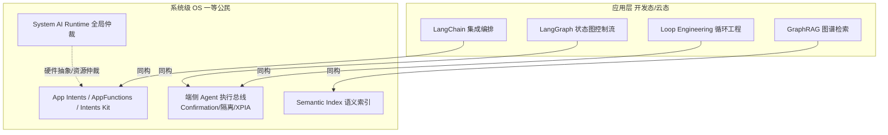
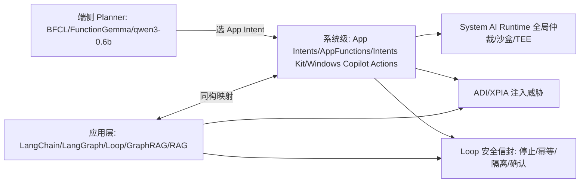

# 应用层 Agent 框架 vs 系统级意图框架 对照

> [!abstract] 摘要
> 本文桥接两套知识库：**应用层 Agent 框架**（LangChain / LangGraph / Loop Engineering / GraphRAG，开发者在代码里搭的）与**系统级意图框架**（Apple App Intents / Android AppFunctions / HarmonyOS Intents Kit / Windows Copilot Actions，OS 把"操控软件"固化为一等公民的协议）。核心论点：应用层框架是这些能力的**开发态/云态表达**，系统级意图框架是把同一套范式**固化进 OS、加沙盒、加授权、加全局仲裁**后的产物。两者不是替代关系，而是**同一抽象在两层的不同实现**。

---

## 一、一句话总论



> **最关键的同构：App Intents 就是"操作系统级的 Tool Calling 协议"。** 应用层用 `@tool` 装饰器把函数暴露给 LLM；OS 层用 `@AppIntent(schema:)` 把能力暴露给系统 AI。契约语义完全一致——只是 OS 层在契约外强制叠加了**沙盒、用户授权、敏感操作确认 UI、来源可信**这些应用层框架默认不给的东西。

---

## 二、核心映射表

| 应用层概念 | 系统级对应 | 关键差异（OS 层多出/不同） |
|---|---|---|
| **Tool Calling**（`@tool` / function schema） | **App Intents / AppFunctions / Intents Kit** 的 Schema 契约 | OS 层契约 + 系统授权网关 + 沙盒，越权调用被 Runtime 拦截 |
| **LangChain 编排（LCEL / chain）** | **App Infra 应用基建** + System AI Runtime 的全局编排 | 应用层只管单进程；OS 层做跨 App、跨硬件的全局仲裁 |
| **LangGraph 状态图（Graph/State/Node/Edge）** | **Action Graph**（Apple 案例里的动作依赖链）+ 端侧 Agent 执行总线 | OS 层把"图"固化为系统能力，配 Confirmation/隔离 |
| **Loop Engineering（ReAct 循环 + 控制流 ownership）** | **端侧 Agent 执行总线**：循环 + 停止条件 + 幂等 + 隔离 + 人工闸门 | OS 层天然带隔离/确认 UI；应用层要自己堆（见 [[Loop Engineering 循环工程]] 失败模式） |
| **RAG / GraphRAG（检索增强）** | **Semantic Index（Spotlight 语义索引）/ App Entities** | OS 层把"私有数据语义化"做成系统服务；GraphRAG 的多跳推理对应 App Entity 关系图 |
| **Context / Prompt Engineering** | **Intent Schema 设计 + 参数填充（Disambiguation & Extraction）** | OS 层把"填参数"做成结构化解析（"明天上午10点"→字段），而非纯 prompt |
| **Agent Data Injection（ADI）** | **XPIA / 沙盒 / 系统授权网关** | 同源威胁；OS 层在 Runtime 内 Load 权重、做 AI 鉴权防注入越权 |
| **Human gate / L1-L3 分阶段** | **敏感/不可逆操作唤起轻量系统 UI 确认**（Apple 案例） | OS 层 Confirmation UI 是系统级原生弹窗，非应用内自定义 |
| **Isolation（Worktrees / Scoped changes）** | **App 沙盒 + Runtime TEE 加载权重** | OS 层隔离由系统保证，应用层靠开发者自觉 |
| **Sub-agent 执行/校验分离** | **系统服务 vs App 能力边界**（全局搜索/智慧助手 vs 第三方 App） | OS 层角色分离由系统权限强制 |

---

## 三、最关键的同构：App Intents == OS 级 Tool Calling

应用层（LangChain）暴露工具：
```python
from langchain_core.tools import tool
@tool
def send_message(contact: str, content: str) -> str:
    """发送消息给指定联系人"""
    ...
```

系统层（Apple App Intents）暴露能力：
```swift
@available(iOS 16, *)
struct SendMessageIntent: AppIntent {
    static var title: LocalizedStringResource = "发送消息"
    @Parameter(title: "联系人") var contact: String
    @Parameter(title: "内容") var content: String
    func perform() async throws -> some IntentResult { ... }
}
```

两者都是**结构化 Schema + 自然语言实体填入参数**。区别只在：OS 层在 `perform()` 之外，由系统统一处理授权、沙盒、确认弹窗、**参数来源可信度**——这三件事应用层框架默认甩给开发者自己兜底（这正是 [[Agent Data Injection 数据注入攻击]] 与 [[Loop Engineering 循环工程]] 反复强调的缺口）。

---

## 四、OS 层比应用层多什么（4 大护城河的系统级映射）

来自 [[OS-PM-系统AI Runtime vs 应用引擎]] 的 4 大护城河，对应到 Agent 框架语境：

1. **硬件异构与驱动碎片** → 应用层框架不管 NPU/GPU 调度；System AI Runtime 统一抽象 HAL，App Intent 的执行后端映射到高通/联发科/海思 NPU 指令集。
2. **全局资源仲裁（最核心）** → 多个 Agent/App 同时拉模型会 OOM；Runtime 做 NPU QoS 分级（相机 P0 > 对话 P1 > 静默抽取 P2）、跨 App KV 共享（内存↓60%）、临近 OOM 统一驱逐。
3. **安全与隐私沙盒** → Runtime 在 TEE/安全世界 Load 权重、做 AI 鉴权，防权重逆向、防 Prompt 注入越权调系统能力（对应 XPIA）。
4. **系统级特性（App 做不到）** → 跨 App Context Engine（屏幕 OCR/剪切板/位置融合）、SpecDec 动态降级、低功耗常驻唤醒、OTA 模型热更——这些让"端侧 Agent"真正可持续，应用层框架无能为力。

> 也就是说：**应用层框架负责"聪明的编排"，系统级意图框架负责"安全地落地"。** 缺了 OS 层，应用层 Agent 在手机上要么越权、要么抢资源崩溃、要么被注入。

---

## 五、应用层比 OS 层多什么

反过来，OS 级意图框架也有天花板，应用层框架在这些维度更强：

- **开发灵活度**：`@tool` 想加就加；App Intent 要走平台审核与 Schema 规范。
- **生态广度**：LangChain 接 1000+ 集成；系统意图受厂商开放范围限制（国内安卓尤甚，见 [[国内安卓厂商做 App Intent 的阻力]]）。
- **高级检索**：GraphRAG 的多跳/全局推理、混合检索、Reranker，远超当前 OS 语义索引的能力（见 [[Graph Engineering 图谱工程]]）。
- **快速迭代**：应用层周级上线；OS 级能力随系统版本年级演进。
- **丰富工具链**：LangSmith 可观测、RAGAS 评估、Loop Engineering 的 observability/trace——OS 层的可观测仍在建设（微软 Project Perception 是端点起步）。

---

## 六、端侧 Planner：两层之间的真正桥梁

来自 [[AppIntent 每日情报 2026-08-04]] 的情报：BFCL v4 已把"端到端 agentic + 多轮"列为 70% 权重，而 **FunctionGemma 270M、qwen3-0.6b-tool-router** 这类端侧小模型，正是"跑在手机上的 LangGraph Planner"——它们干的事和 LangGraph 的路由节点一模一样：**给定工具 Schema，选对工具、填对参数**。

- 应用层：LangGraph 在云端选节点。
- 端侧：BFCL 评测的小模型在 NPU 上选 App Intent。
- 区别在于**执行后端**：应用层调函数，端侧走 System AI Runtime 仲裁后调 App Intent。

> 这解释了为什么 BFCL v4 的 **Hallucination 10%** 对端侧意图路由最关键——小模型"该说不会时硬编调用"在 OS 层会直接触发越权/误操作，比云上聊天后果严重得多。

---

## 七、PM 落地决策（何时走哪条路）

| 场景 | 走 App Intent / 系统意图 | 走 应用层框架自建 | 走 GUI Agent（无障碍树） |
|---|---|---|---|
| 标准开放能力（发消息/日历/翻译） | ✅ 首选，系统原生 | ❌ 重复造轮子 | ❌ 不可靠 |
| 跨 App 任务编排 | ✅ 系统调度 | 有限（需各自 SDK） | 兜底（界面改版即失效） |
| 厂商未开放接口的能力 | ❌ 无门 | ❌ 受限 | ✅ 工业级 GUI Agent（[[工业级 GUI Agent 架构（VLM+无障碍树）]]） |
| 私有知识问答（GraphRAG） | ❌ 超纲 | ✅ 自建 RAG | ❌ |
| 敏感/不可逆操作 | ✅ 系统 Confirmation UI | 需自建 gate | ❌ 风险高 |

**破局逻辑**（呼应 [[安卓厂商意图识别破局策略]]）：标准能力推 App Intent；厂商/超级 App 不给接口时，GUI Agent 是当下最可行的落地路线；纯私有知识检索仍归应用层 RAG。

---

## 八、融合后的知识网



---

> [!note] 双向关联
> **应用层侧**：[[LangChain 概览]] ｜ [[LangGraph 概览]] ｜ [[Loop Engineering 循环工程]] ｜ [[Graph Engineering 图谱工程]] ｜ [[RAG 检索增强生成]] ｜ [[AI Agent 框架 MOC]]
> **系统级侧**：[[App Intent 的核心作用]] ｜ [[Apple Intelligence 与 App Intents]] ｜ [[App Infra 应用基建]] ｜ [[OS-PM-系统AI Runtime vs 应用引擎]] ｜ [[手机AI智能体知识库]] ｜ [[工业级 GUI Agent 架构（VLM+无障碍树）]] ｜ [[国内安卓厂商做 App Intent 的阻力]]
> **安全交叉**：[[Agent Data Injection 数据注入攻击]] ｜ [[Windows Copilot Actions 与 Agent Workspace 2026]] ｜ [[确认机制]] ｜ [[隔离执行]] ｜ [[语义路由]]
> **情报源**：[[AppIntent 每日情报 2026-08-04]]（BFCL v4 / 端侧 Planner / XPIA）
> ⚠️ 飞书文档（密码 833#c154）待接入后合并入本文。

## 深化补充

**心智模型**：本文"应用层管聪明编排、系统层管安全落地"的核心论点，其实给了你一把 PM 判断尺——凡涉及"越权 / 抢资源 / 被注入"的归系统层，纯聪明的活应用层更快；边界划不清时，优先往系统层推（因为失败代价更高）。

**待解问题**
- [ ] 这个"归谁"的边界，在安卓厂商不愿开放接口的现实下，会不会被迫把本属系统层的活推给 GUI Agent？那时"安全落地"的承诺由谁兜底？
