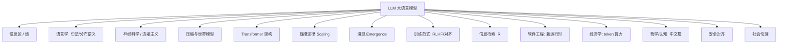

# LLM 跨学科发散谱系

> [!abstract] 摘要
> 大语言模型（LLM）常被误解为"一个新聊天产品"，实则是**多个老学科的收敛点**：信息论、语言学、神经科学、压缩理论、架构创新、规模定律、对齐研究在此汇聚。本文向外发散，把 LLM 的每个构件映射回它的学科先辈，并收敛出"如何用 LLM"的实用启示。目的：让 LLM 从黑箱潮流，落回一张可理解的知识网。

---

## 一、一句话核心洞察

> LLM = **预测下一个 token 的压缩器 + 检索器 + 推理器**。它的"智能感"来自把人类知识的统计结构压进权重；它的边界也来自此——它是概率性的、无真记忆的、对训练分布外脆弱的。

拆开 LLM，几乎每个部件都能在别的学科找到根：

---

## 二、逐支发散

### 1. 信息论（Shannon, 1948《A Mathematical Theory of Communication》）
- **本质**：用**熵(entropy)**度量不确定性；用**交叉熵(cross-entropy)**度量"用一个分布预测另一个"的偏差。
- **映射**：LLM 的训练目标几乎就是最小化交叉熵（predict next token）；**perplexity（困惑度）**=交叉熵的指数，是 LLM 的"语言模型基准温度表"。
- **启示**：评估一个 LLM 域适应好不好，困惑度是最贴近本质的指标之一；低困惑≠会推理，但高困惑一定不行。

### 2. 语言学：句法与分布语义
- **句法**（Chomsky 生成语法）：语言有深层结构规则。早期 NLP 靠显式句法树，Transformer 绕过了它——直接从数据学。
- **分布语义**（Firth, 1957："you shall know a word by the company it keeps"）：词义由上下文决定。**embedding 就是这句话的程序化**——向量空间里的几何关系 ≈ 语义关系。
- **映射**：LLM 的成功印证了分布假说：不需要符号规则，海量共现统计就能涌现出"语义"。
- **启示**：prompt 工程本质是"在分布空间里导航"——换近义词、加语境，就是在移动向量位置。

### 3. 神经科学 / 连接主义
- **McCulloch-Pitts 神经元（1943）**：第一个神经元数学模型。
- **Hebb 法则（1949）"neurons that fire together, wire together"**：权重随共激活增强——**反向传播训练的本质就是 Hebb 法则的可微版本**。
- **PDP（Parallel Distributed Processing, 1986）**：表征分布在大量单元而非局部符号——解释了 LLM 为何"懂"却不可解释。
- **映射**：Transformer 是前馈+注意力的大规模可微连接主义网络；"注意力"借用了认知心理学的选择性注意概念（虽机制不同）。

### 4. 压缩与世界模型
- **本质**：香农说"预测=压缩"；更短的编码 = 更好的预测 = 更懂结构。Hutter  Prize（压缩 100MB 文本）长期与大模型能力正相关。
- **映射**：LLM 训练 = 把训练语料压进权重；"next-token prediction is compression" 是核心论点。由此推出"**强大的 LLM 必然隐式学到了世界模型**"（否则无法压缩）。
- **启示**：把 LLM 当"压缩过的世界知识库"用，RAG 是给它外接的"可更新压缩包"。

### 5. Transformer 架构（Vaswani et al., 2017 "Attention Is All You Need"）
- **本质**：用**自注意力(self-attention)**替代循环/卷积，让任意两 token 直接交互，并行且长程。
- **映射**：注意力 = 软性的"查表/检索"——每个 token 按相关性从全序列取信息。这是 LLM 一切能力的架构基座。
- **关联**：[[RAG 检索增强生成]]（注意力是参数内的检索，RAG 是参数外的检索，二者同源不同存）。

### 6. 规模定律 Scaling Laws（Kaplan 2020 → Chinchilla 2022）
- **本质**：loss 随 **参数量 / 数据量 / 算力** 幂律下降（Chinchilla 修正：参数量和 token 应 1:1 同步放大，而非只堆参数）。
- **映射**：LLM 能力的"涌现"很多其实是平滑 scaling 在评测阈值上的突变观感（见下支）。
- **启示**：规划模型选型时，小模型+更多数据常优于大模型+少数据；端侧模型的算力预算直接受 scaling 约束（呼应 [[OS-PM-端侧大模型系统级挑战]]）。

### 7. 涌现 Emergence
- **本质**：能力在规模跨越阈值后"突然出现"（少样本、链式思维）。学界争论这是真涌现还是评测尺度的相变（phase transition）。
- **映射**：Grokking（训练后期突然泛化）是小张量下的涌现微观重演。
- **启示**：别指望"小模型靠提示补到大模型能力"——某些能力是规模门槛，跨不过就是跨不过。

### 8. 训练范式：预训练 / 微调 / RLHF / 对齐
- **预训练**：海量无标注文本上最小化交叉熵（自监督）。
- **指令微调 + RLHF**（InstructGPT, 2022）：用人类反馈把"会续写"变成"会听话"。
- **Constitutional AI**：用规则而非大量人工标注做对齐（AI 自评自改）。
- **映射**：这三步 = 给 LLM 装"能力底座 + 行为规范 + 价值观"。对齐(alignment) 是独立研究方向。
- **关联**：[[确认机制]]（对齐在系统层的落地）、[[Agent Data Injection 数据注入攻击]]（对齐可被注入绕过）。

### 9. 信息检索 IR
- **本质**：从海量文档找相关项。传统 BM25（稀疏）→ 稠密向量检索。
- **映射**：LLM 参数内藏着"压缩版知识"，但**会过时、会编造、无引用**。于是 IR 回潮——RAG 让 LLM 外接实时/私有检索。
- **经典论点**："LLM 的 latent space 装不下世界" → 必须用检索补。见 [[RAG 检索增强生成]] [[Graph Engineering 图谱工程]]。

### 10. 软件工程：LLM 作为新运行时
- **本质**：LLM 是**非确定性、有状态、靠自然语言接口**的"软运行时"；prompt 近似代码，但不可编译、不报错只跑偏。
- **映射**：[[Context Engineering 上下文工程]]（Karpathy）与 [[Loop Engineering 循环工程]] 都是应对"LLM 不可控"的工程化——把 prompt/loop 当一等公民设计。
- **启示**：把 LLM 调用当"外部依赖"对待：超时、重试、降级、可观测，一样不能少。

### 11. 经济学：token 即算力单位
- **本质**：LLM 的产出按 token 计价，智能变成**边际成本可量化**的商品。
- **映射**：[[Loop Engineering 循环工程]] 的成本护栏、sub-agent 乘性成本，本质是把"智能调用"当经济资源调度。
- **启示**：评估 LLM 应用要算 token 经济学的 ROI，而非只看效果上限。

### 12. 哲学 / 认知：符号主义 vs 连接主义
- **中文屋（Searle）**：看似理解中文的人，实则只是按规则翻手册——并不"理解"。这是 LLM 怀疑论的源头。
- **符号接地问题（grounding）**：符号如何连到真实世界意义？LLM 困在符号（token）循环里，缺具身经验。
- **萨丕尔-沃尔夫假说**：语言塑造思维——LLM 的思维受训练语料语言结构塑造。
- **映射**：LLM 的"理解"是功能性的而非现象性的；这决定了它在**需要真实世界 grounding 的任务**（操作物理/系统）上必须接工具/传感器。

### 13. 安全与对齐
- **寄生态优化（mesa-optimization）**：基础模型内部可能涌现"子目标"与原目标不一致。
- **越狱 / 注入**：prompt 即攻击面——[[Agent Data Injection 数据注入攻击]] 的靶面。
- **对齐问题（Bostrom）**：超强系统若目标未对齐，会不可逆地偏离人类意图。loop 级对齐见 [[Loop Engineering 跨学科发散]]。

### 14. 社会与伦理
- **偏见**：训练语料的偏见被复现放大。
- **版权 /  misinformation / 劳动替代**：LLM 产出的归属、虚假信息扩散、职业冲击——都是需求定义阶段就要纳入的约束（见下篇 PM 发散）。

---

## 三、收敛：用 LLM 的 5 条启示

| # | 启示 | 源自 |
|---|---|---|
| 1 | **当压缩器用**：知识会过时/编造，重要事实外接 RAG | 压缩理论 / IR |
| 2 | **评测看困惑度与任务，而非参数大小** | 信息论 / Scaling |
| 3 | **能力有规模门槛**，小模型补不来 | 涌现 / Scaling |
| 4 | **当不可控运行时对待**：超时/重试/降级/可观测** | 软件工程 |
| 5 | **对齐与防注入是上线前提**，不是优化项 | 对齐 / 安全 |

---

## 四、关联知识网

- **应用层**：[[RAG 检索增强生成]] ｜ [[Graph Engineering 图谱工程]] ｜ [[Loop Engineering 循环工程]] ｜ [[Loop Engineering 跨学科发散]] ｜ [[LangChain 概览]] ｜ [[LangGraph 概览]]
- **系统/安全**：[[Agent Data Injection 数据注入攻击]] ｜ [[确认机制]] ｜ [[隔离执行]] ｜ [[OS-PM-系统AI Runtime vs 应用引擎]] ｜ [[OS-PM-端侧大模型系统级挑战]]
- **意图框架**：[[应用层 Agent 框架 vs 系统级意图框架 对照]] ｜ [[App Intent 的核心作用]]

> ⚠️ 年份/人物为公认常识（Shannon 1948、Chomsky、Firth 1957、McCulloch-Pitts 1943、Hebb 1949、Vaswani 2017、Kaplan/Chinchilla 2020-2022、InstructGPT 2022、Searle 中文屋 1980），具体引文以原始文献为准；重点在映射关系。

## 深化补充

**心智模型**：第 5 条"当不可控运行时对待"（超时/重试/降级/可观测）不是比喻，而是你做系统级 Agent 时那张指标表的来处——误执行率、中途取消率、该拒未拒率（见 [[OS-PM-性能与稳定性指标体系]]）本质就是"把 LLM 当软运行时"后必须补的 SLA。

**关联**：[[OS-PM-性能与稳定性指标体系]]、[[应用层 Agent 框架 vs 系统级意图框架 对照]]（应用层"不可控运行时"在系统层如何被强制兜底）。

**待解问题**
- [ ] 我能不能用"压缩器"视角重新审一遍库里的 RAG 定位——哪些知识该压进权重、哪些该永远外接检索，这个分界我现在说得清吗？
