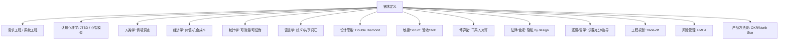

# PM 需求定义 跨学科发散谱系

> [!abstract] 摘要
> "定义需求"看似是写文档，实则是**在不确定性中收敛多方共识**——它坐在需求工程、认知心理学、人类学、经济学、语言学、设计思维、博弈论、法律、逻辑、风险管理的交界处。本文向外发散，把"如何定义好一个需求"映射回各学科先辈，并收敛给 PM 的 5 条可操作启示。结合你 OS/Android PM 的身份，示例偏系统级 AI 能力（如 App Intent、端侧模型特性）的需求定义。

---

## 一、一句话核心洞察

> 需求定义 = **把"模糊的问题"收敛成"可验证、可对齐、可落地的约束与契约"**。
> 它一半是科学（测量、逻辑），一半是艺术（共情、谈判）。跳过任何一支，都会在某个环节爆雷。

---

## 二、逐支发散

### 1. 需求工程 / 系统工程（IEEE 830, MoSCoW, Kano, User Story, NFR）
- **本质**：把利益相关者的需要结构化。MoSCoW（Must/Should/Could/Won't）分优先级；Kano 区分"基本/期望/兴奋"需求；User Story 用"作为 X，我要 Y，以便 Z"锚定价值；NFR（非功能需求）管性能/安全/合规。
- **映射**：定义系统级 AI 能力时（如一个 App Intent），先分清 Must（核心动作契约）vs Could（锦上添花）；NFR 尤其关键——端侧模型的延迟/功耗就是 NFR。
- **启示**：需求文档先写"不做什么"（Won't），比写"做什么"更能防范围蔓延。

### 2. 认知心理学：心智模型与 JTBD
- **JTBD（Christensen）**：用户"雇用"产品来完成一个"待办任务(Job)"，而非购买功能。需求应从 Job 出发，而非从功能清单出发。
- **心智模型**：用户脑中的运作图 vs 系统实际运作图，二者错位即需求失真根源。
- **映射**：定义"用户要对手机说一句话就完成订票"时，Job 是"省去手动操作"，不是"加个语音按钮"。
- **启示**：问"用户雇佣我们完成什么 Job"，而非"用户要什么功能"。

### 3. 人类学 / 民族志：情境调查（Contextual Inquiry）
- **本质**：**观察而非询问**——人说的需求常与其真实行为矛盾（Say-Do gap）。厚描(thick description) 捕捉情境。
- **映射**：定义 OS 级 AI 能力前，先跟测真实用户一天怎么用手机；"用户说自己要智能提醒"可能真实 Job 是"别让我错过关键消息又不骚扰我"。
- **启示**：需求来源要包含观察数据，不能只靠问卷/访谈。

### 4. 经济学：价值、机会成本、边际效用
- **本质**：需求优先级 = **价值 / 成本**；稀缺资源下，做 A 的代价是放弃 B（机会成本）。
- **映射**：端侧 NPU 算力是稀缺资源，一个 AI 特性的需求必须论证"为什么占用这个算力配额而非另一个"。
- **启示**：每个需求旁边写"它消耗什么、放弃了什么"，否则优先级无从谈。

### 5. 统计学 / 测量：可测量即可证伪
- **本质**：不能被测量的需求无法满足（"更快"不行，要"P95 延迟 < 800ms"）。指标=仪器。
- **映射**：定义"智能体回答准确"→ 必须落到可量化（如端到端任务成功率、幻觉率）。呼应 [[AppIntent 每日情报 2026-08-04]] 里 BFCL 的评测思路。
- **启示**：需求写不出验收指标，就是还没定义清楚。

### 6. 语言学 / 沟通：歧义与共享词汇
- **本质**：自然语言天然歧义；需求失真大半来自词汇不对齐。
- **映射**：跨团队定义"智能""流畅""可用"时必须建共享词典（如"可用=首次成功完成率≥90%"）。
- **启示**：把关键形容词变成可操作的名词定义，写进需求文档 glossary。

### 7. 设计思维：Double Diamond（双钻）
- **本质**：先**发散**探索问题空间（Discover/Define），再**发散**探索解空间（Develop/Deliver），两次收敛夹两次发散。
- **映射**：定义需求时，前半段别急着写方案，先把问题钻透；很多 PM 错在直接跳到解。
- **启示**：需求定义卡住时，问自己"我在哪个钻石——问题钻还是解钻？"

### 8. 敏捷 / Scrum：验收标准与 Definition of Done
- **本质**：Backlog 条目要 INVEST（独立/可协商/有价值/可估/小/可测）；AC(验收标准) 把"完成"变可判定。
- **映射**：系统级 AI 特性的需求卡，AC 要包含"在 X 设备、Y 网络下、Z 类输入时行为符合预期"。
- **启示**：没有 AC 的需求=没定义完。AC 是需求定义的最后一公里。

### 9. 博弈论 / 谈判：干系人对齐
- **本质**：多方（厂商/超级 App/用户/监管）需求常冲突，是纳什均衡求解，不是单方面拍板。
- **映射**：定义 App Intent 开放范围时，厂商想收权、超级 App 不给接口、用户要无缝——需求必须在冲突中找均衡点（呼应 [[国内安卓厂商做 App Intent 的阻力]]）。
- **启示**：需求文档要标注"谁会反对这条、为何"，提前设计对齐策略。

### 10. 法律 / 合规：隐私 by Design
- **本质**：合规不是上线后补，是需求阶段就作为**约束**内建（GDPR、数据最小化）。
- **映射**：定义系统 AI 调 App 能力时，隐私/授权边界是需求一等公民（呼应 [[App Intent 的核心作用]] 的标准化隐私边界、[[确认机制]]）。
- **启示**：把"不允许做什么"写成需求约束，而非测试阶段才发现违规。

### 11. 逻辑 / 哲学：必要充分与边界
- **本质**：需求常混淆"必要条件"与"充分条件"；边界 case 才是需求完整性的试金石。
- **映射**："用户说'明天上午开会'"→ 必要：有时间；充分：还要有地点/参会人/提醒方式。漏任一边界即需求缺陷。
- **启示**：每条需求逼问"还差什么条件才真成立"，专抠边界。

### 12. 工程权衡：No Free Lunch / 约束满足
- **本质**：任何需求都有技术可行性边界；trade-off 不可避免。
- **映射**：端侧模型要"小+快+准"三者不可能同时极值，需求必须给定优先级权重（呼应 [[OS-PM-投机采样原理与能效优化]] 的能效权衡）。
- **启示**：需求定义要声明"若不可兼得，保哪条"，把权衡权交给决策而非实现者。

### 13. 风险管理：FMEA（失效模式与影响分析）
- **本质**：预判"需求若未被满足/被错误满足"的后果严重度×发生度×可探测度。
- **映射**：定义 AI 自动执行能力时，FMEA 能逼出"误执行付款"这种高危失效，从而要求加 [[确认机制]]。
- **启示**：需求评审加一栏"错了会怎样"，高危项强制加护栏。

### 14. 产品方法论：OKR / North Star / 问题空间 vs 解空间
- **本质**：Outcome（结果）≠ Output（产出）；North Star 指标锚定价值方向。
- **映射**：定义需求先定"要改善哪个 North Star（如任务一次完成率）"，再倒推特性。
- **启示**：需求要能回溯到某个北极星指标，否则是自嗨功能。

---

## 三、收敛：给 PM 定义需求的 5 条启示

| # | 启示 | 源自 |
|---|---|---|
| 1 | **从 Job 出发，不从功能清单出发**（JTBD） | 认知心理学 |
| 2 | **厘清必要条件与充分条件，专抠边界 case** | 逻辑/哲学 |
| 3 | **每条需求配可证伪的验收指标**（写不出=没定义清） | 统计学 |
| 4 | **约束（隐私/算力/合规）优先于功能**，权衡权重显式化 | 法律/工程权衡 |
| 5 | **需求是干系人博弈的对齐结果**，标注谁会反对 | 博弈论/风险管理 |

---

## 四、结合 OS/Android PM 的实战落点

以"定义一套系统级 App Intent 开放能力"为例，套用上面的发散：
- **JTBD**：用户 Job = "不用记着装了啥 App 也能把事办了"，不是"多一个意图设置页"。
- **经济学**：每条开放能力消耗 NPU 算力配额，需论证 ROI（呼应 [[OS-PM-系统AI Runtime vs 应用引擎]]）。
- **法律/合规**：开放范围必须内建隐私边界（呼应 [[App Intent 的核心作用]]）。
- **FMEA**：误执行高危操作 → 强制 [[确认机制]]（轻量系统 UI 确认）。
- **博弈论**：厂商/超级 App/用户三方冲突 → 借鉴 [[安卓厂商意图识别破局策略]]。

---

## 五、关联知识网

- **PM 知识库**：[[OS-PM-概览与四大核心领域]] ｜ [[OS-PM-系统AI Runtime vs 应用引擎]] ｜ [[OS-PM-端侧大模型系统级挑战]] ｜ [[OS-PM-投机采样原理与能效优化]]
- **需求落地的系统侧**：[[App Intent 的核心作用]] ｜ [[Apple Intelligence 与 App Intents]] ｜ [[国内安卓厂商做 App Intent 的阻力]] ｜ [[安卓厂商意图识别破局策略]]
- **AI 侧呼应**：[[Agent Data Injection 数据注入攻击]]（需求要考虑注入风险）｜ [[确认机制]] ｜ [[应用层 Agent 框架 vs 系统级意图框架 对照]]
- **发散方法论同源**：[[Loop Engineering 跨学科发散]] ｜ [[LLM 跨学科发散]]

> ⚠️ 方法论文献为公认框架（IEEE 830、MoSCoW、Kano、JTBD-Christensen、Double Diamond、FMEA、OKR），具体年份/原始出处以经典文献为准；重点在"映射关系"而非考据。

---

## 深化补充

> 本篇已足够完整（14 支发散 + 5 条收敛）。这里只补**怎么真正用起来**，不重复方法论。

### 一句话心智模型

> **这 14 支不是让我"全部想一遍"，是一副检查清单——用来在评审前找出"我漏了哪一支"。**

我怕的不是这篇写得不够全，是**写得太全反而用不起来**。所以给自己定一个可执行的收缩版：**每次写需求前只强制过 4 支**，其余按需查。

选这 4 支的理由是——**它们对应的失败最贵、且最难在后期补救**：

| 强制过的一支 | 一句话自问 | 漏了会怎样 |
|---|---|---|
| **JTBD**（认知心理学） | 用户雇我完成什么 Job？ | 做出一个没人要的功能，**全盘浪费** |
| **统计学**（可证伪） | 验收指标写得出来吗？ | 上线后争论"到底算不算做完了" |
| **FMEA**（风险） | 错了会怎样？ | 高危漏洞，**可能上升到安全事故** |
| **博弈论**（干系人） | 谁会反对这条？ | 推到一半被否，**沉没成本最大** |

**其余 10 支当作"卡住时的求助手册"**：写不下去了，就翻一遍看哪一支能给我新角度。这个用法比"每次全过一遍"现实得多。

### 结合我自己的实际处境

第四节用 App Intent 做了示范，我想补一条**我自己最容易犯的错**：

作为 OS PM，我的需求经常是**给开发者的**（API、Schema），而不是给终端用户的。这时候 JTBD 里的"用户"要换成"**开发者**"：

- 开发者的 Job 不是"接入意图框架"，是"**让我的服务被更多人用到，且成本可控**"。
- 我写的 Schema 再优雅，如果接入要写 500 行样板代码，Job 就没完成。

**这条对我特别关键，因为整个 [[意图框架的商业与生态博弈]] 的核心矛盾，本质上就是"开发者的 Job 和平台的 Job 不一致"。** 用 JTBD 的语言重述一遍，比用"生态博弈"这种大词更能指向具体动作——**去测量接入成本，而不是去谈判**。

### 关联

- 落地成文档 → [[PRD写作SOP]] ｜ [[OS PM PRD 专项]] ｜ [[OS 系统级 Agent PRD 范例]]
- 领域框架 → [[OS-PM-概览与四大核心领域]]
- 指标怎么定（统计学那一支的展开） → [[OS-PM-性能与稳定性指标体系]]
- 干系人博弈的实例 → [[意图框架的商业与生态博弈]] ｜ [[HarmonyOS 意图框架竞品观察]]
- FMEA 的实例（误执行） → [[Confirmation UI 安全机制]] ｜ [[XPIA 跨提示注入]]
- 同源发散方法 → [[LLM 跨学科发散]] ｜ [[Loop Engineering 跨学科发散]]

### 待解问题

- [ ] "每次强制过 4 支"——这个收缩版能不能做成一个**真正的 PRD 模板字段**（在 [[PRD_Template]] 里加 4 个必填栏）？如果不进模板，我大概率会忘。
- [ ] 给开发者的需求，**JTBD 怎么验证**？我不能像观察终端用户那样跟测开发者一天。是靠接入耗时统计、还是靠开发者访谈？（可能得先做一次真实的"自己按文档接一遍"）
- [ ] 这 14 支里，有没有哪一支**对 OS PM 明显比对 App PM 更重要**？我的初步判断是"工程权衡"和"博弈论"——因为 OS PM 面对的是零和资源和多方生态。**如果是，那这两支应该在我的收缩版里加权。**
