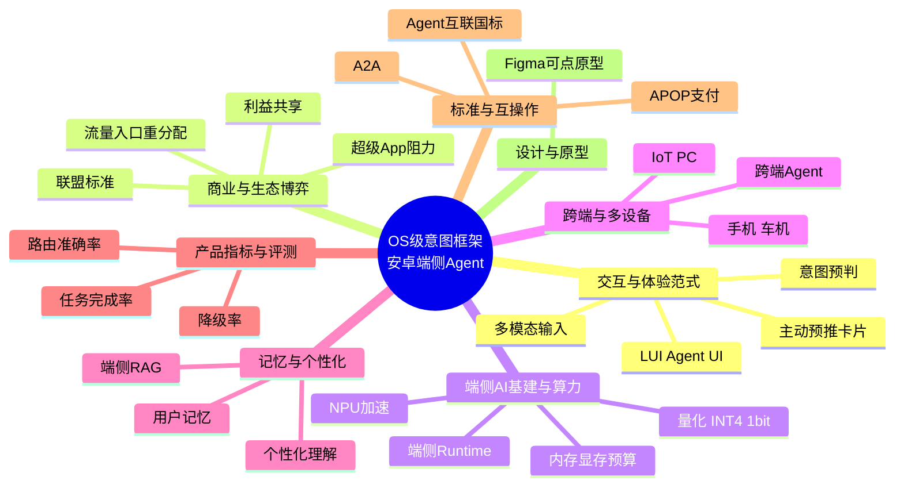

# 意图框架 · 发散图谱

> 从「OS 级意图框架 / 安卓端侧 Agent」这个核心，向**相邻域发散**的概念地图。
> 立场：**安卓系统 PM**，不是鸿蒙；**不侧重安全**（安全已另有 [[Agent 执行安全（PM视角）]] 与知识飞轮专篇）。
> 目的：帮你想清「除了技术实现，这个领域还连着哪些产品/商业/体验/算力问题」——避免只盯技术。

## 图谱（中心 → 发散方向）

## 发散分支（本图谱新建）
- [[端侧 AI 基建与算力预算]] —— NPU / 量化 / 端侧 Runtime / 内存显存预算，决定端侧 Agent 能不能跑、跑多快
- [[意图框架的商业与生态博弈]] —— 超级 App 阻力、流量入口、利益共享、联盟标准，安卓落地的最大变量
- [[跨端与多设备意图流转]] —— 手机作意图中枢，向车机 / IoT / PC 流转
- [[Agent 记忆与个性化意图理解]] —— 用户记忆 + 端侧 RAG，让同一句话对不同人意图不同

## 已有笔记可作分支落点（不另建，直接链）
- 交互与体验：[[App Intent 的核心作用]] · [[Apple Intelligence 与 App Intents]](体验范式参考)
- 产品指标与评测：[[系统级 Intent 路由评估 SOP]] · [[端侧意图路由选型 PM Checklist]]
- 标准与互操作：[[A2A 端侧智能体协议]] · [[智能体互联国家标准与 AIP]] · [[意图支付授权协议 APOP]]
- 设计与原型：[[原型与Figma MOC]]
- 竞品（安卓视角的外部参照）：[[竞品情报 MOC]]

## 怎么用
- 想扩张思路时，从中心挑一个还没写笔记的方向发散；每个分支都接回技术底（[[手机AI智能体知识库]]）。
- 这是「地图」不是「目录」：重在看见关联，不在追求覆盖。

#标签/发散图谱 #标签/AppIntent #标签/安卓 #标签/概念地图
