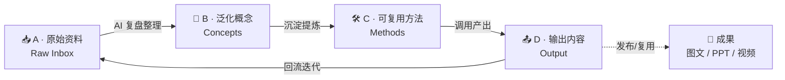

# 用 Codex + Obsidian 搭建自生长 AI 知识库

> [!abstract] 一句话总结
> 基于 **卡帕西（Karpathy）的自生长知识库理论**，用 Codex 联动 Obsidian 构建一套「原始资料 → 泛化概念 → 可复用方法 → 输出内容 → 回流迭代」的自动化闭环，小白也能上手，适配多职业场景。

---

## 一、核心理论：四文件夹循环系统

AI 大神 **卡帕西** 提出：知识库不应是静态收藏夹，而应是**会自己生长的循环系统**。四个文件夹首尾相接，形成持续迭代的飞轮：

| 文件夹 | 角色 | 内容形态 |
|---|---|---|
| **A 原始资料** | 入口 | 抓取/导入的未加工素材 |
| **B 泛化概念** | AI 复盘整理 | 从素材中提炼的通用概念 |
| **C 可复用方法** | 沉淀 | 可反复调用的 SOP / 模板 |
| **D 输出内容** | 出口 | 草稿、成品；回流驱动下一轮迭代 |

> [!tip] 关键认知
> 闭环比收藏重要。每输出一次，D 的内容就回流进系统，让 A→B→C 的提炼质量越滚越高。

---

## 二、安装与配置（打通 Codex 与 Obsidian）

1. **安装两端**：本地安装 `Codex` 与 `Obsidian`。
2. **启用插件**：在 Obsidian 插件市场搜索并启用 **Codex 插件**。
3. **打通路径**：在插件中填入 **CodexCli 路径**，建立两者连接。
4. **链接仓库**：在 Codex 中关联 Obsidian 仓库，实现**文件双向同步**。

> [!note] 打通后，Codex 能直接读写你的笔记库，这是后续自动复盘/迭代的前提。

---

## 三、信息搜集（喂饱 A 文件夹）

三种入库方式：

- **AI 资讯抓取系统（推荐）**
  1. 安装对应插件 → 2. 配置 API 密钥 → 3. 告诉它你的需求
  ⇒ 自动生成**结构化日报**。
- **多平台导入**：用 Obsidian 插件把各平台内容直接拉进库。
- **旧素材迁移**：联动工具把历史资料批量迁进来。

---

## 四、信息迭代（A→B→C 的自动提炼）

- 让 Codex **定制知识迭代系统**。
- 设置**定时任务**，自动「蒸馏」知识库内容、生成阶段总结。
- 制作**复盘看板 Skill**，把沉淀进度**可视化**。

---

## 五、信息输出（D 文件夹 + 回流）

- 调用**自定义 Skill** 快速产出内容初稿。
- 搭配**「去 AI 味」Skill** 调整文风，更像人写。
- 一键生成**配图 / PPT / 视频**等成果。
- 输出内容**回流**进系统，形成闭环。

---

## 六、高光片段（时间戳）

- `00:51` 讲解卡帕西自生长知识库核心循环理论
- `02:53` 讲解 AI 自动化信息搜集系统搭建三步

> [!todo] 我的行动清单
> - [x] 安装 Codex + Obsidian，启用并配置 Codex 插件
> - [ ] 在库中建好 A / B / C / D 四个文件夹
> - [ ] 搭一个 AI 资讯抓取日报（配密钥 + 定义需求）
> - [ ] 让 Codex 写定时蒸馏任务，沉淀 B→C
> - [ ] 做一个「去 AI 味」输出 Skill 试试水

---

## 七、适配性与上手难度

- **适配多职业场景**：写作、研究、运营、开发均可套用同一套飞轮。
- **上手门槛**：教程定位**小白友好**，按步骤走即可跑通最小闭环。

> [!quote] 延伸思考
> 可以把这份笔记本身当作 D 文件夹的第一个产物——它已经回流进你的 Obsidian，下一步就是让 Codex 基于它生成你的专属「知识库搭建 SOP」（C 文件夹）。
