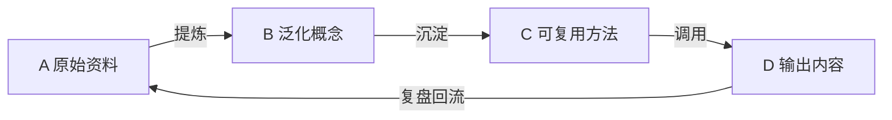

# 知识飞轮看板

## 工作入口

- 新素材：放入 [[A-原始资料]]，使用 [[_模板/原始资料]] 记录来源与问题。
- 知识蒸馏：每周从 A 提炼为 B；成熟结论沉淀为 C。
- 产出：从 C 选择方法，写入 D；发布后补全反馈并回流。

## 本周清单

- [ ] A 中需要处理的资料
- [ ] 可沉淀到 B 的概念
- [ ] 可更新到 C 的方法
- [ ] D 中待复盘的输出

## 规则

1. A 保留来源和原始语境，不追求整洁。
2. B 一条笔记只表达一个可迁移的概念。
3. C 必须包含触发条件、步骤、检查标准和示例。
4. D 必须记录实际反馈，并把新问题回写到 A。

## 本次新增（2026-07-30）· AppIntent 跨平台情报

来源：外部情报简报，按飞轮分层落库，并双链到已有 [[手机AI智能体知识库]] 体系（未重复已有概念/国内生态笔记）。

- **A 原始资料**
  - [[AppIntent 跨平台情报简报 2026-07-30]]
- **B 泛化概念 · 平台卡（2026 技术细节）**
  - [[Apple AppIntents Schema Protocol 2026]]（链 [[Apple Intelligence 与 App Intents]]）
  - [[Android AppFunctions 设备侧意图 2026]]（链 [[国内安卓厂商做 App Intent 的阻力]]）
  - [[HarmonyOS Intents Kit 与 ArkAF 2026]]
  - [[Windows Copilot Actions 与 Agent Workspace 2026]]
- **B 泛化概念 · 跨平台概念节点**
  - [[Intent Schema Protocol 意图模式规范]] ｜ [[Intent Router 语义路由]] ｜ [[Function Calling 端侧工具调用]]（含端侧 Planner 评测表）
  - [[Confirmation UI 安全机制]] ｜ [[Atomic Service 元服务]] ｜ [[Agent Workspace 隔离执行]] ｜ [[A2A 端侧智能体协议]] ｜ [[XPIA 跨提示注入]]
- **C 可复用方法**
  - [[系统级 Intent 路由评估 SOP]]
- **D 输出内容**
  - [[AppIntent 跨平台格局总览 2026]]（与 [[手机AI智能体知识库]] 互补）

> 待办：补 Gemma 4 / Qwen3-Coder-Next 端侧路由实测；补四平台 Registry/权限横向 Checklist。

## 本次新增（2026-07-31）· OS PM 近一月情报（一次性获取，检索窗口≈近1个月）

独立获取、未改动自动化（自动化仍为原 AppIntent 每日 09:00 版）。来源：近一月外部检索，按飞轮分层落库并双链去重。

- **A 原始资料**
  - [[OS PM 近一月情报简报 2026-07-31]]
- **B 泛化概念 · 新增（净新增节点）**
  - [[System Orchestrator 系统编排]]（Apple iOS 27 系统编排者，App 不直接互驱）
  - [[Local Agent Bench 端侧智能体基准]]（端到端智能体基准，qwen3:1.7b #1）
- **B 泛化概念 · 既有增补（不重复，仅补新进展）**
  - [[Apple AppIntents Schema Protocol 2026]]（补 System Orchestrator / 限速 / SiriKit 弃用 / 新框架族）
  - [[Android AppFunctions 设备侧意图 2026]]（补 Gemini 私测 / Android 16+ / @AppFunction / Kotlin 生成）
  - [[HarmonyOS Intents Kit 与 ArkAF 2026]]（补 ArkAF 三层 / DevEco Code / 小艺 1.8 亿 DAU / HPIC）
  - [[Windows Copilot Actions 与 Agent Workspace 2026]]（补 6 known folders / opt-in 路径 / XPIA 缓解）
  - [[Function Calling 端侧工具调用]]（补官方 BFCL / S25 Ultra 实测 / Local Agent Bench 链接 / 口径校准）
- **D 输出内容**
  - [[OS PM 2026-07 月报：四平台新增进展]]（与 [[AppIntent 跨平台格局总览 2026]] 互补的增量月报）

> 待办（延续）：补 Gemma 4 / Qwen3-Coder-Next 端侧路由实测；补四平台 Registry/权限横向 Checklist；回填 Local Agent Bench Round 3 来源 URL。

## 本次新增（2026-07-31）· AI Agent 半月情报（一次性获取，检索窗口≈近半个月）

独立获取、未改动自动化（自动化仍为原 AppIntent 每日 09:00 版）。范围：通用 AI Agent（模型/评测/企业平台/安全），与 OS PM 近一月情报互补、不重复。来源：近半月外部检索，按飞轮分层落库并双链去重。

- **A 原始资料**
  - [[AI Agent 半月情报简报 2026-07-31]]
- **B 泛化概念 · 净新增节点（与既有端侧/OS 笔记互补，未改旧文件）**
  - [[前沿 Agent 大模型 2026H2]]（Opus5 / Gemini3.6Flash / GPT-5.6 + Agent 专项基准；链 [[Function Calling 端侧工具调用]]）
  - [[通用 AI Agent 评测基准 2026]]（AgentCompass / OmniaBench / AgenticDataBench / EdgeBench；链 [[Local Agent Bench 端侧智能体基准]]）
  - [[企业级 Agent 平台与 Agent-as-Asset 2026]]（阿里 Agent Native Cloud / 蚂蚁 Agentar / OpenAI Presence / WAIC 互联互通；链 [[Agent Workspace 隔离执行]]）
  - [[Agent 身份与硬件级审批]]（YubiKey 5.8 / Entrust / Qoder；链 [[XPIA 跨提示注入]] / [[Confirmation UI 安全机制]]）
- **D 输出内容**
  - [[AI Agent 半月观察 2026-07-31]]（与 [[OS PM 2026-07 月报：四平台新增进展]] 互补的通用视角月报）

> 待办（延续）：跟踪 Opus5/Gemini4 正式版与 Agent 专项基准更新；跟踪 WAIC 互联互通倡议是否成跨厂商标准；回填部分来源 URL（OmniaBench/AgenticDataBench/Unified Framework 为 arXiv 编号）。

## 本次新增（2026-07-31）· 最近一个月热门 AI Agent Skill 整理（用户定向请求：整理+中文详解）

独立获取、未改动自动化（仍为原 AppIntent 每日 09:00 版）。范围：Agent Skills 生态（定义/格式/热度榜/分类/对 OS PM 启发），与既有 Agent 笔记互补、双链去重、未改旧文件。

- **A 原始资料**
  - [[AI Agent Skill 生态半月情报 2026-07-31]]（来源 URL 全收录：claudeskills/claudewave/aibestskill/lobehub/skillsmp/今日头条/CSDN/theagenticleaderboard/Anthropic 官方）
- **B 泛化概念 · 净新增节点**
  - [[Agent Skills 技能范式 2026]]（SKILL.md 渐进式披露 / Skill vs Prompt vs MCP / 格式之争；链 [[Function Calling 端侧工具调用]]、[[Local Agent Bench 端侧智能体基准]]、[[企业级 Agent 平台与 Agent-as-Asset 2026]]、[[Agent 身份与硬件级审批]]、[[Apple AppIntents Schema Protocol 2026]]、[[Windows Copilot Actions 与 Agent Workspace 2026]]）
- **D 输出内容**
  - [[最近一个月热门 AI Agent Skill 整理 2026-07-31]]（中文详解主文：定义/生态规模/Top20 热度榜/分类地图/对 OS PM 启发/趋势）

> 待办（延续）：跟踪 skill 格式统一标准进展（AIDF 候选）；跟踪 self-improving skill（claude-reflect 类）与长期记忆方向；补 obsidian-second-brain 与知识飞轮对照。

## 本次新增（2026-07-31）· AppIntent 每日情报（自动化 09:00 版，检索窗口 24h + 库内空白补漏）

严格 24h 命中 4 条（OSWorld 首破 90.2% / 豆包手机二代弃 GUI 转 MCP / 华为小艺 GUI 实测"微信未接入" / 智能体互联 7 项国标）；另补 5 条库内空白的近期官方进展（Android 17 GA、HarmonyOS 7 HMAF 2.0、iOS 27 第三方实测、端侧 Planner 评测补齐、Gemini 40+ App），均已标真实日期、双链去重、未改旧文件。

- **A 原始资料**：[[AppIntent 每日情报 2026-07-31]]
- **B 泛化概念 · 净新增**：[[OSWorld 计算机操作基准]] ｜ [[智能体互联国家标准与 AIP]] ｜ [[端侧执行通道 GUI 与 MCP 路线之争]]
- **B 泛化概念 · 既有增补（追加，不重复）**：[[Android AppFunctions 设备侧意图 2026]] ｜ [[HarmonyOS Intents Kit 与 ArkAF 2026]] ｜ [[Apple AppIntents Schema Protocol 2026]] ｜ [[Confirmation UI 安全机制]] ｜ [[Function Calling 端侧工具调用]]
- **C 可复用方法 · 净新增**：[[端侧执行通道选型 SOP]]
- **D 输出内容 · 净新增**：[[AppIntent 每日情报速览 2026-07-31]]

> 待办（延续）：核验 OSWorld 官方榜单与 7 项国标标准号；完成四平台 Registry/权限横向 Checklist（已挂 3 天）；跟踪 iOS 27 正式版（9-14）第三方覆盖；回填 Gemma 4 / Qwen3-Coder-Next 评测来源。

## 本次新增（2026-08-01）· AppIntent 每日情报（自动化 09:00 版，检索窗口 24h + 库内空白补漏）

严格 24h 硬命中仅 1 条（DroiClaw 登国际媒体）；因连续两天 24h 窗口过薄，本日采用「24h 真增量 + 库内空白补漏」策略，补漏 6 条均标真实日期、双链去重、未改旧文件。最高价值条目为 Copilot for Word 文档型 XPIA 自传播蠕虫（执行安全范式跃迁）。

- **A 原始资料**：[[AppIntent 每日情报 2026-08-01]]
- **B 泛化概念 · 净新增（3）**：[[Simple Attention Network 无FFN端侧路由]] ｜ [[Agentic OS 意图调度内核]] ｜ [[文档型 XPIA 自传播蠕虫]]
- **B 泛化概念 · 既有增补（5，追加不重复）**：[[XPIA 跨提示注入]]（补写回路径失效 / 类别未关闭）｜ [[Function Calling 端侧工具调用]]（补 Needle 26M / 无 FFN 架构）｜ [[Apple AppIntents Schema Protocol 2026]]（补 WWDC26 345 代码级细节）｜ [[Confirmation UI 安全机制]]（补「可逆」维度 + 权限自动回收）｜ [[HarmonyOS Intents Kit 与 ArkAF 2026]]（补负一屏元服务 / Today-Task Skill）
- **C 可复用方法 · 净新增**：[[Agent 写回路径 XPIA 风险评估 SOP]]（写回路径三问判据）
- **D 输出内容 · 净新增**：[[AppIntent 每日情报速览 2026-08-01]]

> 待办（延续）：**将自动化改 7 日滚动窗口**（保留首次入库存量判定做去重）；把「四平台 Registry/权限横向 Checklist」扩为六方（+ AgenticOS / Step AOS）；核验 Needle 评测集；跟踪 Måløy 系列后续 / 微软类别级缓解；澄清鸿蒙设备数口径冲突；跟踪荣耀 Robot Phone 8 月发布。

## 本次新增（2026-08-02）· AppIntent 每日情报（自动化 09:00 版，已切换 7 日滚动窗口 2026-07-26→08-02）

本日**正式从 24h 切换为 7 日滚动窗口**（依记忆文件建议，保留首次入库存量判定做去重）。7 日窗口内真增量 2 条（EU AI Act Article 15 今日生效 / HarmonyOS HDD 西安站端侧云侧 A2A 双模 08-01）；库内空白补漏 2 条（Apple Session 343 + 2.0 / Android AppFunctions Agent Skill 四步 lifecycle，均标真实日期）；排除 1 条（M365 Copilot Agentic 模式，应用层非 OS 级）。本日**未新建独立 B 节点 / C 层 SOP**，全部以「既有 B 追加」形式落库，避免重复。

- **A 原始资料**：[[AppIntent 每日情报 2026-08-02]]
- **B 泛化概念 · 既有增补（5，追加不重复）**：[[HarmonyOS Intents Kit 与 ArkAF 2026]]（补小艺 Agentic 自演进定位 + 端侧/云侧 A2A 落地实证 + 奇妙工具箱开发者实证）｜ [[A2A 端侧智能体协议]]（补端侧/云侧双模路由判据 + 落地实证）｜ [[Apple AppIntents Schema Protocol 2026]]（补 Session 343 View Annotations/IntentValueQuery/Confirmations+entity ownership + 2.0 streaming/多轮）｜ [[Android AppFunctions 设备侧意图 2026]]（补官方 Agent Skill 四步生命周期 + 设备侧 MCP 官方澄清）｜ [[Windows Copilot Actions 与 Agent Workspace 2026]]（补 EU AI Act Article 15 合规抬高）
- **D 输出内容 · 净新增**：[[AppIntent 每日情报速览 2026-08-02]]

> 待办（延续）：跟踪 Digital Omnibus 正式文本是否通过（决定是否更新 Article 15 生效日口径）；理清四平台对 Article 15 的合规触发条件；核验 HarmonyOS 银行 App 具体名称与 1000+ 意图清单；独立确认「Per-Intent Privacy Manifest」是否为真实 Apple API；回填 Android AppFunctions Agent Skill 发布日期；延续六方 Registry/权限 Checklist（AgenticOS/Step AOS 仍未入表）；跟踪荣耀 Robot Phone 8 月发布、Måløy Word 蠕虫类别级缓解。

## 本次新增（2026-08-03）· AppIntent 每日情报（自动化 09:00 版，7 日滚动窗口 2026-07-27→08-03）

本期最重条目为执行安全第三个分水岭 ADI（Agent Data Injection）：攻击者无需注入指令，只伪造 Agent 视为可信的结构化元数据即可使其自推错误结论（同环境对照经典指令注入 0–0.7%，ADI 最高 100%）；姊妹研究 DualView 提出 AgentView/HumanView 双视图隔离原语。窗口内真增量 1 条（DroiClaw 诸葛中国市场正式发布 08-03）；库内空白补漏 4 条（Android alpha10 架构+Registry 硬细节 / ADI / DualView+带外防御 / LFM2.5-8B-A1B+LocalCowork，均标真实一手日期）。净新增 B 2、B 既有增补 6、C 净新增 1、D 净新增 1。

- **A 原始资料**：[[AppIntent 每日情报 2026-08-03]]
- **B 泛化概念 · 净新增（2）**：[[Agent Data Injection 数据注入攻击]] ｜ [[Dual View 智能体数据视图隔离]]
- **B 泛化概念 · 既有增补（6，追加不重复）**：[[Android AppFunctions 设备侧意图 2026]]（补 alpha10 编译时入口点 + Registry 硬细节 + 安全路线分歧）｜ [[XPIA 跨提示注入]]（补 ADI 新攻击类别 + CaMeL Strict 36.5% 可用性代价）｜ [[Confirmation UI 安全机制]]（补 Android 确认下放 + AIMS 带外授权第四维）｜ [[Agent Workspace 隔离执行]]（补数据形态隔离与进程隔离正交）｜ [[Function Calling 端侧工具调用]]（补 LFM2.5-8B-A1B + LocalCowork）｜ [[Agentic OS 意图调度内核]]（补 DroiClaw 中国发布 + 架构口径）
- **C 可复用方法 · 净新增**：[[Agent 读入路径可信数据边界 SOP]]（与 08-01 写回路径 SOP 构成双向闭环）
- **D 输出内容 · 净新增**：[[AppIntent 每日情报速览 2026-08-03]]

> 待办（延续）：**【本期最高优先级】追四平台是否有 ADI 类别评估 / 意图元数据来源校验**（Apple `.appEntityIdentifier` 是否有来源绑定/签名，均待补）；补齐 Apple/HarmonyOS/Windows 的 Registry 动态可见性 API（填满六方 Checklist，仅 Android 一列填实）；跟踪 Anthropic/OpenAI/Google 对 ADI 的类别级缓解；用作者 AgentDojo 扩展版测试套件评估自建端侧 ADI 回归集；跟踪 Digital Omnibus 正式文本、HarmonyOS 银行 App 名、Per-Intent Privacy Manifest、荣耀 Robot Phone、Måløy 类别级缓解。

## 本次新增（2026-08-03 · 晚间增补）· AppIntent 每日情报（自动化 21:00 版，窗口 2026-07-27→08-03）

同日 09:00 已跑完整 7 日窗口，本轮为**增补跑**，只记 09:00 版之后的净新增，**不覆盖上午成果**。四大 OS 官方渠道（Apple/Android/HarmonyOS/Windows）经逐条复核**无新增可核实动作**，已在 A 层显式列出「已复核·无净新增」清单，避免下次重复检索。真增量 2 条：① Bonsai 1-bit 量化模型 BFCL 实测（7/10）② 银联 APOP/AVOP 生态里程碑（6/10）。净新增 B 1、B 既有增补 1、C 既有修订 1、D 净新增 1。

- **A 原始资料**：[[AppIntent 每日情报 2026-08-03-晚]]
- **B 泛化概念 · 净新增（1）**：[[意图支付授权协议 APOP]]（协议层意图授权凭证，既有 [[确认机制]]/[[意图模式规范]] 无法承载该面）
- **B 泛化概念 · 既有增补（1，追加不重复）**：[[Function Calling 端侧工具调用]]（补 Bonsai 1-bit 全表 + 「1-bit QAT 在结构化输出上是增益」反直觉结论 + BFCL/NexusRaven 分裂 30 分 + 端侧规模阶梯更新）
- **C 可复用方法 · 既有修订（1）**：[[系统级 Intent 路由评估 SOP]]（步骤 4 升级为**必须双基准**：BFCL 测格式合规 + NexusRaven 测语义理解；新增量化选型纪律「不按保精度选、按保 Schema 合规选」；失败表增 2 行；**顺手修正残留旧口径 46%→90% 为官方 58%→85%**）
- **D 输出内容 · 净新增**：[[AppIntent 每日情报速览 2026-08-03-晚]]

**本期两条最可执行的结论**：① 内部端侧 Planner 选型表若只有 BFCL 必须补「语义理解分」——同一模型 BFCL 73.3%/NexusRaven 43.8% 且与对手排名倒转，只看 BFCL 会在跨应用编排上选错模型；② 确认 UI 的产物应该是**数据不是事件**——弹窗点确认只产生不可核验、可被 XPIA 绕过的事件，应产出带意图内容哈希的凭证，这是防线从 UI 层下沉到协议层的入口。

> 待办（延续）：**【连续第 2 日未解，最高优先级】四平台 ADI 类别评估 / 意图元数据来源校验**——常规检索路径已失效，下轮改查各平台安全白皮书 PDF；**新增**：追 PrismML 官方技术报告回填 1-bit QAT 训练配方与官方分数；核实 APOP 是否真做到「意图内容与凭证绑定」及协议全文链接；核实 APOP 能否与 AppFunctions/App Intents 对接（还是必须走各自 SDK）；补齐 Apple/HarmonyOS/Windows 的 Registry 动态可见性 API（六方 Checklist 仍仅 Android 填实）；沿用既有待办：Digital Omnibus 正式文本、HarmonyOS 银行 App 名、Per-Intent Privacy Manifest、荣耀 Robot Phone、Måløy 类别级缓解。

## 本次新增（2026-08-04）· AppIntent 每日情报（自动化 21:00 版，7 日滚动窗口 2026-07-29→08-04）

本期两条 8/10 并列最重。**① BFCL v4 权重重构**属「口径变化」而非新事实——Agentic 40% + Multi-Turn 30% 合计 70%，经典单轮压到 20%，另加 Hallucination 10%；**后果是库内所有历史 BFCL 分数（Bonsai 73.3%、qwen3-0.6b-tool-router 90.42% 等）全部是 v3 时代的「格式合规分」，与 v4 不可比**，已在两个 B 节点集中打版本标签。**② 挂了 3 天的最高优先级待办有实质进展但仍未解**：微软 Agent Governance Toolkit 给出成熟的数据溯源模型（六类来源 + 四级密级 + 单调棘轮 + 两阶段闸口，对齐 EU AI Act Article 10），但**已 WebFetch 复核 Windows 官方 agentic security 文档确认 OS 层无来源分级**——结论从「没人做」精化为「治理层有成熟模型、OS 层全空白」。③ Project Perception 公开预览（7/10），Defender 开始检查 agent loop 三段流量，标志防线从「隔离」延伸到「检查」。四大 OS 官方渠道经复核**无新增可执行 API**，已在 A 层显式记录避免重复检索。净新增 B 1、B 既有增补 4、C 既有修订 1、D 净新增 1。

- **A 原始资料**：[[AppIntent 每日情报 2026-08-04]]
- **B 泛化概念 · 净新增（1）**：[[数据溯源分级与单调棘轮]]（ADI 的第一个可落地正面答案，成本远低于 Dual View 的 ~15× 调用开销）
- **B 泛化概念 · 既有增补（4，追加不重复）**：[[Function Calling 端侧工具调用]]（补 BFCL v4 权重表 + 全库历史分数版本作废警示 + 08-03 benchlm 快照）｜ [[Local Agent Bench 端侧智能体基准]]（定位修正：v4 已覆盖 agentic+multi-turn，其价值从「补单点」转为「补部署现实」）｜ [[Agent Data Injection 数据注入攻击]]（补 AGT 溯源模型 + Defender agent-loop 检查；四平台待查清单结论精化，仍全部待补）｜ [[Windows Copilot Actions 与 Agent Workspace 2026]]（补 Project Perception + 「位置权限 ≠ 来源密级」正交性校准 + Article 10 合规勾稽）
- **C 可复用方法 · 既有修订（1）**：[[Agent 读入路径可信数据边界 SOP]]（**步骤 2 由二元「可信/不可信」升级为可执行分级判据**：六类来源枚举表 + 四级密级单调棘轮 + 两阶段闸口；完成标准同步改为三问式）
- **D 输出内容 · 净新增**：[[AppIntent 每日情报速览 2026-08-04]]

**本期两条最可执行的结论**：① **选端侧 Planner 时，v4 的 Hallucination 10% 比总分更值得看**——意图路由最怕「该说不会时硬编一个函数调用」，这正是该子项测的东西，而端侧小模型恰恰在 v4 加权最重的 agentic/多轮上最弱；② **做 OS 意图 Registry 时，「文件夹白名单」这类位置权限是最低门槛而非终点**——真正防 ADI 的是给每条读入数据打来源标签并禁止降级，且这一层四大 OS 都不提供，**必须自己补**。

> 待办（延续）：**【最高优先，本期新增】核实 Berkeley 官方 BFCL v4 权重原文**——本期核心结论建立在二手快照上，下轮优先花检索预算专攻官方源；**【连续第 4 日未解】跟踪四平台是否采纳意图元数据来源分级**（Apple `.appEntityIdentifier` 来源绑定/签名仍待补）；Project Perception 口径统一（CyberGym 95.95% vs 96%、MAI-Cyber-1-Flash vs MAI-Cyber-Flash-1）；**新问题回流**：若 OS 不提供来源分级，应用侧自行打标能否防住 ADI、打标器本身会否成为新靶面；沿用既有待办：PrismML 技术报告、APOP 协议全文与对接方式、六方 Registry Checklist（仍仅 Android 填实）、Digital Omnibus 正式文本、HarmonyOS 银行 App 名、Per-Intent Privacy Manifest、荣耀 Robot Phone（8 月发布）、Måløy 类别级缓解。
