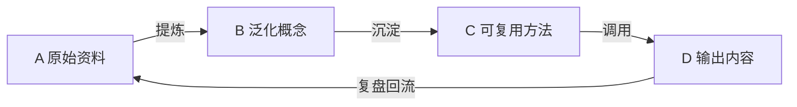

# 知识飞轮看板

## 工作入口

- 新素材：放入 [[A-原始资料]]，使用 [[_模板/原始资料]] 记录来源与问题。
- 知识蒸馏：每周从 A 提炼为 B；成熟结论沉淀为 C。
- 产出：从 C 选择方法，写入 D；发布后补全反馈并回流。

## 本周清单

- [ ] A 中需要处理的资料
- [ ] 可沉淀到 B 的概念
- [ ] 可更新到 C 的方法
- [ ] D 中待复盘的输出

## 规则

1. A 保留来源和原始语境，不追求整洁。
2. B 一条笔记只表达一个可迁移的概念。
3. C 必须包含触发条件、步骤、检查标准和示例。
4. D 必须记录实际反馈，并把新问题回写到 A。

## 本次新增（2026-07-30）· AppIntent 跨平台情报

来源：外部情报简报，按飞轮分层落库，并双链到已有 [[手机AI智能体知识库]] 体系（未重复已有概念/国内生态笔记）。

- **A 原始资料**
  - [[AppIntent 跨平台情报简报 2026-07-30]]
- **B 泛化概念 · 平台卡（2026 技术细节）**
  - [[Apple AppIntents Schema Protocol 2026]]（链 [[Apple Intelligence 与 App Intents]]）
  - [[Android AppFunctions 设备侧意图 2026]]（链 [[国内安卓厂商做 App Intent 的阻力]]）
  - [[HarmonyOS Intents Kit 与 ArkAF 2026]]
  - [[Windows Copilot Actions 与 Agent Workspace 2026]]
- **B 泛化概念 · 跨平台概念节点**
  - [[Intent Schema Protocol 意图模式规范]] ｜ [[Intent Router 语义路由]] ｜ [[Function Calling 端侧工具调用]]（含端侧 Planner 评测表）
  - [[Confirmation UI 安全机制]] ｜ [[Atomic Service 元服务]] ｜ [[Agent Workspace 隔离执行]] ｜ [[A2A 端侧智能体协议]] ｜ [[XPIA 跨提示注入]]
- **C 可复用方法**
  - [[系统级 Intent 路由评估 SOP]]
- **D 输出内容**
  - [[AppIntent 跨平台格局总览 2026]]（与 [[手机AI智能体知识库]] 互补）

> 待办：补 Gemma 4 / Qwen3-Coder-Next 端侧路由实测；补四平台 Registry/权限横向 Checklist。
