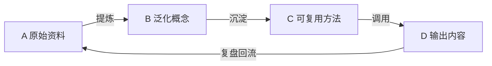

# 知识飞轮看板

## 工作入口

- 新素材：放入 [[A-原始资料]]，使用 [[_模板/原始资料]] 记录来源与问题。
- 知识蒸馏：每周从 A 提炼为 B；成熟结论沉淀为 C。
- 产出：从 C 选择方法，写入 D；发布后补全反馈并回流。

## 本周清单

- [ ] A 中需要处理的资料
- [ ] 可沉淀到 B 的概念
- [ ] 可更新到 C 的方法
- [ ] D 中待复盘的输出

## 规则

1. A 保留来源和原始语境，不追求整洁。
2. B 一条笔记只表达一个可迁移的概念。
3. C 必须包含触发条件、步骤、检查标准和示例。
4. D 必须记录实际反馈，并把新问题回写到 A。
